```{r setup, include=FALSE}
knitr::opts_chunk$set(echo = TRUE, collapse = TRUE, comment = "#>", fig.align = "center")
Sys.setenv(LANGUAGE = "en")  # messages d'erreur en anglais, comme sur la plupart des installations
```

# Introduction {.section-ul data-numero="1" background-color="#E30513"}

## Objectifs

Utilisation *minimale* de R dans un contexte de recherche scientifique :

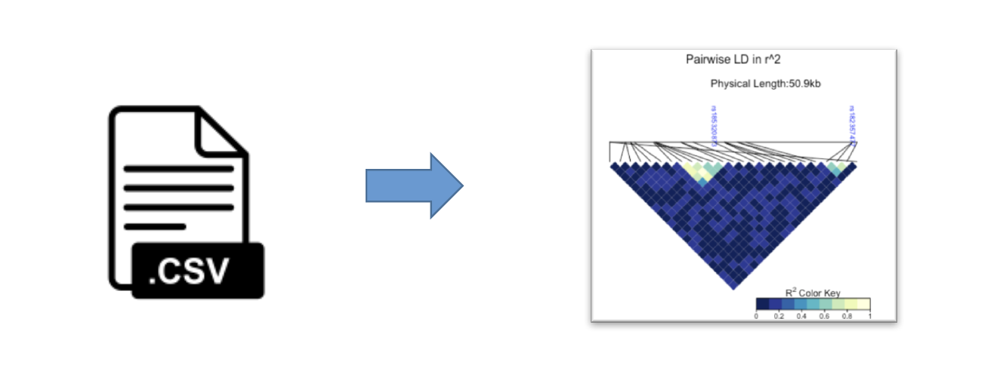{width=80%}

1. Pouvoir modifier des données
2. Pouvoir extraire des sous-ensembles de données (*indexing*)
3. Pouvoir découvrir et utiliser une fonction
4. Produire des scripts pour un travail reproductible et documenté

## Plan

1. Introduction
2. Environnement de travail
3. Un premier contact avec R : variables, vecteurs, types, matrices
4. Les `data.frame` → **TP1**
5. Fonctions, aide et packages
6. Les boucles
7. Importer et exporter des données
8. Les scripts → **TP2** et **TP3**
9. Activité : auditer un script généré par IA

## Présentation du langage R

:::: columns
::: {.column width="55%"}
- Un langage **interprété** (comme Bash ou Python, par opposition aux langages compilés comme C++ ou Java)
- Spécialisé pour les analyses statistiques et la visualisation de données

Une suite logicielle, ou environnement intégré, qui comprend :

- un langage de programmation
- un programme interactif (REPL : *read-eval-print loop*)
- des outils graphiques
- un système d'extensions (*packages*)
:::

::: {.column width="45%"}


[*R for Data Science* (H. Wickham)]{.legende}
:::
::::

## Pourquoi apprendre R

:::: columns
::: {.column width="60%"}
- Analyse de données (*data science*)
- Données diverses (biostatistiques, génomiques, biologiques)
- Graphiques de haute qualité (articles scientifiques)
- Grande communauté active qui ajoute des fonctionnalités et permet des analyses spécialisées

Quand utiliser R : **explorer**, **analyser**, **représenter**, **communiquer** les données.
:::

::: {.column width="40%"}
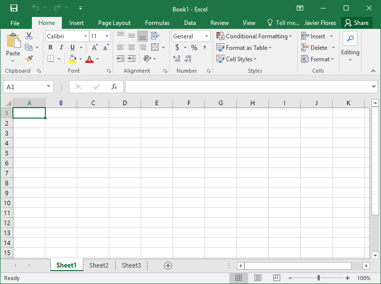{width=70%}

[Ceci n'est pas R !]{.legende}
:::
::::

## Pourquoi apprendre R en 2026 ?

Un assistant d'IA écrit du code R en quelques secondes. Alors pourquoi apprendre ?

| L'assistant sait… | Vous devez savoir… |
|---|---|
| écrire du code plausible | vérifier qu'il fait **ce que vous vouliez** |
| produire un code qui s'exécute sans erreur | repérer les erreurs **qui ne plantent pas** |
| proposer une analyse | en **assumer la responsabilité** : c'est vous qui signez |
| travailler sur des données qu'on lui envoie | travailler quand les données **ne peuvent pas sortir** (données cliniques) |

::: {.fragment}
::: remarque
**Objectif du module** : comprendre, vérifier et corriger une analyse, la vôtre ou celle d'un outil. C'est ce qui est évalué, en présence et sans IA.
:::
:::

## Pourquoi R plutôt que Python ?

| R : le choix du cours | Python : à apprendre ensuite |
|---|---|
| **Bioconductor** : plus de 2 000 packages omiques (DESeq2, limma, mixOmics…) | **Pipelines** (Snakemake), automatisation |
| **Statistiques natives** : `data.frame`, `NA`, tests, modèles | **Apprentissage automatique** (scikit-learn, PyTorch) |
| **Vectorisé par défaut**, RStudio prêt à l'emploi | **Single-cell** (scanpy), structures, Biopython |
| Visualisation, statistiques, réseaux et enrichissement **de ce cours** sont en R | Langage **généraliste**, très demandé hors recherche |

::: {.fragment}
::: remarque
**Les concepts se transfèrent** : vecteur ↔ tableau `numpy`, `data.frame` ↔ `DataFrame` pandas, `NA` ↔ `NaN`. Maîtriser l'un rend l'autre facile.
:::
:::

## R : mode interactif vs. mode script

:::: columns
::: {.column width="50%"}
Le mode **interactif** : utile pour explorer les données *(Ctrl+D pour quitter)*

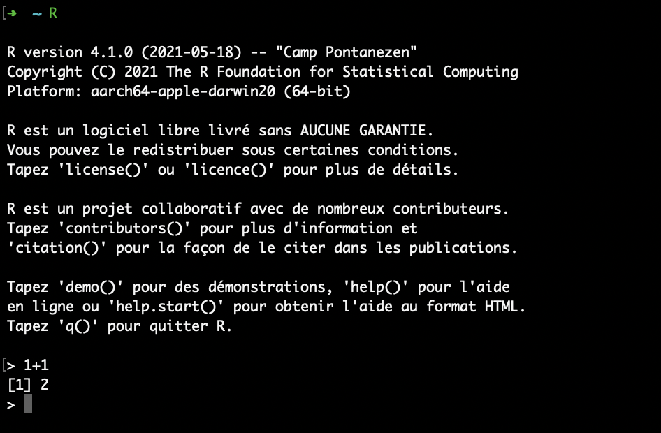
:::

::: {.column width="50%"}
Le mode **script** (`Rscript`) : utile pour réutiliser des commandes utilisées régulièrement. Conserve aussi le détail d'une analyse (*reproductibilité*)

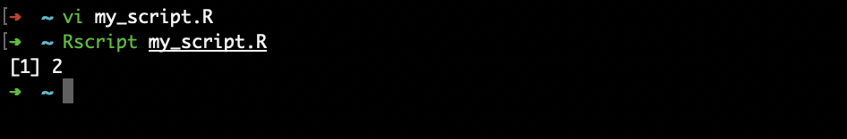
:::
::::

## L'interpréteur

- À la console, l'interpréteur attend qu'on communique avec lui dans le langage qu'il comprend : **R**.
- Toute erreur de syntaxe entraîne une incompréhension de l'interpréteur et produit une erreur.

Erreurs fréquentes :

- mauvaise orthographe (R distingue majuscules et minuscules) ;
- utiliser une fonction inconnue ;
- oublier de fermer un guillemet ou une parenthèse ;
- argument manquant à une fonction (pas de valeur par défaut).

# Environnement de travail {.section-ul data-numero="2" background-color="#E30513"}

## Commencer avec R

- R peut être téléchargé et installé à partir de <https://cran.r-project.org/>
- Pour le cours, un serveur **RStudio** a été installé pour vous : <https://bif-rstudio.compbio.ulaval.ca>

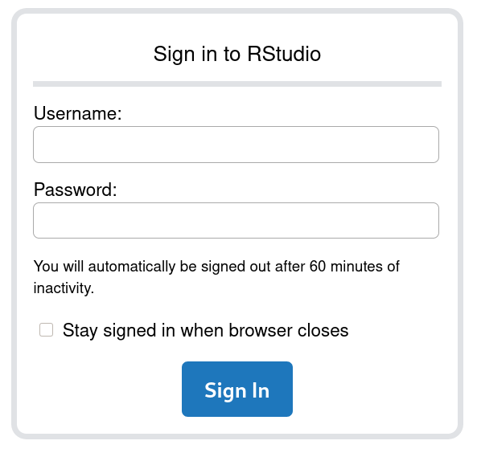{width=35%}

## RStudio

:::: columns
::: {.column width="60%"}
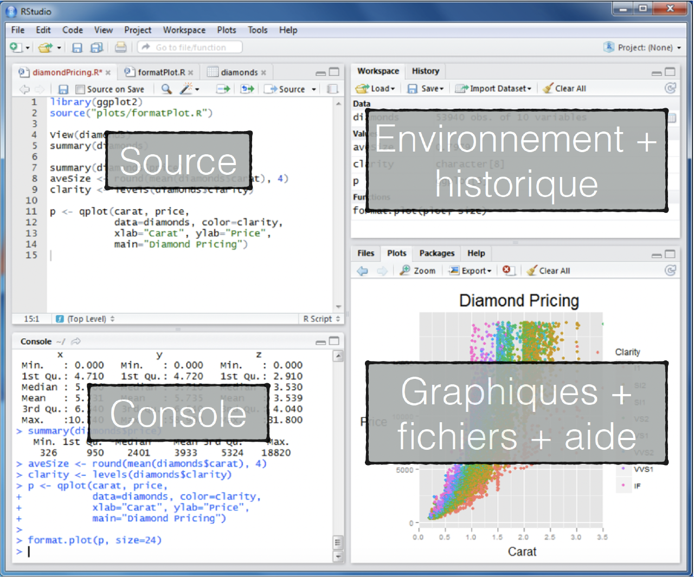
:::

::: {.column width="40%"}
Environnement de travail pour le développement en R.

- **Source** : vos scripts
- **Console** : vos commandes
- **Environment** : variables, historique, Git, etc.
- **Plots, Packages, Help**

Les commandes écrites dans *Source* peuvent être envoyées à la *Console* (Ctrl+Entrée).
:::
::::

# Un premier contact avec R {.section-ul data-numero="3" background-color="#E30513"}

## Premières commandes

Écrivez vos commandes dans la **console** (en bas à gauche), puis appuyez sur **Entrée** pour que R interprète et exécute la commande.

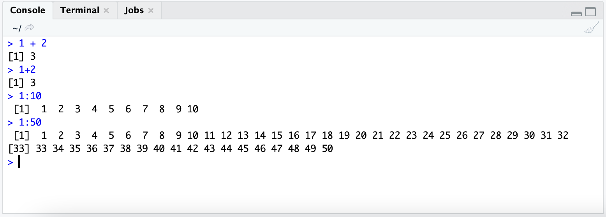{width=60%}

- `>` est l'invite de commande
- les espaces autour des opérateurs sont ignorés, mais `<-` ne se coupe pas : `x < - 1` **compare** `x` à -1
- les résultats sont précédés de leur position sur la ligne de retour : `[1]`

## Les variables

Les résultats sont seulement affichés dans la console, pas sauvegardés.
On utilise des *variables* pour les stocker, avec l'opérateur `<-` :

```{r}
ma_variable <- 1
chien <- "chat"
a <- 1 + 2
```

En tapant le nom de la variable, son contenu s'affiche :

```{r}
ma_variable
chien
a
```

::: remarque
Un nom de variable ne commence pas par un chiffre et ne contient pas de caractères spéciaux : `^`, `!`, `$`, `@`, `+`, `-`, `/` ou `*`.
:::

## Les vecteurs (1)

R est un langage basé sur la notion de **vecteur** : le calcul est simplifié et nécessite peu de boucles.

On combine des valeurs dans un vecteur avec la fonction `c()` :

```{r}
var1 <- c(1, 2)
var2 <- c("chien", "chat")
var3 <- c(TRUE, TRUE, FALSE)
var1; var2; var3
```

Les opérations s'appliquent à **chaque élément** :

```{r}
var1 * 10
```

## Les vecteurs (2)

On accède aux éléments d'un vecteur par leur position (index), entre crochets `[]` :

```{r}
var <- c("chien", "chat", "mouton", "oiseau")
var[1]
var[c(2, 4)]  # éléments 2 et 4
var[2:4]      # éléments 2 à 4 (une tranche)
```

On peut aussi sélectionner avec un vecteur **logique** :

```{r}
nombres <- c(5, 12, 3, 20)
nombres > 10
nombres[nombres > 10]
```

## À vous : prédire la sortie {.a-vous}

Sans exécuter, que renvoie chaque ligne ?

```{r}
x <- c(10, 20, 30, 40)
```

:::: columns
::: {.column width="45%"}
1. `x[2]`
2. `x[2:3]`
3. `x > 25`
4. `x[x > 25]`
5. `x + 1`
:::

::: {.column width="55%"}
::: fragment
```{r}
x[2]
x[2:3]
x > 25
x[x > 25]
x + 1
```
:::
:::
::::

## Les différents types de scalaires

:::: columns
::: {.column width="25%"}
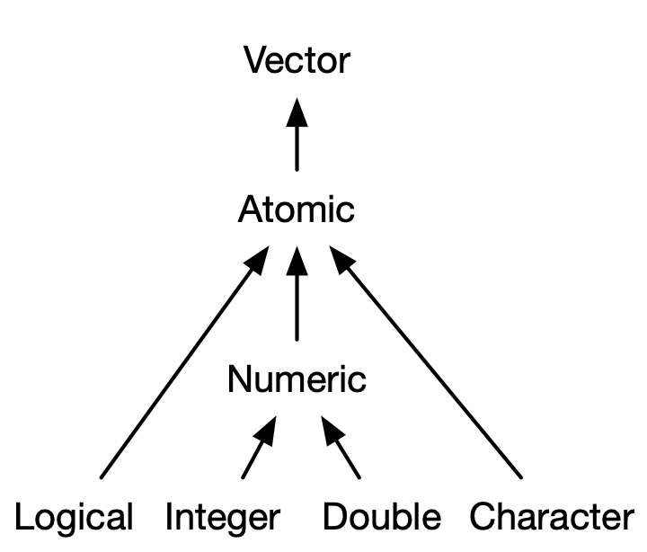

[*Advanced R* (H. Wickham)]{.legende}
:::

::: {.column width="75%"}
Chaque élément d'un vecteur est un scalaire. Types principaux :

- **numériques** : `double` (3.14 ; -0.65) et `integer` (`1L`) ;
- **chaînes de caractères** : entre 'simples' ou "doubles" guillemets ;
- **logiques** : `TRUE` / `FALSE`, à écrire en entier (`T` et `F` peuvent être écrasés par une variable).

À part : `NULL` (valeur *vide*) et `NA` (valeur **manquante**).

Le type *facteur* (`factor`) représente des données catégorielles :

```{r}
a <- factor(c("chien", "chien", "chat")); a
```
:::
::::

## À vous : types et valeurs manquantes {.a-vous}

Sans exécuter : quel résultat, et pourquoi ?

:::: columns
::: {.column width="45%"}
1. `class(c(1, "a", TRUE))`
2. `class(1 == 1)`
3. `mean(c(2, 4, NA))`
4. `1:6 + c(10, 20)`
:::

::: {.column width="55%"}
::: fragment
```{r}
class(c(1, "a", TRUE))  # tout est converti en texte
class(1 == 1)
mean(c(2, 4, NA))       # un NA contamine le calcul
mean(c(2, 4, NA), na.rm = TRUE)
1:6 + c(10, 20)         # c(10, 20) est recyclé
```
:::
:::
::::

## Fonctions utiles sur les vecteurs (1)

Créer et résumer un vecteur :

:::: columns
::: {.column width="50%"}
```{r}
seq(1, 10, by = 3)
rep("a", 3)
notes <- c(12, 15, 9, 18)
length(notes)
```
:::

::: {.column width="50%"}
```{r}
sum(notes)
mean(notes)
max(notes)
min(notes)
```
:::
::::

Toutes acceptent `na.rm = TRUE` pour ignorer les valeurs manquantes (sauf `seq`, `rep` et `length`).

## Fonctions utiles sur les vecteurs (2)

Trier, chercher, compter :

:::: columns
::: {.column width="50%"}
```{r}
q <- c(5, 2, 9)
sort(q)    # les valeurs triées
order(q)   # leurs positions
which(q > 4)
```
:::

::: {.column width="50%"}
```{r}
couleurs <- c("rouge", "vert", "rouge")
table(couleurs)
v <- c(3, NA, 7)
is.na(v)
sum(is.na(v))
```
:::
::::

::: remarque
Pour trier les lignes d'un `data.frame`, on utilise les **positions** : `df[order(df$col), ]`, jamais `sort()`.
:::

## Les matrices

Structures de dimension 2 dont tous les éléments sont **du même type** :

$$
A =
\begin{bmatrix}
2 & 4 & 3\\
1 & 5 & 7
\end{bmatrix}
$$

```{r}
A <- matrix(data = c(2, 1, 4, 5, 3, 7), ncol = 3, nrow = 2, byrow = FALSE)
A
```

## Les matrices (2)

On accède à des lignes, des colonnes, des cases ou des sous-ensembles avec `[ligne, colonne]` :

```{r}
A[2, ]    # la deuxième ligne
A[, 2]    # la deuxième colonne
A[2, 2]   # la case ligne 2, colonne 2
A[, 2:3]  # colonnes 2 à 3, toutes les lignes
```

# Les `data.frame` {.section-ul data-numero="4" background-color="#E30513"}

## Les `data.frame`

Tableau à 2 dimensions : un **agrégat de colonnes** (vecteurs de même longueur).
Contrairement aux matrices, les colonnes peuvent avoir **des types différents**.

```{r}
col1 <- c(1, 2, 3)
col2 <- c(TRUE, TRUE, FALSE)
col3 <- letters[2:4]
df <- data.frame(col1, col2, col3)
df
```

On accède aux éléments comme dans une matrice, et à une colonne par son nom avec `$` :

```{r}
df[2, ]
df$col3
```

## À vous : sélectionner dans un `data.frame` {.a-vous}

Avec le `df` de la diapo précédente, que renvoie :

:::: columns
::: {.column width="45%"}
1. `df[3, 1]`
2. `df$col1 > 1`
3. `df[df$col1 > 1, ]`
4. `df[df$col2, "col3"]`
:::

::: {.column width="55%"}
::: fragment
```{r}
df[3, 1]
df$col1 > 1
df[df$col1 > 1, ]
df[df$col2, "col3"]
```
:::
:::
::::

## Résumé des structures de base

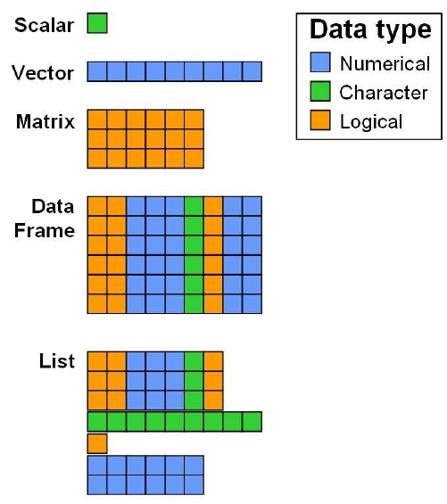{width=55%}

[*A short Introduction to statistics using R* (K. Steinmann)]{.legende}

# TP1 {.section-ul background-color="#E30513"}

# Fonctions, aide et packages {.section-ul data-numero="5" background-color="#E30513"}

## Utiliser une fonction et lire son aide

Une fonction prend des **arguments** et renvoie un résultat : `nom(argument1, argument2, ...)`

```{r}
x <- c(4, 8, NA, 2)
mean(x)
mean(x, na.rm = TRUE)   # argument nommé
```

Pour découvrir une fonction : `?mean` ou `help(mean)`. L'aide contient toujours :

- **Usage** : les arguments et leur valeur par défaut (`na.rm = FALSE`)
- **Arguments** : ce que chaque argument attend
- **Value** : ce que la fonction renvoie
- **Examples** : du code à copier et essayer (le plus utile !)

## Lire un message d'erreur

Un message d'erreur n'est pas un échec, c'est une **indication**. Lisez-le avant de chercher ailleurs.

```{r, error=TRUE}
moyenne <- mean(c(1, 2))
Moyenne                  # R distingue majuscules et minuscules
Mean(c(1, 2))            # la fonction n'existe pas sous ce nom
1:10 + c(1, 2, 3)        # un avertissement (warning), pas une erreur
```

- `Error` : la commande s'est arrêtée, rien n'a été calculé
- `Warning` : le calcul a été fait, mais le résultat est peut-être faux

## Les packages

Un *package* ajoute des fonctions à R. Deux étapes différentes :

```{r, eval=FALSE}
install.packages("ggplot2")  # 1 seule fois : télécharger et installer
library(ggplot2)             # à chaque session : charger le package
```

- `install.packages()` : une seule fois par ordinateur (ou par compte sur le serveur)
- `library()` : au début de **chaque** script qui utilise le package
- Erreur classique : `could not find function "ggplot"` → le package n'est pas chargé

# Les boucles {.section-ul data-numero="6" background-color="#E30513"}

## Les boucles `for` et la fonction `seq()`

Une boucle répète une action plusieurs fois, souvent sur une séquence créée avec `seq()` :

```{r, eval=FALSE}
for (variable in sequence) {
  # instructions à répéter
}
```

```{r}
for (i in seq(1, 3)) {
  print(paste("Itération :", i))
}
```

::: remarque
Avant d'écrire une boucle, vérifiez s'il existe une opération vectorisée : `x * 2` plutôt qu'une boucle qui multiplie chaque élément.
:::

# Importer et exporter des données {.section-ul data-numero="7" background-color="#E30513"}

## Le répertoire de travail

Un **chemin relatif** part du **répertoire de travail** de R, comme dans le terminal Linux :

| R | Bash | Rôle |
|---|---|---|
| `getwd()` | `pwd` | afficher le répertoire de travail |
| `setwd("~/projet")` | `cd ~/projet` | changer de répertoire de travail |
| `list.files()` | `ls` | lister les fichiers du répertoire |

```{r, eval=FALSE}
read.table("donnees.txt")                 # relatif : cherché dans getwd()
read.table("/home/public/R/fruit.tsv")    # absolu : fonctionne d'où que l'on soit
```

::: remarque
Dans RStudio : *Session > Set Working Directory*, ou un **projet RStudio** qui fixe le répertoire de travail automatiquement. Évitez les `setwd()` avec un chemin absolu dans un script partagé : il ne fonctionnera que sur votre ordinateur.
:::

## Chargement des données

- `read.table()` charge un tableau dans R sous la forme d'un `data.frame`
- `write.table()` sauvegarde un `data.frame` dans un fichier texte
- Dans les 2 cas, il faut le chemin du fichier (chemin relatif ou absolu)

```{r, eval=FALSE}
var <- read.table("donnees.txt", header = TRUE, sep = "\t")
write.table(var, file = "donnees.txt", sep = "\t", quote = FALSE, row.names = FALSE)
```

Pour un fichier `.csv` (champs séparés par des virgules) :

```{r, eval=FALSE}
var <- read.csv("donnees.csv")
write.csv(var, file = "donnees.csv", row.names = FALSE)
```

::: remarque
Écrivez avec les **mêmes réglages** que ceux de la relecture. Par défaut, `write.table()` sépare par des espaces et ajoute guillemets et numéros de rangées, et `write.csv()` ajoute une colonne `X` à la relecture.
:::

Sauvegarder et recharger des objets R :

```{r, eval=FALSE}
save(var1, var2, file = "donnees.RData")  # sauvegarde de var1 et var2
load("donnees.RData")
```

## À vous : que s'est-il passé ? {.a-vous}

Le fichier `notes.tsv` contient un en-tête et des colonnes séparées par des tabulations :

```
nom     note
Alice   15
Bob     12
```

Qu'obtient-on avec chacune de ces commandes ?

1. `read.table("notes.tsv", sep = "\t")`
2. `read.csv("notes.tsv")`

::: fragment
1. 3 lignes : l'en-tête `nom` / `note` est lu comme une ligne de données (il manque `header = TRUE`), et la colonne des notes devient du texte.
2. Une seule colonne : `read.csv` cherche des virgules (il manque `sep = "\t"`).

**Réflexe** : après chaque chargement, vérifiez avec `head()`, `dim()` ou le panneau *Environment*.
:::

# Les scripts {.section-ul data-numero="8" background-color="#E30513"}

## Les scripts {.smaller}

:::: columns
::: {.column width="60%"}
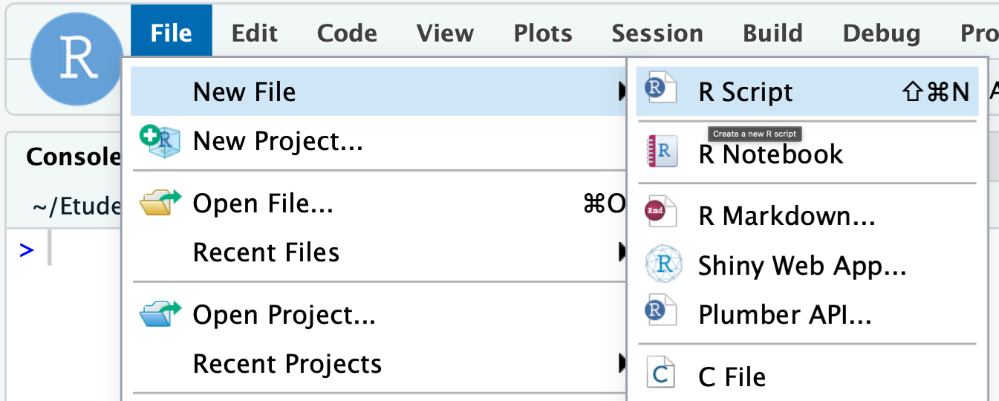{width=75%}

- Documente précisément votre travail
- Permet de le reproduire
- Permet de réutiliser votre code pour d'autres projets
- Contient toutes les étapes réalisées (mais pas les erreurs ni les essais)
- Explique en commentaire (`#`) ce qui n'est pas évident
:::

::: {.column width="40%"}
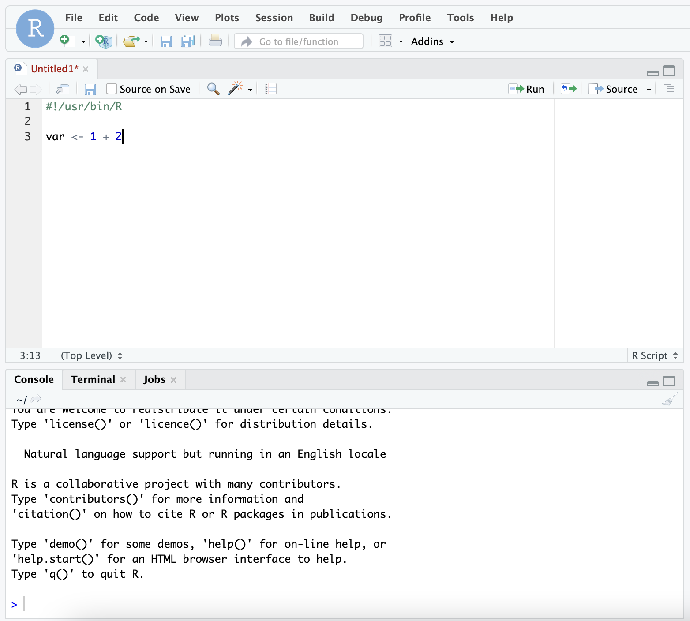
:::
::::

# TP2 {.section-ul background-color="#E30513"}

# TP3 {.section-ul background-color="#E30513"}

# Activité : auditer un script {.section-ul data-numero="9" background-color="#E30513"}

## Auditer un script généré par IA {.audit}

> *« Calcule la différence d'expression moyenne de TP53 entre les groupes traité et contrôle, compte les patients dont l'expression dépasse 8, et affiche les 3 patients avec la plus forte expression. »*

:::: columns
::: {.column width="70%"}
```{r}
#| eval: false
# Analyse de l'expression de TP53 selon le groupe
# Script vérifié et prêt à l'emploi.

donnees <- read.table("/home/public/R/patients.tsv", header = TRUE, sep = "\t")

# 1. Différence d'expression moyenne entre les groupes
moy_traite   <- mean(donnees$TP53[donnees$groupe == "traite"], na.rm = TRUE)
moy_controle <- mean(donnees$TP53[donnees$groupe == "controle"], na.rm = TRUE)
moy_traite - moy_controle

# 2. Nombre de patients avec une expression élevée (> 8)
nrow(donnees[donnees$TP53 > 8, ])

# 3. Les 3 patients avec la plus forte expression
donnees[sort(donnees$TP53, decreasing = TRUE)[1:3], ]
```
:::

::: {.column .donnees width="30%"}
[`patients.tsv`]{.legende}

```{r}
#| echo: false
#| comment: ""
# lu dans le fichier réel : le tableau affiché est celui que chargeront les étudiants
print(read.table("data/patients.tsv", header = TRUE, sep = "\t"), row.names = FALSE)
```
:::
::::

**Il s'exécute sans aucune erreur. Ses trois résultats sont pourtant faux.**

::: {.demarche}
1. **Lire sans exécuter** : que fait réellement chaque bloc ? Quelles lignes sont suspectes ?
2. **Vérifier dans RStudio** : inspecter les données avant de croire les résultats (`head()`, `table()`, `sum(is.na())`)
3. **Corriger** et commenter chaque correction
:::
