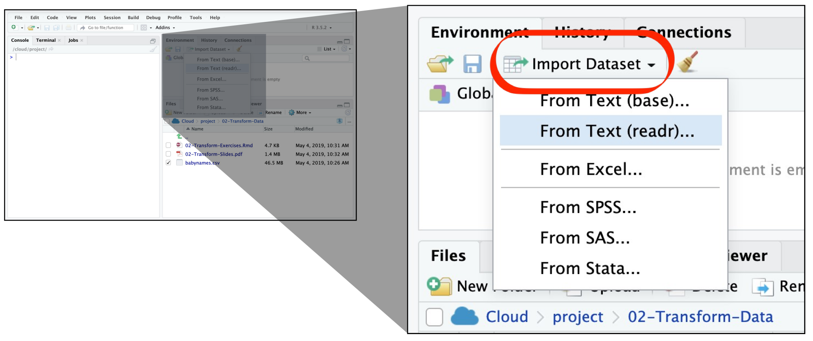
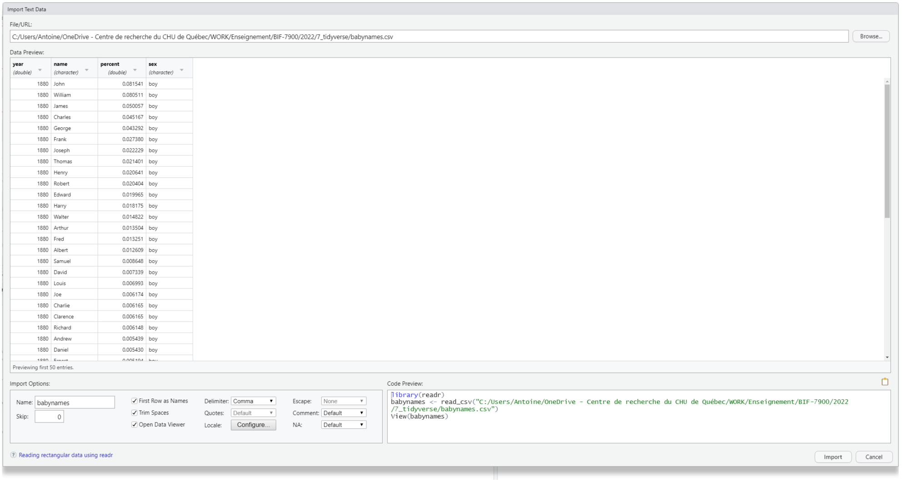
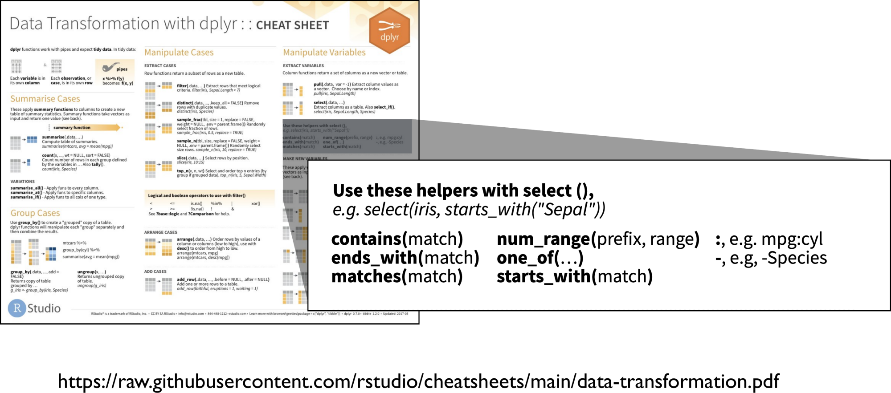
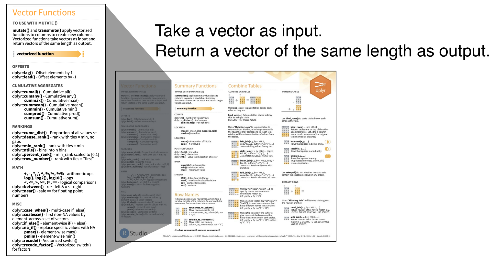
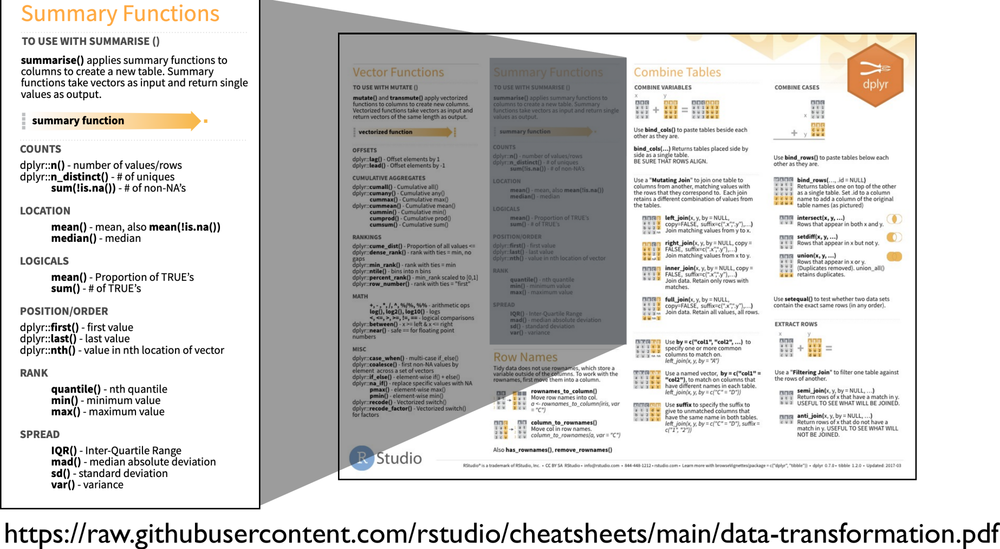
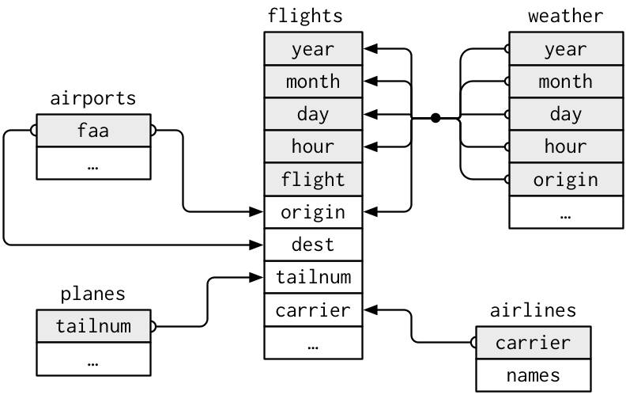
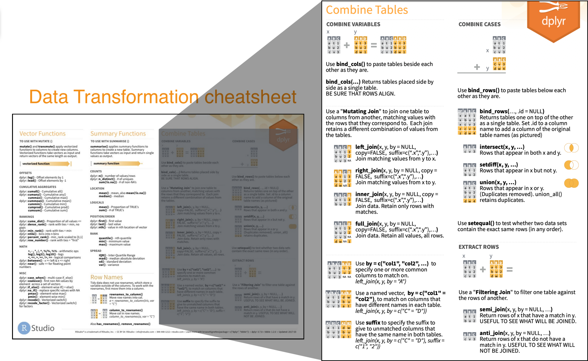
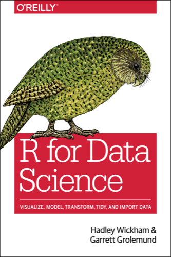

```{r setup, include=FALSE}
knitr::opts_chunk$set(echo = TRUE, collapse = TRUE, comment = "#>", fig.align = "center",
                      message = FALSE)
Sys.setenv(LANGUAGE = "en")  # messages d'erreur en anglais, comme sur la plupart des installations
options(width = 80, pillar.print_min = 6)
suppressPackageStartupMessages(library(tidyverse))
source("_anim.R")  # tableaux animés et code annoté

# Petit jeu de données des exemples
echantillons <- tibble(
  id         = c("S1", "S2", "S3", "S4", "S5", "S6"),
  tissu      = c("foie", "foie", "rein", "rein", "coeur", "coeur"),
  traitement = c("ctrl", "trt", "ctrl", "trt", "ctrl", "trt"),
  TP53       = c(5.1, 9.7, 4.8, NA, 6.2, 10.9),
  MYC        = c(6.8, 4.2, 7.4, 5.0, 6.1, 3.1)
)
```

# Introduction {.section-ul data-numero="1" background-color="#E30513"}

## Objectifs

La semaine dernière, en R de base : `df[df$TP53 > 8, c("id", "TP53")]`

Aujourd'hui, la même chose **en mots** :

```{r, eval=FALSE}
echantillons |>
  filter(TP53 > 8) |>
  select(id, TP53)
```

1. Importer des données et **vérifier** l'importation
2. Enchaîner des opérations avec le *pipe* `|>`
3. Sélectionner, filtrer, créer, trier : les **verbes** de `dplyr`
4. **Résumer par groupe** (`group_by()` + `summarise()`)
5. Changer la forme d'un tableau (`pivot_longer()`, `pivot_wider()`)
6. **Joindre** deux tableaux, et vérifier la jointure

## Plan

1. Introduction
2. Importer avec `readr`
3. Le *pipe*
4. Les verbes de `dplyr` → **TP1**
5. Résumer par groupe
6. Des données *tidy* : `pivot_longer()` et `pivot_wider()` → **TP2**
7. Les jointures → **TP3**
8. De R de base au *tidyverse* : traduire le script de la semaine dernière

## Le *tidyverse*

:::: columns
::: {.column width="42%"}

:::

::: {.column width="58%"}
Une collection de *packages* qui partagent la même logique :

- `readr` : importer (`read_csv()`, `read_tsv()`)
- `dplyr` : manipuler (`filter()`, `mutate()`, `left_join()`…)
- `tidyr` : changer la forme (`pivot_longer()`…)
- `ggplot2` : visualiser (module suivant)
- `stringr`, `forcats`, `lubridate` : textes, facteurs, dates

```{r, eval=FALSE}
library(tidyverse)   # charge les packages principaux d'un coup
```
:::
::::

::: remarque
Un seul principe : **chaque fonction prend un tableau en premier argument et renvoie un tableau**.
:::

## R de base ou *tidyverse* ?

Les deux font la même chose. Le *tidyverse* se **lit** plus facilement, ce qui aide à vérifier.

| Opération | R de base (module 5) | *tidyverse* |
|---|---|---|
| Garder des lignes | `df[df$TP53 > 8, ]` | `filter(df, TP53 > 8)` |
| Garder des colonnes | `df[, c("id", "TP53")]` | `select(df, id, TP53)` |
| Créer une colonne | `df$log <- log2(df$TP53)` | `mutate(df, log = log2(TP53))` |
| Trier | `df[order(df$TP53), ]` | `arrange(df, TP53)` |
| Moyenne par groupe | `tapply(df$TP53, df$tissu, mean)` | `summarise(group_by(df, tissu), m = mean(TP53))` |

::: fragment
::: remarque
**Ce qui ne change pas** : les vecteurs, les types, le recyclage, les `NA` et la casse des catégories. Les pièges de la semaine dernière sont toujours là, simplement mieux cachés.
:::
:::

## Le *tibble*

Le `data.frame` du *tidyverse* : même objet, affichage plus prudent.

```{r}
echantillons
```

- dimensions et **type de chaque colonne** (`<chr>`, `<dbl>`) affichés d'emblée
- seules les premières lignes sont affichées (pas de défilement de 10 000 lignes)

## Installer ou charger ?

:::: columns
::: {.column width="50%"}
```{r}
#| eval: false
install.packages("tidyverse")
```

équivaut à

```{r}
#| eval: false
install.packages("ggplot2")
install.packages("dplyr")
install.packages("tidyr")
install.packages("readr")
install.packages("tibble")
install.packages("stringr")
...    # et une vingtaine d'autres
```

**Une seule fois** par ordinateur (ou par compte sur le serveur).
:::

::: {.column width="50%"}
```{r}
#| eval: false
library(tidyverse)
```

équivaut à

```{r}
#| eval: false
library(ggplot2)
library(dplyr)
library(tidyr)
library(readr)
library(tibble)
library(stringr)
library(forcats)
library(purrr)
```

**À chaque session**, en tête de script : un raccourci pour les packages principaux.
:::
::::

## Le parcours d'une analyse

```{=html}
<div class="cycle">
  <div class="etape ici">Importer</div><span class="fleche">&#10140;</span>
  <div class="etape ici">Ranger</div><span class="fleche">&#10140;</span>
  <div class="etape ici">Transformer</div><span class="fleche">&#10140;</span>
  <div class="etape ailleurs">Visualiser</div>
</div>
```

- **Aujourd'hui** : importer (`readr`), ranger (`tidyr`), transformer (`dplyr`)
- **Module suivant** : visualiser (`ggplot2`), qui attend des données déjà rangées et transformées

{width=45% fig-align="center"}

::: {style="text-align:center"}
[*R for Data Science* (H. Wickham)]{.legende}
:::

# Importer avec `readr` {.section-ul data-numero="2" background-color="#E30513" background-image="figure/hex_readr_ombre.png" background-size="330px" background-position="88% 50%"}

## Importer un fichier texte {auto-animate=true auto-animate-id="import"}

```{r}
#| include: false
lignes_csv <- readLines("data/babynames.csv", n = 9)
bebes_tete <- read_csv(I(paste(lignes_csv, collapse = "\n")), col_types = "dccdd")  # sinon "F" seul est lu comme FALSE
```

:::: columns
::: {.column width="40%"}
Les formats texte : `.csv`, `.tsv`, `.txt`…

Une ligne par **observation**, un **séparateur** entre les valeurs (ici la virgule).

Exemple : `babynames.csv`, les prénoms des bébés nés aux États-Unis de 1880 à 2017.

[`/home/public/tidyverse/babynames.csv`]{style="color:#7FB069"}
:::

::: {.column width="60%"}
{width=110px style="float:right"}

```{r}
#| echo: false
#| results: asis
cat(fichier_brut(lignes_csv, prefixe = "bb-"))
```
:::
::::

## Importer un fichier texte {auto-animate=true auto-animate-id="import"}

```{r}
#| eval: false
bebes <- read_csv("/home/public/tidyverse/babynames.csv")
```

```{r}
#| echo: false
#| results: asis
cat(rangee(tableau(bebes_tete, cles = seq_len(nrow(bebes_tete)), prefixe = "bb-",
                   titre = "chaque valeur trouve sa colonne")))
```

`read_csv()` coupe chaque ligne aux virgules, prend la première ligne comme **noms de colonnes**, et **devine** le type de chaque colonne.

## Lire un fichier en ligne de commande

| Fichier | `readr` | R de base (module 5) |
|---|---|---|
| séparé par des virgules (`.csv`) | `read_csv("fichier.csv")` | `read.csv()` |
| séparé par des tabulations (`.tsv`) | `read_tsv("fichier.tsv")` | `read.table(sep = "\t", header = TRUE)` |
| « CSV européen » (`;` et virgule décimale) | `read_csv2("fichier.csv")` | `read.csv2()` |
| Excel (`.xlsx`) | `readxl::read_excel("fichier.xlsx", sheet = 1)` | |

```{r}
#| include: false
bebes <- read_csv("data/babynames.csv", show_col_types = FALSE)
```

```{r, message=TRUE}
#| eval: false
bebes <- read_csv("/home/public/tidyverse/babynames.csv")
```

```{r}
#| echo: false
#| message: true
#| results: markup
invisible(read_csv("data/babynames.csv"))
```

::: remarque
Ce message n'est pas une erreur : c'est le **compte rendu** de l'importation. Lisez-le : nombre de lignes, de colonnes, et le type deviné pour chacune.
:::

## Importer en mode interactif

{width=95% fig-align="center"}

::: notes
Panneau Environment > Import Dataset > From Text (readr).
:::

## Importer en mode interactif

{width=88% fig-align="center"}

::: remarque
Le *Code Preview* (en bas à droite) donne la commande `read_csv()` : **copiez-la dans votre script**, sinon l'import n'est pas reproductible.
:::

## Vérifier l'importation

`readr` **devine** le type de chaque colonne à partir de son contenu. S'il se trompe, il ne le dit pas.

```{r}
#| echo: false
writeLines(c("id\tTP53", "S1\t5.1", "S2\t9,7", "S3\tn/a"), "mesures.tsv")
```

:::: columns
::: {.column width="40%"}
Le fichier `mesures.tsv` :

```
id    TP53
S1    5.1
S2    9,7
S3    n/a
```
:::

::: {.column width="60%"}
::: fragment
```{r}
mesures <- read_tsv("mesures.tsv", show_col_types = FALSE)
mesures
```
:::
:::
::::

::: fragment
`TP53` est lue comme du **texte** (`<chr>`) : une virgule décimale et un `n/a` suffisent. Tout calcul échouera ensuite.

**Réflexe** : regarder les types après chaque importation (`glimpse()`, `spec()`), et préciser les valeurs manquantes : `read_tsv(..., na = c("", "NA", "n/a"))`.
:::

## Écrire un fichier

| Fichier | Commande |
|---|---|
| `.csv` | `write_csv(donnees, file = "fichier.csv")` |
| `.tsv` | `write_tsv(donnees, file = "fichier.tsv")` |
| Excel, une feuille par tableau | `openxlsx::write.xlsx(list(notes = notes, iris = iris), file = "fichier.xlsx")` |

- pas de numéros de rangées ni de guillemets ajoutés : le fichier se relit tel quel
- les chemins suivent les mêmes règles qu'en R de base (relatif au répertoire de travail, ou absolu)
- Excel : pratique pour échanger avec les collègues biologistes, mais **gardez le `.csv` comme fichier de travail**

# Le *pipe* {.section-ul data-numero="3" background-color="#E30513" background-image="figure/hex_magrittr_ombre.png" background-size="330px" background-position="88% 50%"}

## Une même anatomie pour toutes les fonctions

```{r}
#| echo: false
#| results: asis
cat(code_annote(c("resultat" = "renvoie un tableau", " <- " = NA, "fonction" = NA, "(" = NA,
                  "tableau" = "1er argument : un tableau", ", " = NA,
                  "options" = "les options propres à la fonction", ")" = NA),
                couleurs = c("vert", "gris", "gris", "gris", "bleu", "gris", "gris", "gris")))
```

::: {.fragment}
Puisque chaque fonction **prend** un tableau et **renvoie** un tableau, on peut les enchaîner :

```{r}
#| eval: false
tableau |> fonction1(...) |> fonction2(...) |> fonction3(...)
```
:::

## Le *pipe* `|>`

:::: columns
::: {.column width="15%"}

:::

::: {.column width="65%"}
Le *pipe* prend le résultat de gauche et l'envoie comme **premier argument** de la fonction de droite.

`x |> f(y)` équivaut à `f(x, y)`. Se lit : « **puis** ».

Le même principe que le `|` de Bash :

```{bash}
#| eval: false
cat babynames.csv | grep Garrett | wc -l
```
:::

::: {.column width="20%"}
{width=70%}
:::
::::

:::: columns
::: {.column width="50%"}
Sans *pipe* : se lit de l'intérieur vers l'extérieur

```{r}
round(mean(c(5.1, 9.7, 4.8)), 1)
```
:::

::: {.column width="50%"}
Avec *pipe* : se lit dans l'ordre d'exécution

```{r}
c(5.1, 9.7, 4.8) |>
  mean() |>
  round(1)
```
:::
::::

::: remarque
`%>%` (package `magrittr`) fait la même chose : vous le verrez dans beaucoup de code et de réponses en ligne. `|>` est intégré à R depuis la version 4.1. Raccourci RStudio : **Ctrl+Maj+M**.
:::

## À vous : réécrire avec le *pipe* {.a-vous}

Réécrivez ces commandes avec `|>`, puis dites ce qu'elles renvoient.

1. `head(arrange(echantillons, MYC), 2)`
2. `nrow(filter(echantillons, tissu == "rein"))`

::: fragment
```{r}
echantillons |> arrange(MYC) |> head(2)
echantillons |> filter(tissu == "rein") |> nrow()
```

**Lisez de gauche à droite** : « je prends les échantillons, **puis** je trie par MYC, **puis** je garde les 2 premiers ».
:::

# Les verbes de `dplyr` {.section-ul data-numero="4" background-color="#E30513" background-image="figure/hex_dplyr_couleur_ombre.png" background-size="330px" background-position="88% 50%"}

## Une grammaire de la manipulation

:::: columns
::: {.column width="72%"}
`dplyr` transforme un tableau avec des **verbes** :

| Verbe | Rôle |
|---|---|
| `select()` | garder des **colonnes** |
| `filter()` | garder des **lignes** |
| `mutate()` | **créer** ou modifier une colonne |
| `arrange()` | **trier** les lignes |
| `summarise()` | **résumer** (souvent par groupe) |
:::

::: {.column width="28%"}
{width=80%}
:::
::::

Tous s'écrivent de la même façon :

```{r}
#| echo: false
#| results: asis
cat(code_annote(c("filter" = "un verbe de dplyr", "(" = NA, "babynames" = "le tableau à transformer : toujours en premier",
                  ", " = NA, 'name == "Garrett"' = "ce qu'il faut faire, avec les noms de colonnes sans guillemets ni $", ")" = NA),
                couleurs = c("gris", "gris", "bleu", "gris", "vert", "gris")))
```

::: {.fragment}
::: remarque
Le résultat est **toujours un nouveau tableau** : on peut enchaîner les verbes avec `|>`.
:::
:::

```{r}
#| include: false
# extrait de babynames, comme dans les diapos RStudio : quelques garçons de 1880 et 1881
bb <- bebes |> filter(sex == "M", year %in% 1880:1881,
                      name %in% c("John", "William", "James", "Charles", "Garrett")) |>
  mutate(prop = signif(prop, 3))
cles_bb <- paste(bb$year, bb$name, sep = "-")
```

## `select()` : choisir des colonnes {auto-animate=true auto-animate-id="select"}

`select(babynames, name, prop)`

```{r}
#| echo: false
#| results: asis
cat(rangee(tableau(bb, cles = cles_bb, cols_hl = c("name", "prop"), titre = "babynames (extrait)")))
```

## `select()` : choisir des colonnes {auto-animate=true auto-animate-id="select"}

`select(babynames, name, prop)`

```{r}
#| echo: false
#| results: asis
cat(rangee(tableau(select(bb, name, prop), cles = cles_bb, cols_hl = c("name", "prop"), titre = "résultat : 2 colonnes")))
```

Aides utiles : `select(-prop)` (toutes sauf), `select(year:name)` (une plage), `select(starts_with("n"))`, `select(where(is.numeric))`.

## Les aides de `select()`

{width=92% fig-align="center"}

## `pull()` : extraire un vecteur

`select()` renvoie toujours un **tableau**, même avec une seule colonne. Pour obtenir un **vecteur**, comme avec `$` :

```{r}
bb |> select(name) |> class()      # un tableau
bb |> pull(name) |> class()        # un vecteur, comme bb$name
bb |> filter(name == "Garrett") |> pull(n)
```

Utile en fin de chaîne pour passer à une fonction qui attend un vecteur : `pull(n) |> sum()`, `pull(name) |> unique()`.

## `filter()` : garder des lignes {auto-animate=true auto-animate-id="filter"}

`filter(babynames, name == "Garrett")`

```{r}
#| echo: false
#| results: asis
cat(rangee(tableau(bb, cles = cles_bb, titre = "babynames (extrait)")))
```

## `filter()` : garder des lignes {auto-animate=true auto-animate-id="filter"}

`filter(babynames, name == "Garrett")`

```{r}
#| echo: false
#| results: asis
g <- which(bb$name == "Garrett")
cat(rangee(tableau(bb, cles = cles_bb, cols_hl = "name", lignes_hl = g, lignes_off = setdiff(seq_len(nrow(bb)), g),
                   titre = "le test vaut TRUE pour les lignes Garrett")))
```

## `filter()` : garder des lignes {auto-animate=true auto-animate-id="filter"}

`filter(babynames, name == "Garrett")`

```{r}
#| echo: false
#| results: asis
cat(rangee(tableau(bb[g, ], cles = cles_bb[g], cols_hl = "name", lignes_hl = seq_along(g), titre = "résultat : les lignes Garrett")))
```

::: {.fragment}
Plusieurs conditions : `filter(babynames, name == "Garrett", year == 1880)` (la virgule vaut **et**) : une seule ligne.
:::

## Les tests logiques

:::: columns
::: {.column width="45%"}
| Test | Signification |
|---|---|
| `x == y` | égal à |
| `x != y` | différent de |
| `x < y`, `x <= y` | inférieur (ou égal) |
| `x > y`, `x >= y` | supérieur (ou égal) |
| `x %in% c(a, b)` | l'une des valeurs |
| `is.na(x)` | valeur manquante |
:::

::: {.column width="55%"}
Combiner des tests :

- `a & b`, ou `a, b` dans `filter()` : **et**
- `a | b` : **ou**
- `!a` : **non**

```{r}
bb |> filter(name == "Garrett", year == 1880) |> pull(n)
bb |> filter(name %in% c("John", "James"), year == 1881) |> pull(n)
bb |> filter(n < 100 | name == "John") |> pull(name)
```
:::
::::

## `filter()` et les `NA` {auto-animate=true auto-animate-id="filterna"}

`filter(echantillons, TP53 > 6)` : mesures d'expression de 6 échantillons, dont une **manquante** (S4)

```{r}
#| echo: false
#| results: asis
t <- echantillons |> select(id, tissu, TP53) |> mutate(`TP53 > 6` = TP53 > 6)
cat(rangee(tableau(t, cols_new = "TP53 > 6", titre = "R évalue le test sur chaque ligne")))
```

## `filter()` et les `NA` {auto-animate=true auto-animate-id="filterna"}

`filter(echantillons, TP53 > 6)`

```{r}
#| echo: false
#| results: asis
cat(rangee(tableau(t, cols_new = "TP53 > 6", lignes_hl = which(t$`TP53 > 6`),
                   lignes_off = which(!t$`TP53 > 6`), lignes_na = which(is.na(t$`TP53 > 6`)),
                   titre = "seules les lignes TRUE sont gardées")))
```

::: remarque
S4 : `NA > 6` vaut `NA`, ni `TRUE` ni `FALSE`. `filter()` l'écarte **sans message**.
:::

## `filter()` et les `NA` {auto-animate=true auto-animate-id="filterna"}

`filter(echantillons, TP53 > 6)` et `filter(echantillons, TP53 <= 6)`

```{r}
#| echo: false
#| results: asis
haut <- tableau(t[which(t$`TP53 > 6`), ], cols_new = "TP53 > 6", lignes_hl = 1:3, titre = "TP53 > 6 : 3 lignes")
bas  <- tableau(mutate(t, `TP53 > 6` = !`TP53 > 6`)[which(!t$`TP53 > 6`), ] |> rename(`TP53 <= 6` = `TP53 > 6`),
                prefixe = "b-", cols_new = "TP53 <= 6", lignes_hl = 1:2, titre = "TP53 <= 6 : 2 lignes")
cat(rangee(haut, bas, fleche = FALSE))
```

::: {.fragment}
3 + 2 ≠ 6 : S4 n'est dans **aucun** des deux. Réflexe : vérifier que les parties font le tout, et chercher les manquants avec `filter(is.na(TP53))`.
:::

## `mutate()` : créer une colonne {auto-animate=true auto-animate-id="mutate"}

`mutate(babynames, percent = round(prop * 100, 2))`

```{r}
#| echo: false
#| results: asis
cat(rangee(tableau(bb, cles = cles_bb, cols_hl = "prop", titre = "babynames (extrait)")))
```

## `mutate()` : créer une colonne {auto-animate=true auto-animate-id="mutate"}

`mutate(babynames, percent = round(prop * 100, 2))`

```{r}
#| echo: false
#| results: asis
cat(rangee(tableau(mutate(bb, percent = round(prop * 100, 2)), cles = cles_bb, cols_hl = "prop", cols_new = "percent",
                   titre = "une colonne de plus, autant de lignes")))
```

::: remarque
Le calcul est fait **ligne par ligne** (fonction vectorisée). Une colonne qui porte un **nom existant** est **remplacée** sans avertissement. Et rien n'est modifié tant que le résultat n'est pas **assigné** : `babynames <- babynames |> mutate(...)`.
:::

## Les fonctions vectorisées

Utilisées dans `mutate()` : elles prennent un **vecteur** et renvoient un vecteur **de même longueur**.

{width=80% fig-align="center"}

[<https://raw.githubusercontent.com/rstudio/cheatsheets/main/data-transformation.pdf>]{.legende}

## `arrange()` : trier les lignes {auto-animate=true auto-animate-id="arrange"}

`arrange(babynames, n)`

```{r}
#| echo: false
#| results: asis
cat(rangee(tableau(bb, cles = cles_bb, cols_hl = "n", titre = "babynames (extrait)")))
```

## `arrange()` : trier les lignes {auto-animate=true auto-animate-id="arrange"}

`arrange(babynames, n)`

```{r}
#| echo: false
#| results: asis
o <- order(bb$n)
cat(rangee(tableau(bb[o, ], cles = cles_bb[o], cols_hl = "n", titre = "du plus petit au plus grand")))
```

## `arrange()` : trier les lignes {auto-animate=true auto-animate-id="arrange"}

`arrange(babynames, desc(n))`

```{r}
#| echo: false
#| results: asis
o <- order(bb$n, decreasing = TRUE)
cat(rangee(tableau(bb[o, ], cles = cles_bb[o], cols_hl = "n", titre = "desc() : du plus grand au plus petit")))
```

Les `NA` sont toujours placés **à la fin**, quel que soit le sens. Pour les *n* plus grandes valeurs : `slice_max(n, n = 3)`.

```{r}
#| include: false
# saisie « réelle » : casse incohérente, espace en fin de mot, patient saisi deux fois
saisie <- tibble(id = c("P1", "P2", "P3", "P4", "P4"),
                 groupe = c("traite", "Controle", "controle ", "controle", "controle"))
montre <- function(d) mutate(d, groupe = str_replace(groupe, " $", "\u2423"))   # ␣ = espace rendue visible
nettoye <- saisie |> mutate(groupe = str_trim(str_to_lower(groupe)))
cles_s <- c("P1", "P2", "P3", "P4a", "P4b")
```

## Nettoyer avant d'analyser {auto-animate=true auto-animate-id="nettoyer"}

Les pièges de la semaine dernière (casse, doublons) existent aussi dans le *tidyverse*. `count()` les révèle :

```{r}
#| echo: false
#| results: asis
cat(rangee(tableau(montre(saisie), cles = cles_s, prefixe = "n-", cols_hl = "groupe", titre = "saisie"),
           tableau(montre(count(saisie, groupe)), cle = NULL, prefixe = "nc-", classe = "resume", titre = "count(saisie, groupe)")))
```

Quatre catégories au lieu de deux : `Controle`, `controle` et `controle␣` (une **espace invisible** en fin de mot, rendue visible ici par ␣).

## Nettoyer avant d'analyser {auto-animate=true auto-animate-id="nettoyer"}

```{r}
#| eval: false
saisie |> mutate(groupe = str_to_lower(groupe),    # tout en minuscules
                 groupe = str_trim(groupe))        # retire les espaces au début et à la fin
```

```{r}
#| echo: false
#| results: asis
cat(rangee(tableau(nettoye, cles = cles_s, prefixe = "n-", cols_new = "groupe", lignes_hl = 4:5, titre = "casse et espaces corrigés"),
           tableau(count(nettoye, groupe), cle = NULL, prefixe = "nc-", classe = "resume", titre = "count(groupe)")))
```

Il reste un piège : P4 est saisi **deux fois** et compte double.

## Nettoyer avant d'analyser {auto-animate=true auto-animate-id="nettoyer"}

```{r}
#| eval: false
saisie |> mutate(...) |> distinct()     # retire les lignes identiques
```

```{r}
#| echo: false
#| results: asis
cat(rangee(tableau(distinct(nettoye), cles = cles_s[1:4], prefixe = "n-", titre = "une ligne par patient"),
           tableau(count(distinct(nettoye), groupe), cle = NULL, prefixe = "nc-", classe = "resume", titre = "count(groupe)")))
```

::: remarque
**Réflexe** : `count()` sur chaque colonne de texte, et `count(id) |> filter(n > 1)` pour les doublons, **avant** tout calcul. `distinct()` ne retire que les lignes **strictement identiques** : deux saisies d'un même patient avec des valeurs différentes restent, et c'est à vous de trancher.
:::

## À vous : prédire le résultat {.a-vous}

Avec `echantillons`, combien de lignes renvoie chaque commande ? Laquelle ne fait pas ce qu'elle semble faire ?

1. `filter(echantillons, MYC > 5)`
2. `filter(echantillons, TP53 != 9.7)`
3. `filter(echantillons, tissu == "Foie")`
4. `filter(echantillons, tissu == c("foie", "rein"))`

::: fragment
```{r}
filter(echantillons, MYC > 5) |> nrow()
filter(echantillons, TP53 != 9.7) |> nrow()
filter(echantillons, tissu == "Foie") |> nrow()
filter(echantillons, tissu == c("foie", "rein")) |> pull(id)
```
**2.** S4 (`NA`) est écarté en plus de S2. **3.** La casse compte. **4.** La ligne 1 est comparée à `"foie"`, la 2 à `"rein"`, la 3 à `"foie"`… (**recyclage**) : 2 lignes au lieu de 4. Bonne écriture : `tissu %in% c("foie", "rein")`.
:::

# TP1 {.section-ul background-color="#E30513"}

# Résumer par groupe {.section-ul data-numero="5" background-color="#E30513" background-image="figure/hex_dplyr_couleur_ombre.png" background-size="330px" background-position="88% 50%"}

## `summarise()` : réduire à une ligne {auto-animate=true auto-animate-id="khaleesi"}

Combien de filles ont été nommées Khaleesi, au total ?

```{r}
#| echo: false
#| results: asis
kh <- bebes |> filter(name == "Khaleesi", sex == "F") |> mutate(prop = signif(prop, 3))
cat(rangee(tableau(kh, cles = kh$year, prefixe = "kh-", cols_hl = "n",
                   titre = 'filter(babynames, name == "Khaleesi", sex == "F")')))
```

## `summarise()` : réduire à une ligne {auto-animate=true auto-animate-id="khaleesi"}

```{r}
#| echo: false
#| results: asis
cat(rangee(tableau(kh, cles = kh$year, prefixe = "kh-", cols_hl = "n", titre = "7 lignes"),
           tableau(summarise(kh, total = sum(n)), cle = NULL, prefixe = "kht-", classe = "resume", titre = "une seule ligne")))
```

```{r}
#| eval: false
babynames |>
  filter(name == "Khaleesi", sex == "F") |>
  summarise(total = sum(n))
```

::: {.fragment}
**Et pour chaque prénom ?** Il faudrait découper le tableau par prénom, puis résumer chaque morceau : c'est `group_by()`.
:::

## Les fonctions de résumé

Elles prennent un **vecteur** et renvoient **une seule valeur** :

| Fonction | Renvoie |
|---|---|
| `n()` | le nombre de **lignes** |
| `n_distinct(x)` | le nombre de valeurs **différentes** |
| `sum(x)`, `mean(x)`, `median(x)`, `sd(x)` | somme, moyenne, médiane, écart type |
| `min(x)`, `max(x)` | minimum, maximum |
| `first(x)`, `last(x)` | première, dernière valeur |

::: remarque
Sans `na.rm = TRUE`, un seul `NA` donne un résultat `NA`.
:::

## Les fonctions de résumé : l'aide-mémoire

{width=82% fig-align="center"}

## `group_by()` + `summarise()` {auto-animate=true auto-animate-id="groupe"}

```{r}
#| echo: false
#| results: asis
pollution <- tribble(
  ~city,      ~size,   ~amount,
  "New York", "large",      23,
  "New York", "small",      14,
  "London",   "large",      22,
  "London",   "small",      16,
  "Beijing",  "large",     121,
  "Beijing",  "small",      56
)
cles_po <- paste(pollution$city, pollution$size, sep = "-")
cat(rangee(tableau(pollution, cles = cles_po, cols_hl = "city", titre = "pollution : particules fines (µg/m³)")))
```

::: bandeau-code
```{r}
#| eval: false
pollution |>
  group_by(city)
```
:::

## `group_by()` + `summarise()` {auto-animate=true auto-animate-id="groupe"}

```{r}
#| echo: false
#| results: asis
villes <- c("New York", "London", "Beijing")
gr_po <- lapply(villes, \(v) which(pollution$city == v))
blocs <- vapply(seq_along(villes), \(k) {
  i <- gr_po[[k]]
  tableau(pollution[i, ], cles = cles_po[i], cols_hl = "city", ref = pollution, entete = k == 1, classe = "groupe")
}, "")
cat(rangee(paste(blocs, collapse = ""), fleche = FALSE, classe = "colonne"))
```

::: bandeau-code
```{r}
#| eval: false
pollution |>
  group_by(city)          # découpe en groupes, ne change pas les données
```
:::

## `group_by()` + `summarise()` {auto-animate=true auto-animate-id="groupe"}

```{r}
#| echo: false
#| results: asis
res_po <- pollution |> summarise(mean = mean(amount), sum = sum(amount), n = n(), .by = city)
lignes <- vapply(seq_along(villes), \(k) {
  i <- gr_po[[k]]
  rangee(tableau(pollution[i, ], cles = cles_po[i], cols_hl = "city", ref = pollution, entete = k == 1, classe = "groupe"),
         tableau(res_po[k, ], cles = villes[k], prefixe = "s-", ref = res_po, entete = k == 1, classe = "resume"))
}, "")
cat(sprintf('<div>%s</div>', paste(lignes, collapse = "")))
```

::: bandeau-code
```{r}
#| eval: false
pollution |>
  group_by(city) |>
  summarise(mean = mean(amount), sum = sum(amount), n = n())   # s'applique à chaque groupe
```
:::

## `group_by()` + `summarise()` {auto-animate=true auto-animate-id="groupe"}

```{r}
#| echo: false
#| results: asis
cat(rangee(tableau(res_po, cles = villes, prefixe = "s-", classe = "resume", titre = "une ligne par groupe")))
```

::: bandeau-code
```{r}
#| eval: false
pollution |>
  group_by(city) |>
  summarise(mean = mean(amount), sum = sum(amount), n = n())
```
:::

::: {.fragment}
Même résultat sans `group_by()` : `summarise(..., .by = city)`. Et avec `group_by(city, size)` : une ligne par combinaison ville × taille.
:::

## Sur les vraies données

Combien de filles et de garçons nés aux États-Unis de 1880 à 2017 ?

```{r}
bebes |>
  group_by(sex) |>
  summarise(total = sum(n))
```

::: {.fragment}
`ungroup()` retire le groupement :

```{r}
bebes |>
  group_by(sex) |>
  ungroup() |>
  summarise(total = sum(n))
```
:::

## Compter : `count()`

```{r}
#| echo: false
#| results: asis
cat(rangee(tableau(select(pollution, city, size), cles = cles_po, cols_hl = "city", titre = "pollution"),
           au_clic(paste0('<span class="fleche">&#10140;</span>',
                          tableau(count(pollution, city), prefixe = "c-", classe = "resume", titre = "count(pollution, city)"))),
           fleche = FALSE))
```

`count(x)` est un raccourci de `group_by(x) |> summarise(n = n())`. Il compte des **lignes** : toujours se demander ce que représente une ligne (une mesure ? un prénom ? un patient ?).

## Attention : le groupement persiste {auto-animate=true auto-animate-id="persiste"}

```{r}
#| echo: false
#| results: asis
cat(rangee(tableau(pollution, cles = cles_po, prefixe = "p-", titre = "pollution : 6 lignes, une par ville × taille")))
```

::: bandeau-code
```{r}
#| eval: false
parts <- pollution |>
  group_by(city, size) |>
  summarise(amount = sum(amount))
```
:::

## Attention : le groupement persiste {auto-animate=true auto-animate-id="persiste"}

```{r}
#| echo: false
#| results: asis
blocs2 <- vapply(seq_along(villes), \(k) {
  i <- gr_po[[k]]
  tableau(pollution[i, ], cles = cles_po[i], prefixe = "p-", cols_hl = "city", ref = pollution, entete = k == 1, classe = "groupe")
}, "")
cat(rangee(paste(blocs2, collapse = ""), fleche = FALSE, classe = "colonne"))
```

::: bandeau-code
```{r}
#| message: true
#| results: markup
parts <- pollution |>
  group_by(city, size) |>
  summarise(amount = sum(amount))
```
:::

Après `summarise()`, le résultat **reste groupé par `city`** : seule la dernière variable de groupement est retirée.

## Attention : le groupement persiste {auto-animate=true auto-animate-id="persiste"}

```{r}
#| echo: false
#| results: asis
blocs3 <- vapply(seq_along(villes), \(k) {
  i <- gr_po[[k]]
  g <- pollution[i, ] |> mutate(part = round(amount / sum(amount), 2))
  tableau(g, cles = cles_po[i], prefixe = "p-", cols_hl = "city", cols_new = "part", ref = pollution, entete = k == 1, classe = "groupe")
}, "")
cat(rangee(paste(blocs3, collapse = ""), fleche = FALSE, classe = "colonne"))
```

::: bandeau-code
```{r}
#| eval: false
parts |> mutate(part = amount / sum(amount))     # sum(amount) est calculé dans chaque ville !
```
:::

Les parts font 1 **dans chaque ville** : c'est la part de chaque taille dans sa ville, pas dans l'ensemble des mesures. **Solutions** : `summarise(..., .groups = "drop")`, `ungroup()`, `count()` ou `.by`, qui ne laissent aucun groupement.

## À vous : `mutate()` ou `summarise()` ? {.a-vous}

Combien de lignes et de colonnes, et que contient `m` ?

1. `echantillons |> group_by(traitement) |> summarise(m = mean(MYC))`
2. `echantillons |> group_by(traitement) |> mutate(m = mean(MYC))`
3. `echantillons |> summarise(m = mean(TP53))`

::: fragment
:::: columns
::: {.column width="50%"}
```{r}
echantillons |>
  group_by(traitement) |>
  summarise(m = mean(MYC))
echantillons |>
  summarise(m = mean(TP53))
```
:::

::: {.column width="50%"}
```{r}
echantillons |>
  group_by(traitement) |>
  mutate(m = mean(MYC)) |>
  ungroup() |> select(id, traitement, m)
```
:::
::::

**1.** `summarise()` : **une ligne par groupe** (2 × 2). **2.** `mutate()` : **autant de lignes qu'avant** (6), la valeur du groupe répétée. **3.** `NA` : il manque `na.rm = TRUE`.
:::

# Des données *tidy* {.section-ul data-numero="6" background-color="#E30513" background-image="figure/hex_tidyr_couleur_ombre.png" background-size="330px" background-position="88% 50%"}

## Des données *tidy*

::: schema-tidy
```{=html}
<svg viewBox="0 0 360 360" xmlns="http://www.w3.org/2000/svg"><rect x="22" y="22" width="76" height="30" fill="#6B6B6B"/><text x="60" y="43" fill="#fff" font-size="17" text-anchor="middle" font-family="sans-serif">country</text><rect x="102" y="22" width="76" height="30" fill="#6B6B6B"/><text x="140" y="43" fill="#fff" font-size="17" text-anchor="middle" font-family="sans-serif">year</text><rect x="182" y="22" width="76" height="30" fill="#6B6B6B"/><text x="220" y="43" fill="#fff" font-size="17" text-anchor="middle" font-family="sans-serif">cases</text><rect x="262" y="22" width="76" height="30" fill="#6B6B6B"/><text x="300" y="43" fill="#fff" font-size="17" text-anchor="middle" font-family="sans-serif">pop</text><line x1="20" y1="80" x2="340" y2="80" stroke="#ccc" stroke-width="3"/><line x1="20" y1="125" x2="340" y2="125" stroke="#ccc" stroke-width="3"/><line x1="20" y1="170" x2="340" y2="170" stroke="#ccc" stroke-width="3"/><line x1="20" y1="215" x2="340" y2="215" stroke="#ccc" stroke-width="3"/><line x1="20" y1="260" x2="340" y2="260" stroke="#ccc" stroke-width="3"/><line x1="20" y1="305" x2="340" y2="305" stroke="#ccc" stroke-width="3"/><circle cx="60" cy="80" r="11" fill="#fff" stroke="#222" stroke-width="5"/><circle cx="60" cy="125" r="11" fill="#fff" stroke="#222" stroke-width="5"/><circle cx="60" cy="170" r="11" fill="#fff" stroke="#222" stroke-width="5"/><circle cx="60" cy="215" r="11" fill="#fff" stroke="#222" stroke-width="5"/><circle cx="60" cy="260" r="11" fill="#fff" stroke="#222" stroke-width="5"/><circle cx="60" cy="305" r="11" fill="#fff" stroke="#222" stroke-width="5"/><circle cx="140" cy="80" r="11" fill="#fff" stroke="#222" stroke-width="5"/><circle cx="140" cy="125" r="11" fill="#fff" stroke="#222" stroke-width="5"/><circle cx="140" cy="170" r="11" fill="#fff" stroke="#222" stroke-width="5"/><circle cx="140" cy="215" r="11" fill="#fff" stroke="#222" stroke-width="5"/><circle cx="140" cy="260" r="11" fill="#fff" stroke="#222" stroke-width="5"/><circle cx="140" cy="305" r="11" fill="#fff" stroke="#222" stroke-width="5"/><circle cx="220" cy="80" r="11" fill="#fff" stroke="#222" stroke-width="5"/><circle cx="220" cy="125" r="11" fill="#fff" stroke="#222" stroke-width="5"/><circle cx="220" cy="170" r="11" fill="#fff" stroke="#222" stroke-width="5"/><circle cx="220" cy="215" r="11" fill="#fff" stroke="#222" stroke-width="5"/><circle cx="220" cy="260" r="11" fill="#fff" stroke="#222" stroke-width="5"/><circle cx="220" cy="305" r="11" fill="#fff" stroke="#222" stroke-width="5"/><circle cx="300" cy="80" r="11" fill="#fff" stroke="#222" stroke-width="5"/><circle cx="300" cy="125" r="11" fill="#fff" stroke="#222" stroke-width="5"/><circle cx="300" cy="170" r="11" fill="#fff" stroke="#222" stroke-width="5"/><circle cx="300" cy="215" r="11" fill="#fff" stroke="#222" stroke-width="5"/><circle cx="300" cy="260" r="11" fill="#fff" stroke="#222" stroke-width="5"/><circle cx="300" cy="305" r="11" fill="#fff" stroke="#222" stroke-width="5"/><g class="fragment" data-fragment-index="1"><rect x="36" y="58" width="48" height="268" rx="22" fill="none" stroke="#4A7FC1" stroke-width="5"/><rect x="116" y="58" width="48" height="268" rx="22" fill="none" stroke="#4A7FC1" stroke-width="5"/><rect x="196" y="58" width="48" height="268" rx="22" fill="none" stroke="#4A7FC1" stroke-width="5"/><rect x="276" y="58" width="48" height="268" rx="22" fill="none" stroke="#4A7FC1" stroke-width="5"/></g><g class="fragment" data-fragment-index="2"><rect x="28" y="60" width="304" height="40" rx="18" fill="none" stroke="#5E9A44" stroke-width="5"/><rect x="28" y="105" width="304" height="40" rx="18" fill="none" stroke="#5E9A44" stroke-width="5"/><rect x="28" y="150" width="304" height="40" rx="18" fill="none" stroke="#5E9A44" stroke-width="5"/><rect x="28" y="195" width="304" height="40" rx="18" fill="none" stroke="#5E9A44" stroke-width="5"/><rect x="28" y="240" width="304" height="40" rx="18" fill="none" stroke="#5E9A44" stroke-width="5"/><rect x="28" y="285" width="304" height="40" rx="18" fill="none" stroke="#5E9A44" stroke-width="5"/></g><g class="fragment" data-fragment-index="3"><circle cx="60" cy="80" r="11" fill="#E30513" stroke="#E30513" stroke-width="5"/><circle cx="60" cy="125" r="11" fill="#E30513" stroke="#E30513" stroke-width="5"/><circle cx="60" cy="170" r="11" fill="#E30513" stroke="#E30513" stroke-width="5"/><circle cx="60" cy="215" r="11" fill="#E30513" stroke="#E30513" stroke-width="5"/><circle cx="60" cy="260" r="11" fill="#E30513" stroke="#E30513" stroke-width="5"/><circle cx="60" cy="305" r="11" fill="#E30513" stroke="#E30513" stroke-width="5"/><circle cx="140" cy="80" r="11" fill="#E30513" stroke="#E30513" stroke-width="5"/><circle cx="140" cy="125" r="11" fill="#E30513" stroke="#E30513" stroke-width="5"/><circle cx="140" cy="170" r="11" fill="#E30513" stroke="#E30513" stroke-width="5"/><circle cx="140" cy="215" r="11" fill="#E30513" stroke="#E30513" stroke-width="5"/><circle cx="140" cy="260" r="11" fill="#E30513" stroke="#E30513" stroke-width="5"/><circle cx="140" cy="305" r="11" fill="#E30513" stroke="#E30513" stroke-width="5"/><circle cx="220" cy="80" r="11" fill="#E30513" stroke="#E30513" stroke-width="5"/><circle cx="220" cy="125" r="11" fill="#E30513" stroke="#E30513" stroke-width="5"/><circle cx="220" cy="170" r="11" fill="#E30513" stroke="#E30513" stroke-width="5"/><circle cx="220" cy="215" r="11" fill="#E30513" stroke="#E30513" stroke-width="5"/><circle cx="220" cy="260" r="11" fill="#E30513" stroke="#E30513" stroke-width="5"/><circle cx="220" cy="305" r="11" fill="#E30513" stroke="#E30513" stroke-width="5"/><circle cx="300" cy="80" r="11" fill="#E30513" stroke="#E30513" stroke-width="5"/><circle cx="300" cy="125" r="11" fill="#E30513" stroke="#E30513" stroke-width="5"/><circle cx="300" cy="170" r="11" fill="#E30513" stroke="#E30513" stroke-width="5"/><circle cx="300" cy="215" r="11" fill="#E30513" stroke="#E30513" stroke-width="5"/><circle cx="300" cy="260" r="11" fill="#E30513" stroke="#E30513" stroke-width="5"/><circle cx="300" cy="305" r="11" fill="#E30513" stroke="#E30513" stroke-width="5"/></g></svg>

```

<div>
Un tableau est *tidy* (« bien rangé ») si :

1. [chaque [variable]{.bleu} est dans sa propre [colonne]{.bleu}]{.fragment fragment-index=1}
2. [chaque [observation]{.vert} est dans sa propre [ligne]{.vert}]{.fragment fragment-index=2}
3. [chaque [valeur]{.rouge} est dans sa propre [case]{.rouge}]{.fragment fragment-index=3}
</div>
:::

::: {.fragment fragment-index=4}
Le package `tidyr` range les données : format **large** → **long** avec `pivot_longer()`, format **long** → **large** avec `pivot_wider()`.
:::

## Utile parce que… {auto-animate=true auto-animate-id="utile"}

```{r}
#| echo: false
#| results: asis
cles_t1 <- paste(table1$country, table1$year, sep = "-")
cat(rangee(tableau(table1, cles = cles_t1, prefixe = "u-", cols_hl = c("cases", "population"), titre = "table1")))
```

Chaque variable est une colonne, donc un **vecteur** : les opérations de R s'appliquent directement.

## Utile parce que… {auto-animate=true auto-animate-id="utile"}

```{r}
#| echo: false
#| results: asis
t1_taux <- mutate(table1, rate = signif(cases / population, 3))
cat(rangee(tableau(t1_taux, cles = cles_t1, prefixe = "u-", cols_hl = c("cases", "population"), cols_new = "rate",
                   titre = "table1 avec une colonne de plus")))
```

```{r}
#| eval: false
table1 |> mutate(rate = cases / population)     # en R de base : table1$cases / table1$population
```

Un calcul **vectorisé**, ligne par ligne, sans boucle.

## Exemple de données *tidy*

:::: columns
::: {.column width="80%"}
```{r}
#| echo: false
#| results: asis
cat(rangee(tableau(table1, cles = cles_t1, prefixe = "ex1-", cols_hl = names(table1), titre = "table1")))
```

Une colonne par variable (pays, année, cas, population), une ligne par observation (un pays une année).
:::

::: {.column width="20%"}
::: {.fragment .verdict}
✅
:::
:::
::::

## Exemple de données non *tidy*

:::: columns
::: {.column width="80%"}
```{r}
#| echo: false
#| results: asis
cat(rangee(tableau(table2, cles = paste(table2$country, table2$year, table2$type), prefixe = "ex2-",
                   cols_hl = c("type", "count"), titre = "table2")))
```

La colonne `count` mélange **deux variables** (cas et population), selon la valeur de `type` : une observation est répartie sur **deux lignes**.
:::

::: {.column width="20%"}
::: {.fragment .verdict}
🚫
:::
:::
::::

## À vous : ce tableau est-il *tidy* ? {.a-vous auto-animate=true auto-animate-id="tidy3"}

Les **mêmes données** que `table1`, rangées autrement :

```{r}
#| echo: false
#| results: asis
cles3 <- paste(table3$country, table3$year, sep = "-")
cat(rangee(tableau(table3, cles = cles3, prefixe = "t3-", titre = "table3")))
```

## À vous : ce tableau est-il *tidy* ? Non. {.a-vous auto-animate=true auto-animate-id="tidy3"}

```{r}
#| echo: false
#| results: asis
cat(rangee(tableau(table3, cles = cles3, prefixe = "t3-", cols_hl = "rate", titre = "table3")))
```

**Deux valeurs dans une même case** : `rate` contient les cas *et* la population, sous forme de texte.

## Réparer : `separate_wider_delim()` {auto-animate=true auto-animate-id="tidy3"}

```{r}
#| echo: false
#| results: asis
t3 <- separate_wider_delim(table3, rate, delim = "/", names = c("cases", "population"))
cat(rangee(tableau(t3, cles = cles3, prefixe = "t3-", cols_new = c("cases", "population"), titre = "une valeur par case")))
```

```{r}
#| eval: false
table3 |> separate_wider_delim(rate, delim = "/", names = c("cases", "population"))
```

::: remarque
Piège : `cases` et `population` sont encore du **texte** (`<chr>`), car elles viennent d'une chaîne de caractères. Tout calcul échouera. Il faut les convertir : `mutate(across(c(cases, population), as.numeric))`.
:::

## Ranger des données : à vous ! {.a-vous}

```{r}
#| include: false
cases <- tribble(
  ~country, ~`2011`, ~`2012`, ~`2013`,
  "FR",        7000,    6900,    7000,
  "DE",        5800,    6000,    6200,
  "US",       15000,   14000,   13000
)
cases_long <- pivot_longer(cases, -country, names_to = "year", values_to = "n")
ids_large <- function(prefixe = "cs-") cbind(paste0(prefixe, cases$country, "-pays"),
                                             sapply(c("2011", "2012", "2013"), \(a) paste0(prefixe, cases$country, "-", a)))
ids_long <- function(prefixe = "cs-") cbind(ifelse(cases_long$year == "2011", paste0(prefixe, cases_long$country, "-pays"),
                                                   paste0(prefixe, cases_long$country, "-pays-", cases_long$year)),
                                            paste0(prefixe, cases_long$country, "-annee-", cases_long$year),
                                            paste0(prefixe, cases_long$country, "-", cases_long$year))
```

Le tableau `cases` donne un nombre de cas par pays et par année.

```{r}
#| echo: false
#| results: asis
cat(rangee(tableau(cases, ids = ids_large(), prefixe = "cs-", titre = "cases")))
```

1. Quelles sont les **variables** de ce tableau ?
2. Dessinez sur papier la version *tidy* : combien de lignes, combien de colonnes ?

```{=html}
<div class="minuteur" data-duree="180">03:00</div>
<script>
window.addEventListener("load", () => {
  // minuteur : démarre à l'arrivée sur la diapo, s'arrête quand on la quitte
  Reveal.on("slidechanged", e => {
    document.querySelectorAll(".minuteur").forEach(m => clearInterval(m._t));
    const m = e.currentSlide.querySelector(".minuteur");
    if (!m) return;
    let r = +m.dataset.duree;
    const aff = () => {
      m.textContent = String(Math.floor(r / 60)).padStart(2, "0") + ":" + String(r % 60).padStart(2, "0");
      m.classList.toggle("fini", r <= 0);
    };
    aff();
    m._t = setInterval(() => { r = Math.max(0, r - 1); aff(); if (r <= 0) clearInterval(m._t); }, 1000);
  });
});
</script>
```

::: {.fragment}
Trois variables : le **pays**, l'**année** et le **nombre de cas**. Les années `2011`, `2012`, `2013` sont des **valeurs** de la variable « année » utilisées comme noms de colonnes. Version *tidy* : 3 pays × 3 années = **9 lignes**, 3 colonnes.
:::

```{r}
#| include: false
# ranger cases à la main, case par case, dans l'ordre des diapos d'origine : colonne 2011, puis 2012, puis 2013
ordre <- cases_long |> arrange(year, match(country, cases$country))
pas_a_pas <- function(k) {
  gauche_hl <- gauche_clair <- NULL
  if (k > 0) {
    i <- match(ordre$country[k], cases$country); j <- match(ordre$year[k], names(cases))
    gauche_hl <- cbind(i, j); gauche_clair <- rbind(c(i, 1), c(0, j))
  }
  droite <- ordre[seq_len(k), ]
  ids_d <- cbind(paste0("pd-", droite$country, droite$year, "-c"), paste0("pd-", droite$country, droite$year, "-y"),
                 paste0("pd-", droite$country, droite$year, "-n"))
  t_g <- tableau(cases, prefixe = "pg-", cases_hl = gauche_hl, cases_clair = gauche_clair, titre = "cases")
  t_d <- if (k == 0) tableau(ordre[0, ], prefixe = "pd-", ref = ordre, titre = "version tidy") else
    tableau(droite, ids = ids_d, prefixe = "pd-", ref = ordre, cases_hl = if (k > 0) cbind(k, 3),
            cases_clair = if (k > 0) rbind(c(k, 1), c(k, 2)), titre = "version tidy")
  cat(rangee(t_g, t_d, classe = "haut"))   # aligné en haut : le tableau de gauche ne bouge pas
}
```
## Ranger pas à pas {auto-animate=true auto-animate-id="pasapas"}

```{r}
#| echo: false
#| results: asis
pas_a_pas(0)
```

Chaque case du tableau large devient **une ligne** : le pays, l'année (ancien nom de colonne) et la valeur.

## Ranger pas à pas {auto-animate=true auto-animate-id="pasapas"}

```{r}
#| echo: false
#| results: asis
pas_a_pas(1)
```

## Ranger pas à pas {auto-animate=true auto-animate-id="pasapas"}

```{r}
#| echo: false
#| results: asis
pas_a_pas(2)
```

## Ranger pas à pas {auto-animate=true auto-animate-id="pasapas"}

```{r}
#| echo: false
#| results: asis
pas_a_pas(3)
```

## Ranger pas à pas {auto-animate=true auto-animate-id="pasapas"}

```{r}
#| echo: false
#| results: asis
pas_a_pas(4)
```

## Ranger pas à pas {auto-animate=true auto-animate-id="pasapas"}

```{r}
#| echo: false
#| results: asis
pas_a_pas(5)
```

## Ranger pas à pas {auto-animate=true auto-animate-id="pasapas"}

```{r}
#| echo: false
#| results: asis
pas_a_pas(6)
```

## Ranger pas à pas {auto-animate=true auto-animate-id="pasapas"}

```{r}
#| echo: false
#| results: asis
pas_a_pas(7)
```

## Ranger pas à pas {auto-animate=true auto-animate-id="pasapas"}

```{r}
#| echo: false
#| results: asis
pas_a_pas(8)
```

## Ranger pas à pas {auto-animate=true auto-animate-id="pasapas"}

```{r}
#| echo: false
#| results: asis
pas_a_pas(9)
```

**9 lignes** : c'est exactement ce que fait `pivot_longer()`, en une commande.

## `pivot_longer()` : du large au long

```{r}
#| echo: false
#| results: asis
cat(code_annote(c("cases" = "le tableau à ranger", " |> pivot_longer(" = NA,
                  "cols = 2:4" = "les colonnes à empiler (positions, noms, ou « toutes sauf »)",
                  ", " = NA, 'names_to = "year"' = "nouvelle colonne : reçoit les anciens noms de colonnes",
                  ",  " = NA, 'values_to = "n"' = "nouvelle colonne : reçoit les valeurs des cellules", ")" = NA),
                couleurs = c("bleu", "gris", "jaune", "gris", "vert", "gris", "rouge", "gris")))
```

::: {.fragment}
Trois façons de désigner les mêmes colonnes : par **positions**, par **noms**, ou « **toutes sauf** » :

```{r}
#| eval: false
cases |> pivot_longer(cols = 2:4, names_to = "year", values_to = "n")
cases |> pivot_longer(cols = c(`2011`, `2012`, `2013`), names_to = "year", values_to = "n")
cases |> pivot_longer(cols = -country, names_to = "year", values_to = "n")
```

Un nom qui commence par un chiffre s'écrit entre accents graves : `` `2011` ``.
:::

## `pivot_longer()` : du large au long {auto-animate=true auto-animate-id="pivot"}

```{r}
#| echo: false
#| results: asis
cat(rangee(tableau(cases, ids = ids_large(), prefixe = "cs-", cols_hl = c("2011", "2012", "2013"),
                   titre = "format large : une colonne par année")))
```

::: bandeau-code
```{r}
#| eval: false
cases |> pivot_longer(cols = -country, names_to = "year", values_to = "n")
```
:::

## `pivot_longer()` : du large au long {auto-animate=true auto-animate-id="pivot"}

```{r}
#| echo: false
#| results: asis
t_long <- tableau(cases_long, ids = ids_long(), prefixe = "cs-", cols_hl = "n", cols_new = "year",
                  titre = "format long : une ligne par pays × année")
cat(rangee(sub('data-id="cs-h-year"', 'data-id="cs-h-year-new"', t_long)))
```

::: bandeau-code
```{r}
#| eval: false
cases |> pivot_longer(cols = -country, names_to = "year", values_to = "n")
```
:::

::: {.fragment}
On peut maintenant résumer **par année** : `cases_long |> summarise(total = sum(n), .by = year)`. C'est aussi le format attendu par `ggplot2`.
:::

## `pivot_wider()` : du long au large {auto-animate=true auto-animate-id="wider"}

Dans `pollution`, quelles sont les variables ? La ville, la quantité de **grosses** particules, la quantité de **petites** particules.

```{r}
#| echo: false
#| results: asis
po_w <- pivot_wider(pollution, names_from = size, values_from = amount)
ids_po_long <- cbind(ifelse(pollution$size == "large", paste0("w-", pollution$city, "-ville"),
                            paste0("w-", pollution$city, "-ville-small")),
                     paste0("w-", pollution$city, "-taille-", pollution$size),
                     paste0("w-", pollution$city, "-", pollution$size))
ids_po_large <- cbind(paste0("w-", po_w$city, "-ville"), paste0("w-", po_w$city, "-large"), paste0("w-", po_w$city, "-small"))
cat(rangee(tableau(pollution, ids = ids_po_long, prefixe = "w-", cols_hl = c("size", "amount"), titre = "pollution")))
```

::: bandeau-code
```{r}
#| eval: false
pollution |> pivot_wider(names_from = size, values_from = amount)
```
:::

## `pivot_wider()` : du long au large {auto-animate=true auto-animate-id="wider"}

```{r}
#| echo: false
#| results: asis
cat(rangee(tableau(po_w, ids = ids_po_large, prefixe = "w-", cols_new = c("large", "small"),
                   titre = "une ligne par ville, une colonne par taille")))
```

```{r}
#| echo: false
#| results: asis
cat(code_annote(c("pollution" = "le tableau à remodeler", " |> pivot_wider(" = NA,
                  "names_from = size" = "la colonne qui fournit les noms des nouvelles colonnes",
                  ", " = NA, "values_from = amount" = "la colonne qui fournit les valeurs des nouvelles cellules", ")" = NA),
                couleurs = c("bleu", "gris", "vert", "gris", "rouge", "gris")))
```

::: {.fragment}
On peut maintenant calculer **entre colonnes**, ligne par ligne : `mutate(ratio = small / large)`. Le format large sert à **présenter** (un tableau d'article) ; le format long sert à **résumer** et à **visualiser**.
:::

## À vous : la forme du tableau {.a-vous}

Un tableau `comptes` contient 3 gènes (lignes) et 4 échantillons (colonnes `S1` à `S4`), plus une colonne `gene`.

1. Combien de lignes et de colonnes après `pivot_longer(comptes, -gene, names_to = "echantillon", values_to = "n")` ?
2. Et si on oubliait le `-gene` : `pivot_longer(comptes, everything(), ...)` ?

::: fragment
```{r, error=TRUE}
comptes <- tibble(gene = c("TP53", "MYC", "BRCA1"), S1 = 1:3, S2 = 4:6, S3 = 7:9, S4 = 10:12)
pivot_longer(comptes, -gene, names_to = "echantillon", values_to = "n") |> dim()
pivot_longer(comptes, everything(), names_to = "echantillon", values_to = "n")
```

1. 3 × 4 = **12 lignes** et 3 colonnes (`gene`, `echantillon`, `n`).
2. Une **erreur** : on tente d'empiler du texte (`gene`) et des nombres dans la même colonne `n`.
:::

# TP2 {.section-ul background-color="#E30513"}

# Les jointures {.section-ul data-numero="7" background-color="#E30513" background-image="figure/hex_dplyr_couleur_ombre.png" background-size="330px" background-position="88% 50%"}

## Des données *tidy* réparties dans plusieurs tableaux

:::: columns
::: {.column width="55%"}


[`nycflights13` : vols au départ de New York en 2013 (TP3)]{.legende}
:::

::: {.column width="45%"}
Chaque tableau décrit **une** chose : les vols, les compagnies, les aéroports, les avions, la météo.

Ils sont reliés par des colonnes communes : les **clés** (`carrier`, `faa`/`dest`, `tailnum`…).

::: {.fragment}
**Quelles compagnies ont les plus longs retards ?**

`flights` contient les retards, mais seulement le **code** de la compagnie (`UA`, `AA`…). Les **noms** sont dans `airlines`.

Il faut **joindre** les deux tableaux par la clé `carrier`.
:::
:::
::::

## Joindre deux tableaux

```{r}
#| echo: false
#| results: asis
cat(code_annote(c("band" = "le tableau de gauche : celui qu'on complète", " |> left_join(" = NA,
                  "instrument" = "le tableau de droite : celui qui apporte des colonnes",
                  ", " = NA, 'by = "name"' = "la clé : la colonne commune aux deux tableaux", ")" = NA),
                couleurs = c("bleu", "gris", "vert", "gris", "jaune", "gris")))
```

::: {.fragment}
Si la clé ne porte pas le même nom des deux côtés : `by = join_by(dest == faa)`.
:::

```{r}
#| include: false
# band_members et band_instruments : jeux d'exemple du package dplyr
band <- band_members
instrument <- band_instruments
ids_jointure <- function(r) {
  m <- cbind(paste0("r-", r$name, "-name"), paste0("r-", r$name, "-band"), paste0("r-", r$name, "-plays"))
  m[, match(names(r), c("name", "band", "plays")), drop = FALSE]
}
schema_jointure <- function(r, gardes_x, gardes_y, titre) {
  cat(rangee(tableau(band, prefixe = "x-", cols_hl = "name", lignes_hl = gardes_x, lignes_off = setdiff(1:3, gardes_x), titre = "band"),
             tableau(instrument, prefixe = "y-", cols_hl = "name", lignes_hl = gardes_y, lignes_off = setdiff(1:3, gardes_y), titre = "instrument"),
             fleche = FALSE))
  cat(rangee(tableau(r, ids = ids_jointure(r), prefixe = "r-", titre = titre)))
}
```

## Les jointures {auto-animate=true auto-animate-id="jointures"}

`band |> left_join(instrument, by = "name")` : **toutes** les lignes de `band`, complétées par `instrument`

```{r}
#| echo: false
#| results: asis
schema_jointure(left_join(band, instrument, by = "name"), 1:3, 1:2, "Mick ne joue d'aucun instrument connu : NA")
```

## Les jointures {auto-animate=true auto-animate-id="jointures"}

`band |> right_join(instrument, by = "name")` : **toutes** les lignes de `instrument`, complétées par `band`

```{r}
#| echo: false
#| results: asis
schema_jointure(right_join(band, instrument, by = "name"), 2:3, 1:3, "Keith n'a pas de groupe connu : NA")
```

## Les jointures {auto-animate=true auto-animate-id="jointures"}

`band |> inner_join(instrument, by = "name")` : seulement les lignes présentes **dans les deux**

```{r}
#| echo: false
#| results: asis
schema_jointure(inner_join(band, instrument, by = "name"), 2:3, 1:2, "Mick et Keith disparaissent")
```

## Les jointures {auto-animate=true auto-animate-id="jointures"}

`band |> full_join(instrument, by = "name")` : **toutes** les lignes des deux

```{r}
#| echo: false
#| results: asis
schema_jointure(full_join(band, instrument, by = "name"), 1:3, 1:3, "des NA de chaque côté")
```

## Les jointures {auto-animate=true auto-animate-id="jointures"}

`band |> anti_join(instrument, by = "name")` : les lignes de `band` **sans correspondance** dans `instrument`

```{r}
#| echo: false
#| results: asis
schema_jointure(anti_join(band, instrument, by = "name"), 1, integer(0), "l'outil de vérification : qui n'a pas trouvé de partenaire ?")
```

::: remarque
`left_join()` est la plus utilisée. `anti_join()` ne sert pas à construire un résultat, mais à **vérifier** une jointure. `semi_join()` garde les lignes de `x` qui ont une correspondance, sans ajouter de colonnes.
:::

## Les jointures : l'aide-mémoire

{width=82% fig-align="center"}

[<https://raw.githubusercontent.com/rstudio/cheatsheets/main/data-transformation.pdf>]{.legende}

## Quand la clé pose problème {auto-animate=true auto-animate-id="doublon"}

```{r}
#| echo: false
#| results: asis
x6 <- select(echantillons, id, TP53)
lots <- tibble(id = c("S1", "S2", "S3", "S3", "s5", "S9"),
               lot = c("L1", "L1", "L2", "L2", "L3", "L3"))
cat(rangee(tableau(x6, prefixe = "x-", cols_hl = "id", titre = "echantillons"),
           tableau(lots, cle = NULL, prefixe = "y-", cols_hl = "id", lignes_hl = 3:4, lignes_na = 5, titre = "lots"),
           fleche = FALSE))
```

`left_join(echantillons, lots, by = "id")` : combien de lignes ?

## Quand la clé pose problème {auto-animate=true auto-animate-id="doublon"}

```{r}
#| echo: false
#| results: asis
j <- left_join(x6, lots, by = "id")
ids <- cbind(paste0("x-", j$id, "-id"), paste0("x-", j$id, "-TP53"), paste0("y-lot-", seq_len(nrow(j))))
ids[4, 1:2] <- c("x-S3-id-2", "x-S3-TP53-2")      # la ligne dupliquée apparaît
ids[1:4, 3] <- paste0("y-", 1:4, "-lot")          # les lots trouvés viennent de y
cat(rangee(tableau(j, ids = ids, lignes_hl = 3:4, lignes_new = 4, lignes_na = 6, titre = "7 lignes au lieu de 6")))
```

:::: columns
::: {.column width="50%"}
`left_join(echantillons, lots, by = "id")`
:::

::: {.column width="50%"}
::: {.fragment}
- S3 en double dans `lots` : sa ligne est **dupliquée**
- `s5` ≠ `S5` (casse) : S5 reste **sans lot**
- S4, S6 absents de `lots` : `NA`

**Aucun message.**
:::
:::
::::

## Vérifier une jointure

Trois vérifications, à faire **à chaque jointure** :

```{r}
nrow(echantillons)                                      # 1. lignes avant…
echantillons |> left_join(lots, by = "id") |> nrow()    #    … et après : 7 ≠ 6
lots |> count(id) |> filter(n > 1)                      # 2. clés en double
echantillons |> anti_join(lots, by = "id") |> pull(id)  # 3. clés sans correspondance
```

::: remarque
Une jointure **à gauche** ne doit pas changer le nombre de lignes. Si c'est le cas, une clé est en double dans le tableau de droite. Pour l'exiger : `left_join(..., relationship = "many-to-one")`, qui produit alors une erreur.
:::

## À vous : combien de lignes ? {.a-vous}

Avec `echantillons` (6 lignes, S1 à S6) et `lots` (S1, S2, S3, S3, s5, S9), combien de lignes renvoie :

:::: columns
::: {.column width="40%"}
1. `inner_join(echantillons, lots, by = "id")`
2. `full_join(echantillons, lots, by = "id")`
3. `anti_join(lots, echantillons, by = "id")`
4. `semi_join(echantillons, lots, by = "id")`
:::

::: {.column width="60%"}
::: fragment
```{r}
inner_join(echantillons, lots, by = "id") |> pull(id)
full_join(echantillons, lots, by = "id") |> pull(id)
anti_join(lots, echantillons, by = "id") |> pull(id)
semi_join(echantillons, lots, by = "id") |> pull(id)
```

`semi_join()` garde les lignes de `x` qui ont une correspondance, **sans les dupliquer** ni ajouter de colonnes.
:::
:::
::::

# TP3 {.section-ul background-color="#E30513"}

# De R de base au *tidyverse* {.section-ul data-numero="8" background-color="#E30513"}

## À vous : traduire le script de la semaine dernière {.a-vous}

Le script **corrigé** de l'audit TP53 (module 5), en R de base. Réécrivez chaque bloc avec les verbes du *tidyverse*.

```{r}
#| eval: false
donnees <- read.table("/home/public/R/patients.tsv", header = TRUE, sep = "\t")
donnees$groupe <- tolower(donnees$groupe)

# 1. Différence d'expression moyenne entre les groupes
moy_traite   <- mean(donnees$TP53[donnees$groupe == "traite"], na.rm = TRUE)
moy_controle <- mean(donnees$TP53[donnees$groupe == "controle"], na.rm = TRUE)
moy_traite - moy_controle

# 2. Nombre de patients avec une expression > 8
sum(donnees$TP53 > 8, na.rm = TRUE)

# 3. Les 3 patients avec la plus forte expression
head(donnees[order(donnees$TP53, decreasing = TRUE), ], 3)
```

## Traduction en *tidyverse*

```{r}
#| include: false
donnees_audit <- read_tsv("data/patients.tsv", show_col_types = FALSE)
```

:::: columns
::: {.column width="55%"}
```{r}
#| eval: false
donnees <-
  read_tsv("/home/public/R/patients.tsv") |>
  mutate(groupe = str_to_lower(groupe))
```
```{r}
#| echo: false
donnees <- donnees_audit |> mutate(groupe = str_to_lower(groupe))
```

::: fragment
```{r}
# 1. une moyenne par groupe, puis la différence
donnees |>
  summarise(moyenne = mean(TP53, na.rm = TRUE),
            .by = groupe) |>
  pivot_wider(names_from = groupe,
              values_from = moyenne) |>
  mutate(difference = traite - controle)
```
:::
:::

::: {.column width="45%"}
::: fragment
```{r}
# 2. filter() écarte déjà le NA de P05
donnees |> filter(TP53 > 8) |> nrow()
```
:::

::: fragment
```{r}
# 3. pas de piège sort() / order()
donnees |> slice_max(TP53, n = 3)
```
:::
:::
::::

::: fragment
::: remarque
**Mêmes résultats** que la semaine dernière (4.46 ; 5 ; P03, P07, P01). Deux des trois erreurs de l'audit disparaissent d'elles-mêmes : `filter()` ne garde que les `TRUE`, et `slice_max()` ne confond pas valeurs et positions. La casse, elle, reste à corriger à la main.
:::
:::

## Ressources

:::: columns
::: {.column width="75%"}
Ce module a été construit à partir de ressources libres de **RStudio (Posit)** :

- *Master the Tidyverse* (G. Grolemund, RStudio Education, CC BY-SA 4.0) : exemples (*babynames*, *pollution*, *cases*, *band* / *instrument*), jeux de données des TP (*nycflights13*) et principe des tableaux animés, repris de la version PowerPoint 2023 du cours
- *R for Data Science*, 2^e^ édition (H. Wickham, M. Çetinkaya-Rundel, G. Grolemund) : <https://r4ds.hadley.nz>
- *Introduction to the Tidyverse* (O. Gimenez, *Reproducible science workshop*) : exemple `table3` de `tidyr` (deux valeurs dans une case)
- Aide-mémoire *Data transformation with dplyr* et *Data tidying with tidyr* : <https://posit.co/resources/cheatsheets/>

Pour aller plus loin : les chapitres *Data transformation*, *Data tidying* et *Joins* de *R for Data Science*.
:::

::: {.column width="25%"}

:::
::::

```{r}
#| include: false
file.remove(c("echantillons.tsv", "mesures.tsv"))
```
