```{r setup, include=FALSE}
knitr::opts_chunk$set(echo = TRUE, collapse = TRUE, comment = "#>", fig.align = "center",
                      message = FALSE, warning = FALSE, dpi = 150,
                      fig.width = 8, fig.height = 4.2, out.width = "75%")
Sys.setenv(LANGUAGE = "en")  # messages d'erreur en anglais, comme sur la plupart des installations
options(width = 80, pillar.print_min = 6)
suppressPackageStartupMessages({
  library(tidyverse)
  library(patchwork)
  library(ggrepel)
})
source("_anim.R")  # tableaux animés (tableau(), rangee()) et code annoté (code_annote())
theme_set(theme_minimal(base_size = 16))
bleu <- "#4A7FC1"
couleurs_fruits <- c(Jaune = "#FFC103", Orange = "#F68B33", Rouge = "#E30513", Vert = "#7FB069")

# copies locales de /home/public/tidyverse/ et /home/public/visu/
fruit  <- read_tsv("data/fruit.tsv", show_col_types = FALSE)
notes  <- read_tsv("data/grades.tsv", show_col_types = FALSE)
sexes  <- read_tsv("data/grades_sex.tsv", show_col_types = FALSE)
bebes  <- read_csv("data/babynames.csv", show_col_types = FALSE)
de     <- read_csv("data/de_resultats.csv", show_col_types = FALSE)
tpm    <- read_csv("data/tpm.csv", show_col_types = FALSE)
notes_long <- notes |> pivot_longer(D1:E2, names_to = "Type", values_to = "Note")

# Renommer l'en-tête d'un tableau animé en gardant ses data-id (les cellules glissent au lieu de réapparaître)
garder_ids <- function(html, anciens, nouveaux) {
  for (k in seq_along(anciens)) html <- gsub(gsub("[^A-Za-z0-9_-]", "_", nouveaux[k]), anciens[k], html, fixed = TRUE)
  html
}
```

# Introduction {.section-ul data-numero="1" background-color="#E30513"}

## Objectifs

Deux examens du cours, 79 étudiants (`grades.tsv`, module 6). Les deux moyennes :

```{r}
#| include: false
examens <- notes_long |> filter(Type %in% c("E1", "E2"))
moy <- examens |> summarise(moyenne = mean(Note), .by = Type)
```

:::: columns
::: {.column width="45%"}
```{r}
#| echo: false
#| out-width: "100%"
#| fig-width: 4.6
#| fig-height: 4
ggplot(moy, aes(Type, moyenne)) +
  geom_col(width = 0.5, fill = bleu) +
  geom_text(aes(label = round(moyenne, 1)), vjust = -0.4, size = 6) +
  scale_y_continuous(limits = c(0, 100)) +
  labs(x = NULL, y = "Note moyenne", title = "« Deux examens équivalents »")
```
:::

::: {.column width="55%"}
::: fragment
```{r}
#| echo: false
#| out-width: "100%"
#| fig-width: 5.4
#| fig-height: 4
ggplot(examens, aes(Type, Note)) +
  geom_boxplot(width = 0.5, outlier.shape = NA) +
  geom_jitter(width = 0.15, height = 0, alpha = 0.6, color = bleu, size = 2) +
  labs(x = NULL, y = "Note", title = "Toutes les notes")
```
:::
:::
::::

::: fragment
**Même moyenne, deux examens différents** : E2 a une médiane plus haute, mais une dizaine d'échecs. Le barplot n'a rien caché par erreur : il **résume**, et le résumé était le mauvais choix.
:::

## Objectifs

1. Faire les graphiques usuels avec **R de base** (`plot()`, `hist()`, `boxplot()`)
2. Comprendre la **grammaire** de `ggplot2` : données, *aesthetics*, *geoms*, couches
3. Ajuster un graphique : statistiques, positions, **échelles**, facettes, thèmes
4. **Préparer** les données pour `ggplot2` : format long, ordre des catégories, groupes
5. Construire les graphiques de la **bioinformatique** (volcano plot, heatmap) et **choisir** le bon graphique

## Plan

1. Introduction
2. Les graphiques de R de base
3. La grammaire de `ggplot2` → **TP1**
4. Ajuster un graphique
5. Préparer les données → **TP2**
6. Graphiques de la bioinformatique et bonnes pratiques → **TP3**
7. Activité : auditer un script `ggplot2` généré par IA

## Où en est-on ?

```{=html}
<div class="cycle">
  <div class="etape ailleurs">Importer</div><span class="fleche">&#10140;</span>
  <div class="etape ailleurs">Ranger</div><span class="fleche">&#10140;</span>
  <div class="etape ailleurs">Transformer</div><span class="fleche">&#10140;</span>
  <div class="etape ici">Visualiser</div>
</div>
```

- **Module 6** : importer (`readr`), ranger (`tidyr`), transformer (`dplyr`)
- **Aujourd'hui : visualiser.** On réutilise tout : un graphique `ggplot2` part d'un tableau **rangé**, souvent après un `pivot_longer()` ou un `summarise()`
- **Module suivant** : modéliser (statistiques), pour dire si ce qu'on voit sur le graphique dépasse le hasard

## Pourquoi des graphiques en lignes de code ?

:::: columns
::: {.column width="50%"}
- **Reproductible** : le script refait le graphique à l'identique, sur les nouvelles données de la semaine prochaine
- **Modifiable** : changer une couleur, un seuil, un ordre, en une ligne
- **Partageable** : le code accompagne la figure de l'article
- Des milliers de packages spécialisés (génomique, réseaux, cartes)
:::

::: {.column width="50%"}
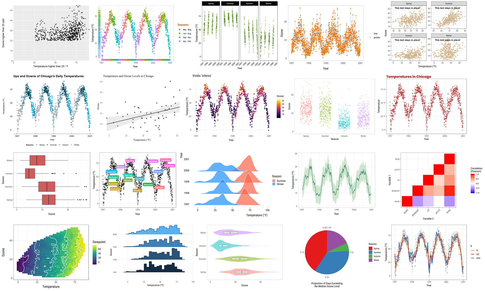{width=100%}

[Quelques graphiques `ggplot2` (C. Scherer, *A ggplot2 tutorial for beautiful plotting in R*)]{.legende}
:::
::::

::: fragment
::: remarque
Un graphique est souvent **la première vérification** d'une analyse : il montre les valeurs aberrantes, les `NA`, les groupes mal codés, les distributions bizarres, que les moyennes et les tests cachent. Un assistant d'IA écrit le code d'un graphique en une seconde ; **lire** le graphique, et voir ce qu'il ne montre pas, reste votre travail.
:::
:::

# Les graphiques de R de base {.section-ul data-numero="2" background-color="#E30513"}

## La fonction `plot()`

`plot()` choisit le graphique selon le **type** de ce qu'on lui donne :

```{r}
#| fig-width: 11
#| fig-height: 3.6
#| out-width: "100%"
par(mfrow = c(1, 4))                      # 4 graphiques côte à côte
plot(diamonds$clarity)                    # un facteur : barplot des effectifs
plot(diamonds$x[1:90])                    # un vecteur numérique : valeur selon la position
plot(diamonds$x[1:50], diamonds$y[1:50])  # deux numériques : nuage de points
plot(diamonds$clarity, diamonds$price)    # facteur + numérique : boxplots
```

[`diamonds` (inclus dans `ggplot2`) : prix, poids (`carat`), taille, couleur et pureté (`clarity`) de 53 940 diamants.]{.legende}

## Les arguments de `plot()`

:::: columns
::: {.column width="45%"}
```{r}
#| eval: false
x <- 1:10
y <- c(2, 4, 3, 1, 2, 3, 4, 4, 2, 1)
plot(x = x, y = y, type = "l", col = "red",
     main = "Une courbe", xlab = "Temps",
     ylab = "Valeur")
```

```{r}
#| echo: false
#| out-width: "100%"
#| fig-width: 5
#| fig-height: 3.4
x <- 1:10
y <- c(2, 4, 3, 1, 2, 3, 4, 4, 2, 1)
par(mar = c(4, 4, 2, 1))
plot(x = x, y = y, type = "l", col = "red", main = "Une courbe", xlab = "Temps", ylab = "Valeur")
```
:::

::: {.column width="55%"}
| Argument | Rôle |
|---|---|
| `x`, `y` | les valeurs ; ou la formule `plot(y ~ x)` |
| `type` | `"p"` points, `"l"` lignes, `"b"` les deux |
| `main`, `xlab`, `ylab` | titre, titres des axes |
| `xlim`, `ylim` | limites des axes : `xlim = c(1, 3)` |
| `col` | couleur |
| `pch`, `lty` | forme des points, type de ligne |

Toutes les options : `help(plot)`, `help(par)`
:::
::::

## Ajouter des couches : `lines()`, `points()`, `legend()`

:::: columns
::: {.column width="50%"}
```{r}
#| eval: false
z <- c(4, 3, 5, 5, 3, 4, 3, 5, 4, 3)
plot(x, y, type = "l", col = "red",
     ylim = c(1, 5), main = "2 variables")
lines(x, z, col = "blue", lty = 2)
legend("bottomleft", legend = c("y", "z"),
       col = c("red", "blue"), lty = c(1, 2))
```

- `plot()` **ouvre** un graphique
- `lines()`, `points()`, `abline()`, `text()`, `legend()` **ajoutent** sur le graphique ouvert
- Les limites sont fixées par le premier `plot()` : d'où `ylim`
:::

::: {.column width="50%"}
```{r}
#| echo: false
#| out-width: "100%"
#| fig-width: 5
#| fig-height: 4
z <- c(4, 3, 5, 5, 3, 4, 3, 5, 4, 3)
par(mar = c(4, 4, 2, 1))
plot(x, y, type = "l", col = "red", ylim = c(1, 5), main = "2 variables")
lines(x, z, col = "blue", lty = 2)
legend("bottomleft", legend = c("y", "z"), col = c("red", "blue"), lty = c(1, 2))
```
:::
::::

## Histogramme, barplot, boxplot, heatmap

```{r}
#| fig-width: 12
#| fig-height: 3.8
#| out-width: "100%"
par(mfrow = c(1, 4))
hist(iris$Sepal.Length, main = "hist()")              # distribution d'un numérique
barplot(table(diamonds$clarity), main = "barplot()")  # hauteurs déjà calculées (effectifs)
boxplot(Sepal.Length ~ Species, data = iris, main = "boxplot()")
image(cor(mtcars), main = "image()")                  # une matrice en couleurs
```

[`iris` : 4 mesures de fleurs (mm) pour 150 iris de 3 espèces (Fisher, 1936). `mtcars` : 11 caractéristiques de 32 voitures.]{.legende}

## Sauvegarder un graphique

```{r}
#| eval: false
# 1. ouvrir un fichier graphique : png(), jpeg(), tiff(), pdf(), svg()
png("figures/mon_graphique.png", width = 1600, height = 1200, res = 200)

# 2. faire le graphique (il ne s'affiche pas : il s'écrit dans le fichier)
boxplot(Sepal.Length ~ Species, data = iris)

# 3. fermer le fichier
dev.off()
```

- Oublier `dev.off()` : le fichier reste **vide** ou incomplet, et les graphiques suivants s'y écrivent aussi
- `pdf()` peut contenir **plusieurs pages** : un graphique par page jusqu'au `dev.off()`
- Dans RStudio : onglet *Plots* > *Export*, pratique mais **pas reproductible**

## Piège : la légende écrite à la main

:::: columns
::: {.column width="52%"}
```{r}
#| eval: false
plot(iris$Petal.Length, iris$Petal.Width,
     col = iris$Species, pch = 19)
legend("topleft",
       legend = c("virginica", "versicolor",
                  "setosa"),
       col = 1:3, pch = 19)
```

::: fragment
- `col = iris$Species` : R utilise le **numéro** du niveau du facteur : setosa = 1 (noir), versicolor = 2 (rouge), virginica = 3 (vert)
- La légende, elle, est **un texte libre** : R ne vérifie pas qu'elle correspond aux couleurs
- **Aucun message**, et un graphique faux : les petites fleurs noires sont des *setosa*
:::
:::

::: {.column width="48%"}
```{r}
#| echo: false
#| out-width: "100%"
#| fig-width: 5
#| fig-height: 4.4
par(mar = c(4, 4, 1, 1))
plot(iris$Petal.Length, iris$Petal.Width, col = iris$Species, pch = 19)
legend("topleft", legend = c("virginica", "versicolor", "setosa"), col = 1:3, pch = 19)
```

::: fragment
Correction : `legend = levels(iris$Species)`. Avec `ggplot2`, la légende est **construite à partir des données** : ce piège disparaît.
:::
:::
::::

## À vous : quel graphique ? {.a-vous}

Sans exécuter, quel graphique produit chaque appel ?

```{r}
#| eval: false
plot(iris$Species)                           # 1
plot(iris$Sepal.Length)                      # 2
plot(iris$Sepal.Length, iris$Sepal.Width)    # 3
plot(iris$Species, iris$Sepal.Length)        # 4
hist(iris$Species)                           # 5
```

::: fragment
1. Un **barplot** des effectifs (50 par espèce)
2. Les 150 longueurs **selon leur position** dans le tableau (axe x : de 1 à 150)
3. Un **nuage de points** : largeur selon longueur
4. Trois **boxplots**, un par espèce
5. Une **erreur** : `'x' must be numeric`. Un histogramme découpe un axe **numérique** en intervalles
:::

# La grammaire de `ggplot2` {.section-ul data-numero="3" background-color="#E30513"}

## Une grammaire des graphiques

> *« In brief, the grammar tells us that a graphic maps the **data** to the **aesthetic attributes** (colour, shape, size) of **geometric objects** (points, lines, bars). »*
>
> H. Wickham, *ggplot2: Elegant Graphics for Data Analysis*

:::: columns
::: {.column width="50%"}
**Avantages**

- Une **grammaire** cohérente (L. Wilkinson, 2005) : les mêmes règles pour tous les graphiques
- Des couches qu'on **ajoute** une à une
- Légendes et axes construits **à partir des données**
- Fait partie du *tidyverse* : attend un tableau **rangé**
:::

::: {.column width="50%"}
**Limites**

- Graphiques en 3D
- Réseaux et graphes (voir `igraph`, module réseaux)
- Graphiques interactifs (voir `plotly`)
- Heatmaps annotées : plus simple avec `pheatmap` ou `ComplexHeatmap`
:::
::::

## Un graphique en trois ingrédients

```{r}
#| echo: false
#| results: asis
cat(code_annote(c("ggplot(" = NA, "data = fruit" = "① les données : un tableau",
                  ", " = NA, "mapping = aes(x = FRUIT, y = QUANTITE)" = "② le mapping : quelle colonne va sur quelle propriété visuelle",
                  ") +" = NA, " geom_col()" = "③ le geom : avec quelle forme dessiner"),
                couleurs = c("gris", "bleu", "gris", "vert", "gris", "rouge")))
```

::: fragment
- `ggplot()` crée le graphique **vide** ; chaque `+` **ajoute une couche**
- Le `+` **termine la ligne** : une ligne qui commence par `+` est une nouvelle commande, et R ne trace que la première partie
- Les autres couches sont **facultatives** : `stat`, `position`, `scale_*()`, `coord_*()`, `facet_*()`, `theme()`, `labs()`
:::

::: fragment
::: remarque
`ggplot2` est le package ; `ggplot()` est la fonction. Ne pas confondre le `+` de `ggplot2` (ajouter une couche) et le pipe `|>` (passer un résultat à la fonction suivante).
:::
:::

```{r}
#| include: false
# extrait de fruit.tsv : 6 fruits, dont le citron, en deux couleurs
fr <- fruit |> slice(c(1, 2, 3, 7, 9, 10))
cles_fr <- paste(fr$FRUIT, fr$COULEUR, sep = "-")
```

## Du tableau au graphique {auto-animate=true auto-animate-id="mapping"}

`ggplot(fruit, aes(x = FRUIT, y = QUANTITE, fill = COULEUR)) + geom_col()`

```{r}
#| echo: false
#| results: asis
cat(rangee(tableau(fr, cles = cles_fr, prefixe = "fr-", titre = "fruit.tsv (extrait)")))
```

Chaque **ligne** du tableau deviendra **une barre** ; chaque **colonne** peut être reliée à une propriété visuelle.

## Du tableau au graphique {auto-animate=true auto-animate-id="mapping"}

`ggplot(fruit, aes(x = FRUIT, y = QUANTITE, fill = COULEUR)) + geom_col()`

:::: columns
::: {.column width="45%"}
```{r}
#| echo: false
#| results: asis
noms <- c("x = FRUIT", "y = QUANTITE", "fill = COULEUR")
t_map <- tableau(setNames(fr, noms), cles = cles_fr, prefixe = "fr-", cols_hl = noms, titre = "le mapping")
cat(rangee(garder_ids(t_map, c("FRUIT", "QUANTITE", "COULEUR"), noms)))
```
:::

::: {.column width="55%"}
::: fragment
```{r}
#| echo: false
#| out-width: "100%"
#| fig-width: 6
#| fig-height: 4.2
ggplot(fr, aes(x = FRUIT, y = QUANTITE, fill = COULEUR)) +
  geom_col() + scale_fill_manual(values = couleurs_fruits)
```
:::
:::
::::

::: fragment
`aes()` répond à **quoi** : quelle colonne sur quel axe, quelle couleur. Le geom répond à **comment** : des barres, des points, des lignes.
:::

## Les *aesthetics*

Les propriétés visuelles qu'on peut relier à une colonne, dans `aes()` :

| *Aesthetic* | Propriété | Geoms |
|---|---|---|
| `x`, `y` | position | tous |
| `color` (ou `colour`) | couleur du contour, des points, des lignes | tous |
| `fill` | couleur de **remplissage** | barres, boxplots, surfaces |
| `size`, `linewidth` | taille des points, épaisseur des lignes | points, lignes |
| `shape` | forme des points | points |
| `alpha` | transparence (de 0 à 1) | tous |
| `group` | quelles lignes forment **un même objet** (une courbe) | lignes, boxplots |
| `label` | le texte affiché | `geom_text()`, `geom_label()` |

::: remarque
Une barre a un contour (`color`) **et** un intérieur (`fill`) : `aes(color = COULEUR)` sur `geom_col()` ne colore que le bord.
:::

## *Mapping* ou *setting* ?

:::: columns
::: {.column width="50%"}
```{r}
#| eval: false
ggplot(iris, aes(Sepal.Length, Sepal.Width)) +
  geom_point(aes(color = Species))
```

```{r}
#| echo: false
#| out-width: "92%"
#| fig-width: 5.4
#| fig-height: 3.6
ggplot(iris, aes(Sepal.Length, Sepal.Width)) +
  geom_point(aes(color = Species), size = 2) + ggtitle("Mapping")
```

**Mapping**, dans `aes()` : la couleur **dépend d'une colonne**. `ggplot2` choisit les couleurs et crée une **légende**.
:::

::: {.column width="50%"}
```{r}
#| eval: false
ggplot(iris, aes(Sepal.Length, Sepal.Width)) +
  geom_point(color = "red")
```

```{r}
#| echo: false
#| out-width: "92%"
#| fig-width: 5.4
#| fig-height: 3.6
ggplot(iris, aes(Sepal.Length, Sepal.Width)) +
  geom_point(color = "red", size = 2) + ggtitle("Setting")
```

**Setting**, hors de `aes()` : une **valeur fixe** pour tous les points. Pas de légende.
:::
::::

## Piège : une constante dans `aes()`

:::: columns
::: {.column width="50%"}
```{r}
#| eval: false
ggplot(iris, aes(Sepal.Length, Sepal.Width)) +
  geom_point(aes(color = "blue"))
```

Que va-t-on obtenir ?
:::

::: {.column width="50%"}
::: fragment
```{r}
#| echo: false
#| out-width: "100%"
#| fig-width: 5.4
#| fig-height: 3.6
ggplot(iris, aes(Sepal.Length, Sepal.Width)) +
  geom_point(aes(color = "blue"), size = 2)
```
:::
:::
::::

::: fragment
- Dans `aes()`, `"blue"` n'est pas une couleur : c'est **une donnée**, une colonne qui vaudrait `"blue"` pour chaque ligne
- `ggplot2` lui attribue la **première couleur de sa palette** (un rouge saumon), et une légende « blue »
- Aucun message. Règle : une **colonne** dans `aes()`, une **valeur fixe** hors de `aes()`
:::

## Superposer des couches

```{r}
#| out-width: "62%"
#| fig-width: 7.5
#| fig-height: 4.2
ggplot(iris, aes(x = Sepal.Length, y = Sepal.Width, color = Species)) +
  geom_point(alpha = 0.6) +                   # couche 1 : les points
  geom_smooth(method = "lm", se = FALSE)      # couche 2 : une droite de régression par espèce
```

Les couches se dessinent **dans l'ordre** : la dernière passe par-dessus les autres.

## Où placer `aes()` ?

:::: columns
::: {.column width="50%"}
```{r}
#| eval: false
ggplot(iris, aes(Sepal.Length, Sepal.Width,
                 color = Species)) +
  geom_point() +
  geom_smooth(method = "lm", se = FALSE)
```

```{r}
#| echo: false
#| out-width: "90%"
#| fig-width: 5.4
#| fig-height: 3.4
ggplot(iris, aes(Sepal.Length, Sepal.Width, color = Species)) +
  geom_point() + geom_smooth(method = "lm", se = FALSE) + theme(legend.position = "none")
```

Dans `ggplot()` : l'*aesthetic* vaut pour **toutes les couches** : trois droites.
:::

::: {.column width="50%"}
```{r}
#| eval: false
ggplot(iris, aes(Sepal.Length, Sepal.Width)) +
  geom_point(aes(color = Species)) +
  geom_smooth(method = "lm", se = FALSE)
```

```{r}
#| echo: false
#| out-width: "90%"
#| fig-width: 5.4
#| fig-height: 3.4
ggplot(iris, aes(Sepal.Length, Sepal.Width)) +
  geom_point(aes(color = Species)) + geom_smooth(method = "lm", se = FALSE, color = "black") +
  theme(legend.position = "none")
```

Dans un geom : seulement **cette couche** : une seule droite, pour toutes les fleurs.
:::
::::

::: fragment
Les deux graphiques sont justes ; ils ne répondent pas à la même question. La pente globale est **négative**, les pentes par espèce **positives** (un paradoxe de Simpson, module 9).
:::

## Les *geoms*

Le choix du geom dépend du **nombre** et du **type** des variables à représenter :

| Variables | Geoms |
|---|---|
| 1 numérique | `geom_histogram()`, `geom_density()`, `geom_boxplot()` |
| 1 catégorielle | `geom_bar()` (compte les lignes) |
| 1 catégorielle + 1 numérique | `geom_boxplot()`, `geom_violin()`, `geom_jitter()`, `geom_col()` |
| 2 numériques | `geom_point()`, `geom_smooth()`, `geom_line()` (si x est ordonné : temps) |
| 2 catégorielles | `geom_count()`, `geom_tile()` |
| Repères | `geom_hline()`, `geom_vline()`, `geom_abline()`, `geom_text()` |

Tous les geoms et leurs *aesthetics* : l'aide-mémoire *Data visualization with ggplot2* (Posit).

## L'aide-mémoire

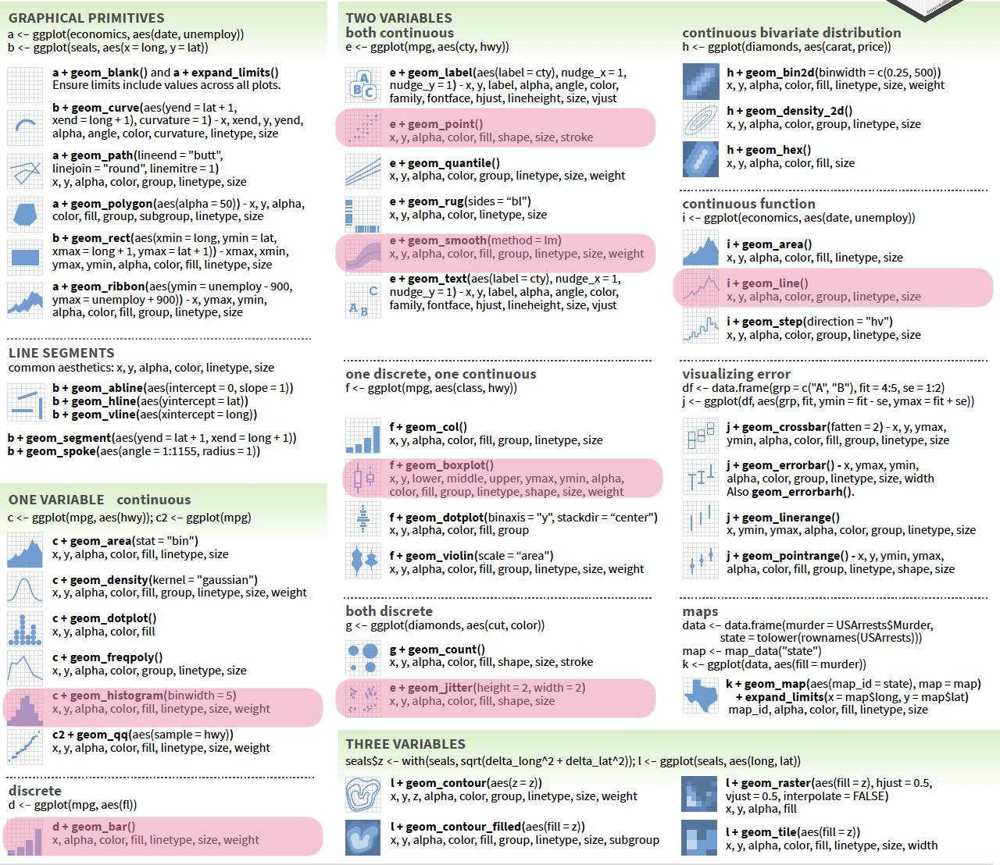{width=62% fig-align="center"}

[<https://rstudio.github.io/cheatsheets/data-visualization.pdf>]{.legende}

## À vous : prédire {.a-vous}

Sans exécuter : un graphique (lequel ?) ou une erreur ?

```{r}
#| eval: false
ggplot(iris, aes(Species, Sepal.Length)) + geom_point()                   # 1
ggplot(iris, aes(Sepal.Length)) + geom_point()                            # 2
ggplot(iris, aes(Sepal.Length, Sepal.Width)) + geom_point(color = Species) # 3
ggplot(iris, aes(Sepal.Length, Sepal.Width))                              # 4
ggplot(iris, aes(Sepal.Length, Sepal.Width))
  + geom_point()                                                          # 5
```

::: fragment
1. Trois **colonnes de points** superposés, une par espèce (d'où `geom_jitter()`)
2. Erreur : `geom_point() requires the following missing aesthetics: y`
3. Erreur : `object 'Species' not found`. Hors de `aes()`, R cherche une **variable** `Species`, pas une colonne
4. Un graphique **vide**, avec les axes : il n'y a aucune couche de geom
5. Un graphique vide, **puis** une erreur sur la ligne `+ geom_point()` : le `+` doit **terminer** la ligne
:::

# TP1 {.section-ul background-color="#E30513"}

# Ajuster un graphique {.section-ul data-numero="4" background-color="#E30513"}

## `geom_bar()` compte les lignes {auto-animate=true auto-animate-id="bar"}

`ggplot(fruit, aes(x = COULEUR)) + geom_bar()`

```{r}
#| echo: false
#| results: asis
fr_tri <- arrange(fr, COULEUR)
cles_tri <- paste(fr_tri$FRUIT, fr_tri$COULEUR, sep = "-")
cat(rangee(tableau(fr_tri, cles = cles_tri, prefixe = "fb-", cols_hl = "COULEUR", titre = "fruit (extrait), trié par couleur")))
```

On ne donne que `x` : la hauteur de chaque barre est **calculée** par `geom_bar()`.

## `geom_bar()` compte les lignes {auto-animate=true auto-animate-id="bar"}

`ggplot(fruit, aes(x = COULEUR)) + geom_bar()`

:::: columns
::: {.column width="58%"}
```{r}
#| echo: false
#| results: asis
cat(rangee(tableau(fr_tri, cles = cles_tri, prefixe = "fb-", cols_hl = "COULEUR", titre = "6 lignes"),
           tableau(count(fr_tri, COULEUR), cle = NULL, prefixe = "fbc-", classe = "resume", titre = "stat = \"count\"")))
```
:::

::: {.column width="42%"}
```{r}
#| echo: false
#| out-width: "100%"
#| fig-width: 4.6
#| fig-height: 3.8
ggplot(fr, aes(x = COULEUR)) + geom_bar(fill = bleu)
```
:::
::::

Chaque geom a une **statistique** par défaut : `geom_bar()` utilise `stat = "count"`, `geom_histogram()` `stat = "bin"`, `geom_boxplot()` `stat = "boxplot"`, `geom_point()` `stat = "identity"` (les valeurs telles quelles).

## `geom_col()` : la hauteur est dans les données

:::: columns
::: {.column width="50%"}
```{r}
#| eval: false
ggplot(fruit, aes(x = FRUIT, y = QUANTITE)) +
  geom_col()

# équivalent (forme des anciens scripts) :
ggplot(fruit, aes(x = FRUIT, y = QUANTITE)) +
  geom_bar(stat = "identity")
```

- `geom_bar()` : **une** variable, il compte
- `geom_col()` : `x` **et** `y`, il trace `y` tel quel
- `geom_bar(aes(x, y))` sans `stat = "identity"` : erreur `must only have an x or y aesthetic`
:::

::: {.column width="50%"}
```{r}
#| echo: false
#| out-width: "100%"
#| fig-width: 6
#| fig-height: 4.4
ggplot(fruit, aes(x = FRUIT, y = QUANTITE)) + geom_col(fill = bleu) +
  theme(axis.text.x = element_text(angle = 45, hjust = 1))
```
:::
::::

## Piège : plusieurs lignes pour une même barre {auto-animate=true auto-animate-id="citron"}

`ggplot(fruit, aes(x = FRUIT, y = QUANTITE)) + geom_col()`

```{r}
#| echo: false
#| results: asis
cit <- which(fr$FRUIT == "Citron")
cat(rangee(tableau(fr, cles = cles_fr, prefixe = "fc-", cols_hl = "QUANTITE", lignes_hl = cit, titre = "fruit (extrait)")))
```

Quelle sera la hauteur de la barre « Citron » ?

## Piège : plusieurs lignes pour une même barre {auto-animate=true auto-animate-id="citron"}

`ggplot(fruit, aes(x = FRUIT, y = QUANTITE)) + geom_col()`

:::: columns
::: {.column width="45%"}
```{r}
#| echo: false
#| results: asis
cat(rangee(tableau(fr, cles = cles_fr, prefixe = "fc-", cols_hl = "QUANTITE", lignes_hl = cit, titre = "2 lignes Citron")))
```
:::

::: {.column width="55%"}
```{r}
#| echo: false
#| out-width: "100%"
#| fig-width: 5.6
#| fig-height: 3
ggplot(fr, aes(x = FRUIT, y = QUANTITE)) + geom_col(fill = bleu, color = "white")
```
:::
::::

- `geom_col()` **empile** les lignes de même `x` : la barre vaut 9 + 8 = **17**, la **somme**. Aucun message
- Pour une **moyenne**, la calculer d'abord : `summarise(moy = mean(QUANTITE), .by = FRUIT)`
- Ici, le trait blanc trahit l'empilement ; sans contour, rien ne se voit

## Les positions : `stack`, `dodge`, `fill`

```{r}
#| echo: false
#| fig-width: 13
#| fig-height: 4.2
#| out-width: "100%"
base <- ggplot(fruit, aes(COULEUR, QUANTITE, fill = FRUIT)) + theme(legend.position = "none")
(base + geom_col(position = "stack") + ggtitle('position = "stack" (défaut)')) +
  (base + geom_col(position = "dodge") + ggtitle('"dodge" : côte à côte')) +
  (base + geom_col(position = "fill") + ggtitle('"fill" : proportions') + labs(y = "proportion"))
```

```{r}
#| eval: false
ggplot(fruit, aes(COULEUR, QUANTITE, fill = FRUIT)) + geom_col(position = "dodge")
```

Avec `"fill"`, l'axe y ne montre plus des quantités mais des **proportions** (chaque barre vaut 1) : renommer l'axe.

## Résumer dans le graphique : `stat_summary()`

```{r}
#| out-width: "62%"
#| fig-width: 7.5
#| fig-height: 4.2
ggplot(iris, aes(x = Species, y = Sepal.Width)) +
  geom_jitter(width = 0.15, alpha = 0.4) +                           # toutes les fleurs
  stat_summary(fun = mean, geom = "point", color = "red", size = 5)  # moyenne par espèce
```

Montrer **les données et leur résumé** : c'est souvent le graphique le plus honnête.

## Les échelles : `scale_*()`

Une échelle contrôle **comment une valeur devient une propriété visuelle**, et l'axe ou la légende qui va avec.

:::: columns
::: {.column width="50%"}
```{r}
#| eval: false
ggplot(fruit, aes(FRUIT, QUANTITE,
                  fill = COULEUR)) +
  geom_col()
```

```{r}
#| echo: false
#| out-width: "100%"
#| fig-width: 6
#| fig-height: 3.4
ggplot(fruit, aes(FRUIT, QUANTITE, fill = COULEUR)) + geom_col() +
  theme(axis.text.x = element_text(angle = 45, hjust = 1))
```

::: fragment
`ggplot2` ne lit pas le **contenu** : « Jaune » reçoit la première couleur de la palette (rouge saumon), « Rouge » un bleu.
:::
:::

::: {.column width="50%"}
::: fragment
```{r}
#| eval: false
... + scale_fill_manual(values = c(
  Jaune = "gold", Orange = "orange",
  Rouge = "red", Vert = "green3"))
```

```{r}
#| echo: false
#| out-width: "100%"
#| fig-width: 6
#| fig-height: 3.4
ggplot(fruit, aes(FRUIT, QUANTITE, fill = COULEUR)) + geom_col() +
  scale_fill_manual(values = c(Jaune = "gold", Orange = "orange", Rouge = "red", Vert = "green3")) +
  theme(axis.text.x = element_text(angle = 45, hjust = 1))
```

Un vecteur **nommé** : chaque catégorie reçoit sa couleur, quel que soit l'ordre.
:::
:::
::::

## Les familles d'échelles

| Échelle | Usage |
|---|---|
| `scale_color_manual()`, `scale_fill_manual()` | couleurs choisies à la main (vecteur nommé) |
| `scale_color_viridis_d()`, `scale_fill_brewer()` | palettes prêtes à l'emploi, lisibles par les **daltoniens** |
| `scale_color_gradient(low, high)` | une variable **continue** : un dégradé |
| `scale_color_gradient2(low, mid, high, midpoint)` | dégradé **divergent** (log2 *fold change*, corrélations) |
| `scale_x_continuous(breaks = )`, `scale_y_continuous(labels = )` | graduations, étiquettes des axes |
| `scale_x_log10()`, `scale_y_log10()` | axe logarithmique |
| `scale_x_discrete(limits = )` | **ordre** et sélection des catégories |

Le nom se lit : `scale_` + *aesthetic* + `_` + type d'échelle.

## Piège : `limits` retire des données

Les notes de l'examen E2, sur 100. On veut « zoomer » sur la partie haute :

```{r}
#| include: false
e2 <- notes_long |> filter(Type == "E2")
b <- ggplot(e2, aes(x = Type, y = Note)) + geom_boxplot(width = 0.4) + labs(x = NULL)
med_tout <- median(e2$Note); med_50 <- median(e2$Note[e2$Note >= 50]); n_out <- sum(e2$Note < 50)
```

```{r}
#| echo: false
#| fig-width: 13
#| fig-height: 3.8
#| out-width: "100%"
(b + ggtitle("Toutes les notes")) +
  (b + scale_y_continuous(limits = c(50, 100)) + ggtitle("scale_y_continuous(limits = )")) +
  (b + coord_cartesian(ylim = c(50, 100)) + ggtitle("coord_cartesian(ylim = )"))
```

::: fragment
- `limits` dans une échelle **supprime** les `r n_out` notes sous 50 **avant** de calculer le boxplot : la médiane passe de `r med_tout` à `r round(med_50, 2)`. Seul un *warning* le signale : « Removed `r n_out` rows containing non-finite outside the scale range »
- `coord_cartesian()` **zoome** : toutes les données sont gardées, le boxplot est juste
- Même piège avec `xlim()`, `ylim()` : ce sont des raccourcis pour `limits`
:::

## Les systèmes de coordonnées

```{r}
#| echo: false
#| fig-width: 13
#| fig-height: 3.8
#| out-width: "100%"
g <- ggplot(iris, aes(Species, Sepal.Length)) + geom_boxplot(fill = bleu, alpha = 0.5)
(g + ggtitle("défaut")) + (g + coord_flip() + ggtitle("+ coord_flip()")) +
  (g + coord_cartesian(ylim = c(5, 6)) + ggtitle("+ coord_cartesian(ylim = )"))
```

- `coord_cartesian(xlim, ylim)` : **zoomer** sans retirer de données
- `coord_flip()` : échanger x et y (étiquettes longues : on peut aussi écrire `aes(y = categorie)`)
- `coord_fixed()` : même échelle sur les deux axes (un nuage de points d'une mesure contre elle-même)

## Les facettes

Un graphique par **sous-ensemble** des données :

:::: columns
::: {.column width="40%"}
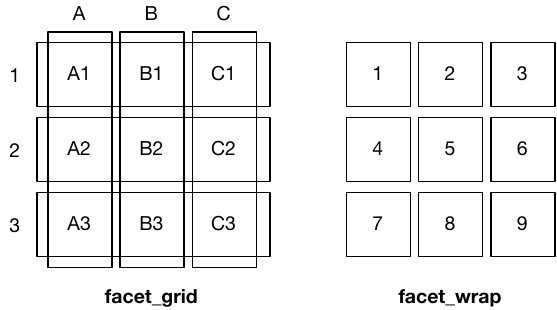{width=100%}

- `facet_wrap(~ var)` : un panneau par valeur, qui passe à la ligne
- `facet_grid(lignes ~ colonnes)` : une grille selon deux variables
- `scales = "free_y"` : un axe y propre à chaque panneau ; **attention** aux comparaisons entre panneaux
:::

::: {.column width="60%"}
```{r}
#| out-width: "100%"
#| fig-width: 7.5
#| fig-height: 3.2
ggplot(iris, aes(Sepal.Length, Sepal.Width)) +
  geom_point() +
  facet_wrap(~ Species)
```

```{r}
#| eval: false
ggplot(diamonds, aes(carat, price)) +
  geom_point() + facet_grid(cut ~ color)
```
:::
::::

## Les thèmes

```{r}
#| echo: false
#| fig-width: 13
#| fig-height: 4.6
#| out-width: "92%"
d <- ggplot(iris, aes(Sepal.Length, Sepal.Width, color = Species)) + geom_point() + theme_grey() +
  theme(legend.position = "none")
(d + theme_grey() + theme(legend.position = "none") + ggtitle("theme_grey() (défaut)")) +
  (d + theme_bw() + theme(legend.position = "none") + ggtitle("+ theme_bw()")) +
  (d + theme_classic() + theme(legend.position = "none") + ggtitle("+ theme_classic()")) +
  (d + theme_minimal() + theme(legend.position = "none") + ggtitle("+ theme_minimal()")) +
  plot_layout(ncol = 4)
```

Le thème change l'**apparence** (fond, grille, polices), jamais les données. `theme_set(theme_bw())` en début de script : pour tous les graphiques.

## Titres, légendes, sauvegarde

```{r}
#| eval: false
ggplot(iris, aes(Sepal.Length, Sepal.Width, color = Species)) +
  geom_point() +
  labs(title = "Sépales des iris", x = "Longueur (cm)", y = "Largeur (cm)",
       color = "Espèce", caption = "Données : Fisher (1936)") +  # un titre par aesthetic
  theme_bw() +
  theme(legend.position = "bottom",                                # "none" : pas de légende
        axis.text.x = element_text(angle = 90, hjust = 1))         # étiquettes verticales

ggsave("figures/iris.png", width = 16, height = 10, units = "cm", dpi = 300)  # dernier graphique
ggsave("figures/iris.pdf", plot = p, width = 16, height = 10, units = "cm")
```

- `labs()` : un titre pour chaque *aesthetic* utilisé (`x`, `y`, `color`, `fill`…) ; **toujours** les unités
- `ggsave()` : l'extension choisit le format ; `width`, `height` et `dpi` fixent la **taille réelle** dans l'article
- Un graphique `ggplot2` est un **objet** : `p <- ggplot(...)`, puis `p + theme_bw()`, `ggsave(plot = p)`

## À vous : *limits* ou zoom ? {.a-vous}

Les tailles de 50 cellules, dont 3 très grosses (> 200 µm). On écrit :

```{r}
#| eval: false
ggplot(cellules, aes(x = lignee, y = taille)) +
  geom_boxplot() +
  ylim(0, 100)
```

1. Que deviennent les 3 grosses cellules ?
2. La médiane affichée est-elle celle des 50 cellules ?
3. Comment voir le détail sous 100 µm **sans** changer les boxplots ?

::: fragment
1. Elles sont **retirées des données** (`ylim()` = `scale_y_continuous(limits = )`), avec un simple *warning* `Removed 3 rows`
2. Non : médiane, quartiles et moustaches sont calculés sur les **47** restantes
3. `coord_cartesian(ylim = c(0, 100))` : les 3 points sortent du cadre, mais comptent dans le calcul
:::

# Préparer les données {.section-ul data-numero="5" background-color="#E30513"}

```{r}
#| include: false
# 3 étudiants, 3 évaluations : le format de grades.tsv
nl <- notes |> slice(1:3) |> select(ID_etu, D1, D2, E1)
nl_long <- nl |> pivot_longer(-ID_etu, names_to = "Type", values_to = "Note")
ids_large <- cbind(paste0("gl-id-", nl$ID_etu), matrix(paste0("gl-", rep(nl$ID_etu, 3), "-", rep(c("D1", "D2", "E1"), each = 3)), ncol = 3))
ids_long <- cbind(paste0("gl-id-", nl_long$ID_etu, c("", "-b", "-c")),  # un seul data-id par cellule d'origine
                  paste0("gl-t-", seq_len(9)), paste0("gl-", nl_long$ID_etu, "-", nl_long$Type))
```

## `ggplot2` attend le format long {auto-animate=true auto-animate-id="long"}

Un boxplot des notes **par type d'évaluation** : quelle colonne mettre en `x` ?

```{r}
#| echo: false
#| results: asis
cat(rangee(tableau(nl, ids = ids_large, cols_hl = c("D1", "D2", "E1"), titre = "grades.tsv : une colonne par évaluation")))
```

::: fragment
Aucune : le type d'évaluation est **dans les noms de colonnes**. Il faut une colonne `Type` et une colonne `Note`.
:::

## `ggplot2` attend le format long {auto-animate=true auto-animate-id="long"}

```{r}
#| echo: false
#| results: asis
cat(rangee(tableau(nl_long, ids = ids_long, cols_hl = "Note", cols_new = "Type", titre = "une ligne par étudiant × évaluation")))
```

::: bandeau-code
```{r}
#| eval: false
notes_long <- notes |> pivot_longer(D1:E2, names_to = "Type", values_to = "Note")
ggplot(notes_long, aes(x = Type, y = Note)) + geom_boxplot()
```
:::

## Le format long, puis le graphique

```{r}
#| out-width: "70%"
#| fig-width: 9
#| fig-height: 4
notes_long <- notes |> pivot_longer(D1:E2, names_to = "Type", values_to = "Note")
ggplot(notes_long, aes(x = Type, y = Note, fill = Cohorte)) +
  geom_boxplot() +
  facet_wrap(~ Annee)
```

Une colonne par *aesthetic* : `Type` en x, `Note` en y, `Cohorte` en couleur, `Annee` en facettes.

## L'ordre des catégories

Les évaluations ont eu lieu dans l'ordre D1, D2, **E1**, D3, D4, **E2**. Sur le graphique, elles sont dans l'ordre **alphabétique** :

```{r}
#| echo: false
#| fig-width: 13
#| fig-height: 3.6
#| out-width: "100%"
p_ordre <- ggplot(notes_long, aes(x = Type, y = Note)) + geom_boxplot(fill = bleu, alpha = 0.5) + labs(x = NULL)
(p_ordre + ggtitle("Ordre alphabétique (texte)")) +
  (ggplot(mutate(notes_long, Type = fct_inorder(Type)), aes(x = Type, y = Note)) +
     geom_boxplot(fill = bleu, alpha = 0.5) + labs(x = NULL) + ggtitle("fct_inorder(Type) : ordre des colonnes"))
```

| Fonction (`forcats`) | Ordre obtenu |
|---|---|
| `factor(x, levels = c("D1", "D2", "E1"))` | celui qu'on écrit |
| `fct_inorder(x)` | ordre d'apparition dans les données |
| `fct_infreq(x)` | du plus fréquent au moins fréquent (`geom_bar()` trié) |
| `fct_reorder(x, y)` | selon la médiane de `y` (boxplots ou barres triés) |

## Les lignes : l'*aesthetic* `group`

L'évolution de 3 prénoms de garçons (`babynames`) :

```{r}
#| include: false
trois <- bebes |> filter(sex == "M", name %in% c("John", "William", "Garrett"))
```

:::: columns
::: {.column width="50%"}
```{r}
#| eval: false
trois |>
  ggplot(aes(year, n)) + geom_line()
```

```{r}
#| echo: false
#| out-width: "100%"
#| fig-width: 5.6
#| fig-height: 3.6
ggplot(trois, aes(year, n)) + geom_line()
```

::: fragment
Une **seule** ligne relie toutes les lignes du tableau dans l'ordre des x : elle zigzague d'un prénom à l'autre chaque année.
:::
:::

::: {.column width="50%"}
::: fragment
```{r}
#| eval: false
trois |>
  ggplot(aes(year, n, color = name)) + geom_line()
```

```{r}
#| echo: false
#| out-width: "100%"
#| fig-width: 5.6
#| fig-height: 3.6
ggplot(trois, aes(year, n, color = name)) + geom_line()
```

`color` (ou `group = name`) découpe les données : **une ligne par prénom**.
:::
:::
::::

## Les `NA` dans un graphique

```{r}
#| warning: true
ggplot(notes_long, aes(Type, Note)) + geom_boxplot()
```

- Une note `D2` manque : `ggplot2` la **retire** et prévient par un *warning*, sans s'arrêter
- Dans un rapport Quarto, les *warnings* sont souvent masqués : comptez les `NA` **avant** de tracer
- Dans une colonne **catégorielle**, `NA` devient une catégorie à part, grise, dans la légende : souvent le signe d'une jointure ratée ou d'une valeur mal saisie

::: remarque
Même logique pour les catégories mal saisies (module 5) : `"Male"` et `"male "` font **deux** couleurs dans la légende. Un graphique est souvent le moyen le plus rapide de les repérer.
:::

## À vous : quel code a produit ce graphique ? {.a-vous}

```{r}
#| echo: false
#| out-width: "60%"
#| fig-width: 8
#| fig-height: 3.8
notes_long |>
  left_join(sexes, by = "ID_etu") |>
  ggplot(aes(x = factor(Annee), y = Note, fill = Sex)) +
  geom_boxplot() +
  labs(x = "Année", fill = "Sexe")
```

Écrivez le code, à partir de `notes` et `sexes` (une ligne par étudiant : `ID_etu`, `Sex`).

::: fragment
```{r}
#| eval: false
notes |>
  pivot_longer(D1:E2, names_to = "Type", values_to = "Note") |>  # une ligne par note
  left_join(sexes, by = "ID_etu") |>                               # ajouter le sexe
  ggplot(aes(x = factor(Annee), y = Note, fill = Sex)) +           # factor() : 3 groupes
  geom_boxplot() +
  labs(x = "Année", fill = "Sexe")
```
:::

# TP2 {.section-ul background-color="#E30513"}

# Graphiques de la bioinformatique {.section-ul data-numero="6" background-color="#E30513"}

## Le boxplot

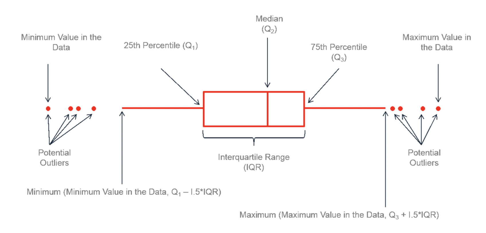{width=78% fig-align="center"}

- La boîte : **50 %** des valeurs (du 1^er^ au 3^e^ quartile) ; le trait : la **médiane**
- Les moustaches : jusqu'à 1.5 × IQR ; au-delà, les points atypiques
- Il ne montre **pas l'effectif** : 4 points et 400 points donnent la même boîte. Ajoutez les points (`geom_jitter()`)

## Les limites du barplot

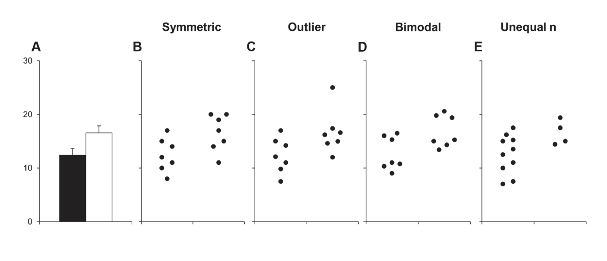{width=95% fig-align="center"}

Les cinq jeux de données B à E donnent **le même barplot** A (moyenne ± erreur type) : symétrique, valeur aberrante, bimodal, effectifs inégaux.

[Weissgerber *et al.* (2015). *Beyond bar and line graphs: time for a new data presentation paradigm*. PLoS Biology 13(4): e1002128.]{.legende}

::: remarque
Un barplot convient aux **comptes** et aux **totaux**. Pour une variable continue mesurée sur quelques réplicats, montrez **les points**.
:::

## L'histogramme : la largeur des classes

```{r}
#| echo: false
#| fig-width: 13
#| fig-height: 3.6
#| out-width: "100%"
h <- ggplot(e2, aes(Note)) + labs(y = "effectif")
(h + geom_histogram(bins = 5, fill = bleu) + ggtitle("bins = 5")) +
  (h + geom_histogram(binwidth = 5, fill = bleu) + ggtitle("binwidth = 5")) +
  (h + geom_density(fill = bleu, alpha = 0.5) + ggtitle("geom_density()"))
```

- Les notes de E2 : avec 5 classes, on ne voit pas le groupe d'échecs ; avec des classes de 5 points, il apparaît
- `ggplot2` choisit 30 classes par défaut et le dit : `` `stat_bin()` using `bins = 30`. Pick better value `` : choisissez `bins` ou `binwidth`
- La densité lisse l'histogramme ; elle peut déborder hors des valeurs possibles (au-delà de 100)

## Les résultats d'une expression différentielle

```{r}
#| echo: false
de |> filter(gene %in% c("CRABP2", "ICAM1", "TSPAN6", "TNMD")) |> as.data.frame()
```

[`/home/public/visu/de_resultats.csv` : deux conditions, 3 réplicats chacune, `r format(nrow(de), big.mark = " ")` gènes. Produit par DESeq2 (module 9).]{.legende}

- `log2FoldChange` : l'**ampleur** du changement. +1 = deux fois plus exprimé, −1 = deux fois moins
- `pvalue`, `padj` : la **significativité** ; `padj` est corrigée pour les tests multiples (module 9)
- `padj` vaut `NA` pour les gènes **non testés** (trop peu exprimés) : ici, `r sum(is.na(de$padj))` gènes

## Le volcano plot

```{r}
#| include: false
de_v <- de |>
  filter(!is.na(padj)) |>
  mutate(statut = case_when(padj < 0.05 & log2FoldChange > 1  ~ "haut",
                            padj < 0.05 & log2FoldChange < -1 ~ "bas",
                            .default = "non significatif"))
top <- de_v |> filter(statut != "non significatif") |> slice_min(padj, n = 8)
```

:::: columns
::: {.column width="56%"}
```{r}
#| eval: false
de_v <- de |>
  filter(!is.na(padj)) |>
  mutate(statut = case_when(
    padj < 0.05 & log2FoldChange > 1  ~ "haut",
    padj < 0.05 & log2FoldChange < -1 ~ "bas",
    .default = "non significatif"))

ggplot(de_v, aes(x = log2FoldChange,
                 y = -log10(padj), color = statut)) +
  geom_point(alpha = 0.6) +
  geom_vline(xintercept = c(-1, 1), linetype = 2) +
  geom_hline(yintercept = -log10(0.05),
             linetype = 2) +
  geom_text_repel(data = top, aes(label = gene)) +
  scale_color_manual(values = c(
    haut = "red", bas = "blue",
    `non significatif` = "grey70"))
```
:::

::: {.column width="44%"}
```{r}
#| echo: false
#| out-width: "100%"
#| fig-width: 5.6
#| fig-height: 5
ggplot(de_v, aes(x = log2FoldChange, y = -log10(padj), color = statut)) +
  geom_point(alpha = 0.6) +
  geom_vline(xintercept = c(-1, 1), linetype = 2) +
  geom_hline(yintercept = -log10(0.05), linetype = 2) +
  geom_text_repel(data = top, aes(label = gene), color = "black", size = 4.5) +
  scale_color_manual(values = c(haut = "#E30513", bas = "#4A7FC1", `non significatif` = "grey70")) +
  theme(legend.position = "bottom") + labs(color = NULL)
```
:::
::::

## Lire un volcano plot

:::: columns
::: {.column width="55%"}
- **x** : log2 *fold change*. À droite : plus exprimé ; à gauche : moins exprimé
- **y** : −log10(`padj`). **Plus c'est haut, plus c'est significatif** : `padj` = 0.05 → 1.3 ; 0.001 → 3 ; 10^−20^ → 20
- En haut à droite et en haut à gauche : les gènes **à la fois** très changés et significatifs
- Les pointillés : des **seuils choisis** par l'analyste (ici |log2FC| > 1 et `padj` < 0.05). Les changer change la liste des gènes
:::

::: {.column width="45%"}
::: fragment
**Deux couches de données** : `geom_text_repel(data = top, ...)` n'utilise que les 8 gènes de `top`, sur le même graphique. `ggrepel` écarte les étiquettes pour qu'elles ne se chevauchent pas.
:::

::: fragment
::: remarque
« haut » : plus exprimé dans **quelle** condition ? Cela dépend du **niveau de référence** de la comparaison. Vérifiez sur un gène (TP3) ou lisez l'en-tête des résultats (module 9) avant d'écrire « induit ».
:::
:::
:::
::::

## La heatmap

:::: columns
::: {.column width="45%"}
```{r}
#| eval: false
library(pheatmap)
genes <- de |> slice_min(padj, n = 30) |>
  pull(gene)
m <- tpm |>
  filter(gene %in% genes) |>
  column_to_rownames("gene") |>
  as.matrix()
pheatmap(log2(m + 1), scale = "row")
```

- Une **matrice** : un gène par ligne, un échantillon par colonne
- `log2(m + 1)` : les TPM vont de 0 à 20 000 ; le `+ 1` évite `log2(0) = -Inf`
- `scale = "row"` : chaque gène centré-réduit. On compare les **échantillons** entre eux, gène par gène
- Les arbres : un **regroupement** des gènes et des échantillons qui se ressemblent
:::

::: {.column width="55%"}
```{r}
#| echo: false
#| out-width: "88%"
#| fig-width: 5.4
#| fig-height: 5.2
genes <- de |> slice_min(padj, n = 30) |> pull(gene)
m <- tpm |> filter(gene %in% genes) |> column_to_rownames("gene") |> as.matrix()
pheatmap::pheatmap(log2(m + 1), scale = "row", fontsize_row = 7, fontsize_col = 11)
```
:::
::::

## Sans `scale = "row"`

```{r}
#| echo: false
#| fig-width: 11
#| fig-height: 4.4
#| out-width: "92%"
p1 <- pheatmap::pheatmap(log2(m + 1), cluster_rows = FALSE, show_rownames = FALSE, main = "log2(TPM + 1)", silent = TRUE)
p2 <- pheatmap::pheatmap(log2(m + 1), scale = "row", cluster_rows = FALSE, show_rownames = FALSE, main = 'scale = "row"', silent = TRUE)
gridExtra::grid.arrange(p1$gtable, p2$gtable, ncol = 2)
```

- À gauche : la couleur montre surtout **quels gènes sont très exprimés**. Les différences entre conditions sont invisibles
- À droite : chaque gène est comparé à **sa propre moyenne** : les deux conditions se séparent
- Une heatmap sans légende des couleurs, ou sans dire si les lignes sont centrées, ne se lit pas

## D'autres graphiques de la bioinformatique

:::: columns
::: {.column width="33%"}
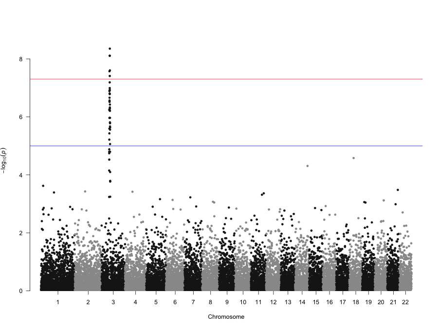{width=100%}

**Manhattan plot** : −log10(p) de chaque SNP le long du génome (études d'association, GWAS)
:::

::: {.column width="33%"}
```{r}
#| echo: false
#| out-width: "100%"
#| fig-width: 4.4
#| fig-height: 3.3
qq <- de |> filter(!is.na(pvalue)) |> arrange(pvalue) |>
  mutate(attendu = -log10(ppoints(n())), observe = -log10(pvalue))
ggplot(qq, aes(attendu, observe)) + geom_abline(color = "red") + geom_point(size = 0.8) +
  labs(x = "attendu sous H0 : −log10(p)", y = "observé : −log10(p)") + theme_minimal(base_size = 12)
```

**Q-Q plot** des p-values : sous H0, les points suivent la diagonale ; les gènes qui s'en écartent en haut sont les vrais signaux
:::

::: {.column width="33%"}
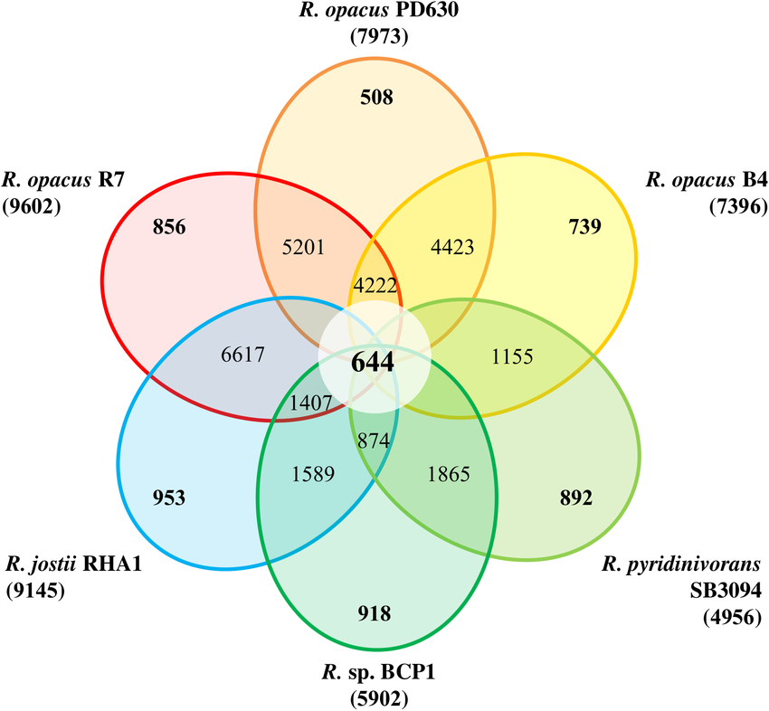{width=78%}

**Diagramme de Venn** (ou UpSet) : les gènes communs à plusieurs listes. Réseaux : module 10
:::
::::

# Bonnes pratiques {.section-ul background-color="#E30513"}

## Choisir le graphique

1. **Quelle est la question ?** Comparer des groupes, montrer une distribution, une relation, une évolution
2. **Choisissez le visuel** pour la question et le type de variables, pas pour l'effet
3. **Montrez les données** quand il y en a peu : des points plutôt qu'une barre
4. Donnez le **contexte** : titre, axes avec unités, légende, effectifs, source
5. **Simplifiez** : pas de 3D, pas d'ombres, pas de couleurs qui ne codent rien

## Les erreurs fréquentes

:::: columns
::: {.column width="50%"}
- Axes sans titre ou sans unités
- **Axe tronqué** : un barplot qui ne commence pas à 0
- Des parts qui ne font pas 100 % (*pie chart*)
- Un mauvais type de graphique pour les données
- *Cherry-picking* : ne montrer que les données qui arrangent
- Pas de titre, pas de légende
:::

::: {.column width="50%"}
- **Couleurs** : rouge et vert ensemble (≈ 8 % des hommes ne les distinguent pas) ; préférer `viridis` ou rouge/bleu
- Une **3D** inutile, qui déforme les hauteurs
- Plusieurs variables sans rapport sur un même graphique (deux axes y)
- **Échelles libres** entre facettes sans le signaler
:::
::::

## À vous : qu'est-ce qui ne va pas ? {.a-vous}

:::: columns
::: {.column width="50%"}
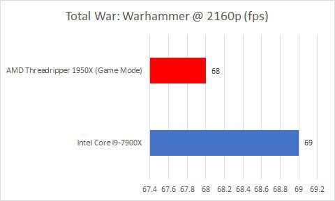{width=100%}

[<https://getdolphins.com/wp-content/uploads/2018/02/DG5UK_WUAAAVQe5.jpg>]{.legende}
:::

::: {.column width="50%"}
::: fragment
- L'axe des x commence à **67.4**, pas à 0 : 68 contre 69 images par seconde, une différence de 1.5 %, devient une barre **2.7 fois** plus longue
- Pour un barplot, la **longueur** de la barre est le message : l'axe doit partir de 0
- Pour des points ou des lignes, un axe qui ne part pas de 0 est acceptable, s'il est clairement gradué
:::
:::
::::

## À vous : qu'est-ce qui ne va pas ? {.a-vous}

:::: columns
::: {.column width="35%"}
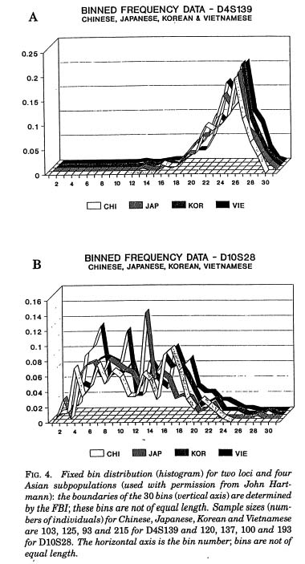{height=430px}
:::

::: {.column width="65%"}
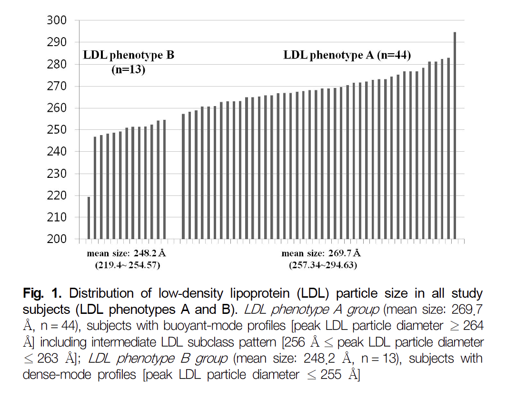{height=430px}
:::
::::

::: fragment
- À gauche : la **3D** n'ajoute aucune information ; les courbes se cachent les unes les autres
- À droite : une barre **par individu**, triée, sur un axe qui part de 200 : difficile de comparer les deux groupes. Des points par groupe (`geom_jitter()` + boxplot) diraient la même chose en un coup d'œil
:::

[K. Broman, *The top ten worst graphs* : <https://www.biostat.wisc.edu/~kbroman/topten_worstgraphs/>]{.legende}

## À vous : qu'est-ce qui ne va pas ? {.a-vous}

:::: columns
::: {.column width="50%"}
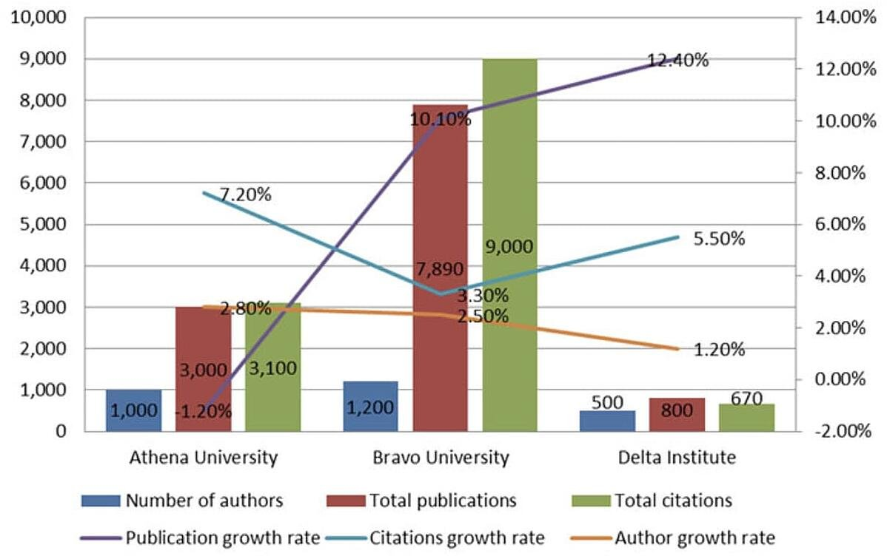{width=100%}
:::

::: {.column width="50%"}
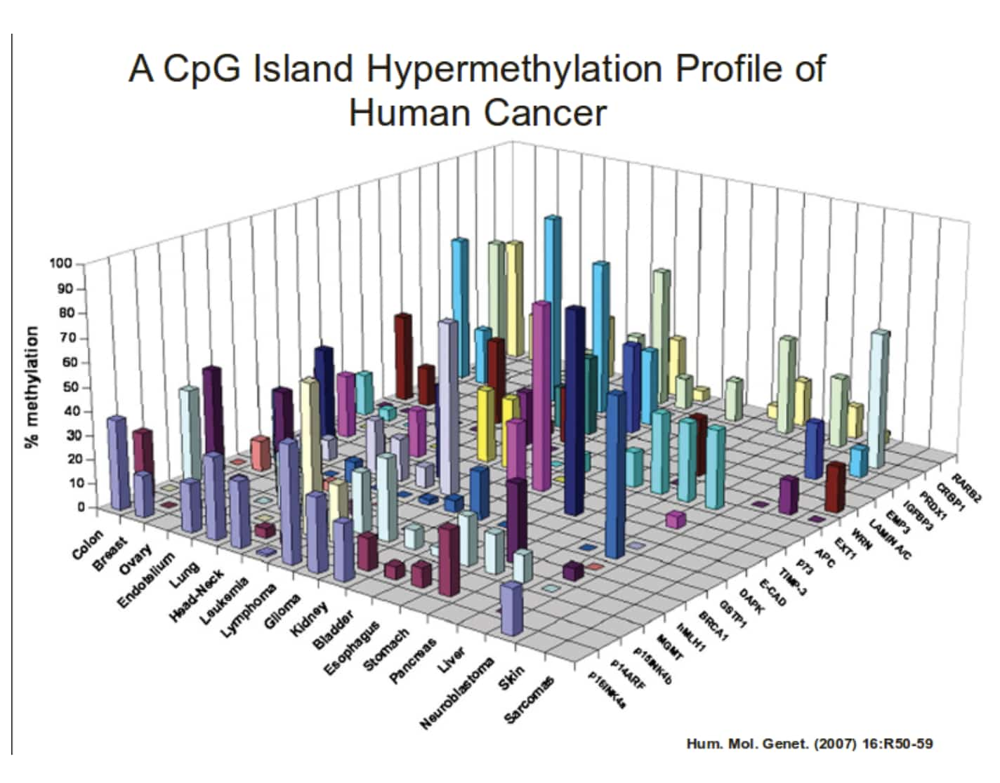{width=88%}
:::
::::

::: fragment
- À gauche : six variables sur un même visuel, avec **deux axes y** : on ne sait plus quelle barre ou quelle ligne lire sur quel axe
- À droite : un tableau tissu × gène en **barres 3D** : des barres en cachent d'autres. Une **heatmap** (couleur = % de méthylation) montrerait tout
:::

# TP3 {.section-ul background-color="#E30513"}

# Activité : auditer un script {.section-ul data-numero="7" background-color="#E30513"}

## Auditer un script `ggplot2` généré par IA {.audit}

> *« À partir de grades.tsv, compare les deux cohortes : (1) la distribution des notes de chaque évaluation, dans l'ordre du trimestre (D1, D2, E1, D3, D4, E2) ; (2) un barplot de la note moyenne de chaque cohorte. Les notes sont sur 100. »*

:::: columns
::: {.column width="64%"}
```{r}
#| eval: false
library(tidyverse)
# Script vérifié : s'exécute sans erreur.
notes <- read_tsv("/home/public/tidyverse/grades.tsv")

notes_long <- notes |>
  pivot_longer(D1:E2, names_to = "Type", values_to = "Note")

# 1. Distribution des notes par évaluation et par cohorte
ggplot(notes_long, aes(x = Type, y = Note, fill = Cohorte)) +
  geom_boxplot() +
  scale_y_continuous(limits = c(50, 100)) +   # les notes sont sur 100
  theme_bw()

# 2. Note moyenne par cohorte
ggplot(notes_long, aes(x = Cohorte, y = Note, fill = "steelblue")) +
  geom_col() +
  labs(y = "Note moyenne")
```
:::

::: {.column .donnees width="36%"}
[`grades.tsv` (premières lignes)]{.legende}

```{r}
#| echo: false
#| comment: ""
print(as.data.frame(head(select(notes, ID_etu, D1, E2, Annee, Cohorte), 4)), row.names = FALSE)
```

[Effectifs]{.legende}

```{r}
#| echo: false
#| comment: ""
cat(sprintf("%d étudiants, %d notes, %d NA", nrow(notes), nrow(notes_long), sum(is.na(notes_long$Note))))
```
:::
::::

## Auditer : la démarche {.audit}

**Le script s'exécute sans erreur. Au moins trois de ses graphiques ou de ses détails sont pourtant faux.**

::: {.demarche}
1. **Lire sans exécuter** : que fait réellement chaque ligne ? Lesquelles sont suspectes ?
2. **Vérifier dans RStudio** : lire **tous** les messages, les **axes** et les **légendes**, et refaire les calculs avec `summarise()`
3. **Corriger** et commenter chaque correction
:::

::: remarque
Indices : relisez la demande (l'**ordre** des évaluations, ce qu'est une **moyenne**), lisez les *warnings*, et regardez les valeurs sur l'axe y. Certaines lignes sont correctes : ne corrigez pas ce qui fonctionne.
:::

## Ressources

- *R for Data Science* (2^e^ éd., H. Wickham, M. Çetinkaya-Rundel, G. Grolemund) : <https://r4ds.hadley.nz>, chapitres 1, 9, 10 et 11 (visualisation)
- *ggplot2: Elegant Graphics for Data Analysis* (3^e^ éd., H. Wickham) : <https://ggplot2-book.org>
- *R Graphics Cookbook* (W. Chang) : <https://r-graphics.org>, une recette par graphique
- *Fundamentals of Data Visualization* (C. Wilke) : <https://clauswilke.com/dataviz/>, choisir et soigner un graphique
- Aide-mémoire `ggplot2` : <https://rstudio.github.io/cheatsheets/data-visualization.pdf>
- Galerie : <https://r-graph-gallery.com>, des centaines de graphiques avec leur code

Données : `iris` (Fisher, 1936), `diamonds` (package `ggplot2`), `babynames` (Social Security Administration, États-Unis ; package `babynames`, H. Wickham), notes anonymisées du cours (`grades.tsv`), résultats DESeq2 d'une expérience RNA-seq (`de_resultats.csv`, `tpm.csv`).
