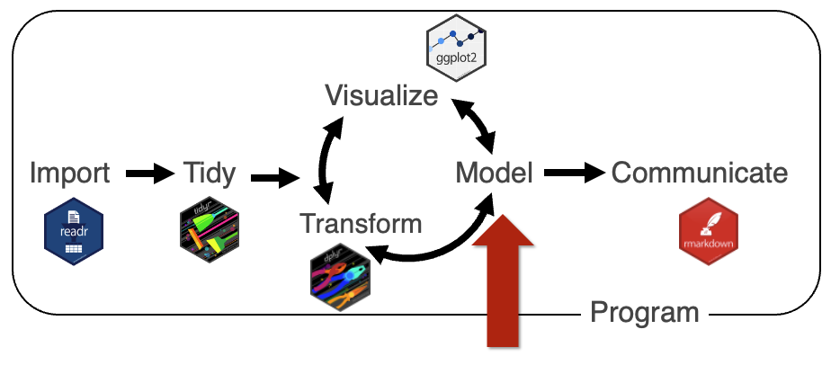
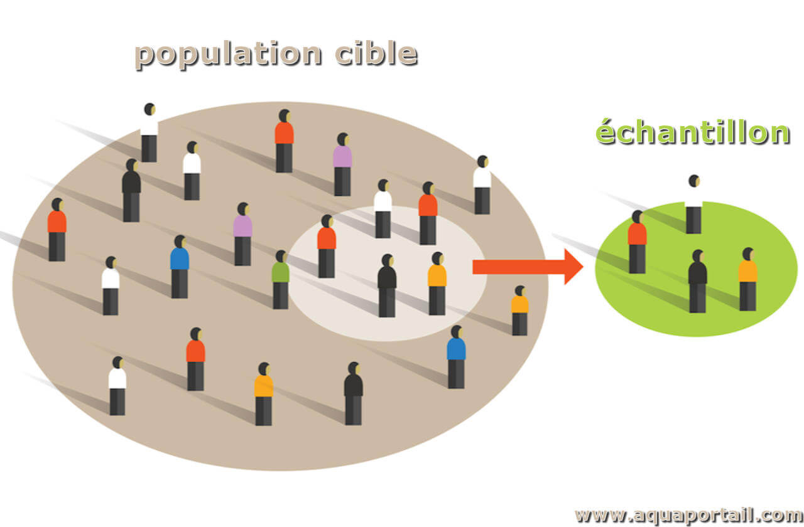

```{r setup, include=FALSE}
knitr::opts_chunk$set(echo = TRUE, collapse = TRUE, comment = "#>", fig.align = "center",
                      message = FALSE, warning = FALSE, dpi = 150,
                      fig.width = 8, fig.height = 4.2, out.width = "75%")
Sys.setenv(LANGUAGE = "en")  # messages d'erreur en anglais, comme sur la plupart des installations
options(width = 80, pillar.print_min = 6, show.signif.stars = FALSE)
suppressPackageStartupMessages({
  library(tidyverse)
  library(car)
  library(DESeq2)
})
theme_set(theme_minimal(base_size = 16))
source("_anim.R")  # tableaux en HTML (tableau(), rangee())
couleurs_especes <- c(Adelie = "#E30513", Chinstrap = "#FFC103", Gentoo = "#4A7FC1")

# copie locale de /home/public/stat/penguins.tsv
manchots <- read_tsv("data/penguins.tsv", show_col_types = FALSE)
adelie <- manchots |> filter(species == "Adelie", !is.na(sex))
```

# Introduction {.section-ul data-numero="1" background-color="#E30513"}

## Objectifs

Un somnifère, 10 patients, les heures de sommeil gagnées avec deux doses (`sleep`, W. S. Gosset, 1908) :

:::: columns
::: {.column width="50%"}
```{r}
t.test(extra ~ group, data = sleep)$p.value
```
« Pas de différence entre les doses. »
:::

::: {.column width="50%"}
::: fragment
```{r}
#| echo: false
sommeil <- sleep |> pivot_wider(names_from = group, values_from = extra, names_prefix = "dose_")
```
```{r}
t.test(sommeil$dose_2, sommeil$dose_1,
       paired = TRUE)$p.value
```
« La dose 2 fait mieux dormir. »
:::
:::
::::

::: fragment
**Mêmes données, deux conclusions.** R a exécuté les deux tests sans erreur ni message. Une seule réponse est juste, et R ne peut pas savoir laquelle.
:::

::: fragment
1. Décrire des données et **vérifier les conditions** d'un test
2. Formuler une hypothèse, lire une **p-value** et un **intervalle de confiance**
3. **Choisir** le test : t, Wilcoxon, apparié ou non, ANOVA
4. Ajuster et lire une **régression linéaire**
5. Comprendre les **tests multiples** et mener une analyse d'**expression différentielle**
:::

## Plan

1. Introduction
2. Décrire et vérifier
3. Tester une hypothèse → **TP1**
4. Comparer plusieurs groupes
5. La régression linéaire → **TP2**
6. Tests multiples et expression différentielle → **TP3**
7. Activité : auditer un script DESeq2 généré par IA

## Où en est-on ?

{width=70% fig-align="center"}

- Modules précédents : **importer, ranger, transformer** (`tidyverse`), **visualiser** (`ggplot2`)
- **Aujourd'hui : modéliser.** Passer de « je vois une différence sur le graphique » à « cette différence n'est probablement pas due au hasard », et dire **de combien**

## Échantillon et population

:::: columns
::: {.column width="50%"}

:::

::: {.column width="50%"}
- On mesure un **échantillon** : 8 souris, 4 lignées cellulaires, 344 manchots
- On veut conclure sur la **population** : toutes les souris de cette lignée, tous les manchots de l'archipel
- Un autre échantillon aurait donné d'autres valeurs

::: remarque
La statistique inférentielle **quantifie l'incertitude** de ce passage de l'échantillon à la population. Elle ne supprime pas cette incertitude.
:::
:::
::::

## Les données du jour

:::: columns
::: {.column width="45%"}
Les manchots de l'archipel Palmer (Antarctique), mesurés de 2007 à 2009 : 3 espèces, 344 individus.

[`/home/public/stat/penguins.tsv`]{style="color:#7FB069"}

```{r}
#| eval: false
manchots <- read_tsv("/home/public/stat/penguins.tsv")
```

[*penguins* se traduit par « manchots » : les pingouins vivent dans l'hémisphère nord.]{.legende}
:::

::: {.column width="55%"}
```{r}
glimpse(manchots, width = 52)
```
:::
::::

[Gorman, Williams et Fraser (2014), *PLoS ONE* ; package `palmerpenguins` (Horst, Hill et Gorman), inclus dans R depuis la version 4.5.]{.legende}

## La démarche

1. **Poser la question** avant de regarder les résultats : quels groupes, quelle variable, quel plan d'expérience ?
2. **Décrire et visualiser** : effectifs, moyennes, dispersion, valeurs manquantes, graphiques
3. **Vérifier les conditions** du test envisagé
4. **Tester** : une p-value
5. **Mesurer l'effet** : la différence et son intervalle de confiance
6. **Interpréter** : biologiquement, et avec les limites du plan d'expérience

::: fragment
::: remarque
R exécute **n'importe quel test sur n'importe quelles données**. Un assistant d'IA écrit `t.test()` en une seconde, mais il ne sait pas que vos patients sont appariés ni comment vos groupes sont codés. Le choix du test, la vérification des conditions et l'interprétation restent votre travail.
:::
:::

# Décrire et vérifier {.section-ul data-numero="2" background-color="#E30513"}

## Tendance centrale et dispersion

:::: columns
::: {.column width="50%"}
**Tendance centrale** : où sont les valeurs ?

| Mesure | R |
|---|---|
| Moyenne $\bar{x} = \frac{1}{n}\sum x_i$ | `mean(x)` |
| Médiane (valeur du milieu) | `median(x)` |

**Dispersion** : à quel point varient-elles ?

| Mesure | R |
|---|---|
| Variance, écart-type | `var(x)`, `sd(x)` |
| Étendue | `range(x)` |
| Intervalle interquartile (Q3 − Q1) | `IQR(x)` |
| Quantiles | `quantile(x)` |
:::

::: {.column width="50%"}
::: fragment
Sur les manchots, par espèce :

```{r}
manchots |>
  summarise(
    n   = n(),
    moy = mean(body_mass, na.rm = TRUE),
    med = median(body_mass, na.rm = TRUE),
    et  = sd(body_mass, na.rm = TRUE),
    .by = species)
```

`na.rm = TRUE` : sinon un seul `NA` rend le résumé `NA` (module 5).
:::
:::
::::

## Moyenne ou médiane ?

Cinq mesures d'expression, dont une **erreur de saisie** (`51` au lieu de `5.1`) :

```{r}
x <- c(5.1, 4.8, 5.3, 5.0, 51)
mean(x)
median(x)
```

::: fragment
- La **moyenne** est tirée par la valeur aberrante, la **médiane** ne bouge presque pas : elle est **robuste**
- Aucun message ne signale le problème : c'est en **décrivant** les données qu'on le voit, avant tout test

::: remarque
Réflexe : `summary(x)` ou un boxplot avant chaque analyse. Une moyenne très différente de la médiane signale une distribution asymétrique ou une valeur aberrante.
:::
:::

## Lire un boxplot

:::: columns
::: {.column width="55%"}
```{r}
#| echo: false
#| out-width: "100%"
#| fig-width: 6
#| fig-height: 4.6
ggplot(manchots, aes(x = species, y = body_mass, fill = species)) +
  geom_boxplot(alpha = 0.6, outlier.shape = NA, width = 0.6) +
  geom_jitter(width = 0.15, alpha = 0.35, size = 1) +
  scale_fill_manual(values = couleurs_especes, guide = "none") +
  labs(x = NULL, y = "Masse (g)")
```
:::

::: {.column width="45%"}
- trait central : la **médiane**
- la boîte : du 1^er^ au 3^e^ quartile (50 % des valeurs)
- les moustaches : jusqu'à 1,5 × IQR au-delà de la boîte
- au-delà : valeurs **atypiques**, à examiner (erreur de saisie ? individu particulier ?)

```{r}
#| eval: false
ggplot(manchots, aes(species, body_mass)) +
  geom_boxplot() +
  geom_jitter(width = 0.15)
```

Ajouter les points : avec peu de données, un boxplot seul cache l'effectif.
:::
::::

## Lois de probabilité usuelles

```{r}
#| echo: false
#| fig-width: 11
#| fig-height: 4.6
#| out-width: "95%"
set.seed(2026)
lois <- bind_rows(
  tibble(loi = "Normale : rnorm()\nmesures continues (taille, masse)", x = rnorm(5000)),
  tibble(loi = "Uniforme : runif()\np-values quand H0 est vraie", x = runif(5000)),
  tibble(loi = "Poisson : rpois()\ncomptages rares", x = rpois(5000, 4)),
  tibble(loi = "Binomiale négative : rnbinom()\ncomptes RNA-seq (surdispersés)", x = rnbinom(5000, mu = 4, size = 1))
) |> mutate(loi = fct_inorder(loi))
ggplot(lois, aes(x)) +
  geom_histogram(bins = 30, fill = "#4A7FC1", colour = "white") +
  facet_wrap(~ loi, scales = "free", nrow = 1) +
  labs(x = NULL, y = NULL) +
  theme(strip.text = element_text(size = 11), axis.text.y = element_blank())
```

- `rnorm()`, `runif()`, `rpois()`, `rnbinom()` tirent des valeurs au hasard ; `set.seed()` rend le tirage reproductible
- Deux de ces lois reviennent en fin de cours : l'**uniforme** (tests multiples) et la **binomiale négative** (RNA-seq)

## Visualiser la normalité

```{r}
#| echo: false
#| fig-width: 10
#| fig-height: 4.6
#| out-width: "85%"
set.seed(2026)
qq <- bind_rows(
  tibble(cas = "A. Masse des Adélie femelles", x = adelie$body_mass[adelie$sex == "female"]),
  tibble(cas = "B. Loi exponentielle (asymétrique)", x = rexp(73) * 300 + 3000)
)
p1 <- ggplot(qq, aes(x)) + geom_histogram(bins = 15, fill = "#4A7FC1", colour = "white") +
  facet_wrap(~ cas, scales = "free", ncol = 1) + labs(x = NULL, y = NULL, title = "Histogramme")
p2 <- ggplot(qq, aes(sample = x)) + stat_qq(colour = "#4A7FC1") + stat_qq_line(colour = "#E30513") +
  facet_wrap(~ cas, scales = "free", ncol = 1) + labs(x = "Quantiles théoriques", y = NULL, title = "Q-Q plot")
gridExtra::grid.arrange(p1, p2, ncol = 2)
```

Le **Q-Q plot** compare les quantiles observés à ceux d'une loi normale : si les données sont normales, les points suivent la **droite**. A : oui. B : courbure, asymétrie à droite.

```{r}
#| eval: false
ggplot(adelie, aes(sample = body_mass)) + stat_qq() + stat_qq_line() + facet_wrap(~ sex)
```

## Tester la normalité : Shapiro-Wilk

H0 : les données suivent une loi normale.

```{r}
shapiro.test(adelie$body_mass[adelie$sex == "female"])
```

::: fragment
Par groupe, avec le *tidyverse* :

```{r}
adelie |> summarise(p_shapiro = shapiro.test(body_mass)$p.value, .by = sex)
```

p > 0.05 : on **ne rejette pas** la normalité, ce qui ne veut pas dire qu'on l'a démontrée.
:::

## Ce que Shapiro-Wilk ne dit pas

```{r}
#| include: false
set.seed(2026)
p_petit <- replicate(1000, shapiro.test(rexp(8))$p.value)
p_grand <- shapiro.test(rt(5000, df = 10))$p.value
```

:::: columns
::: {.column width="50%"}
**Peu de données** : 1000 échantillons de 8 valeurs tirées d'une loi exponentielle, nettement **non normale**.

```{r}
#| eval: false
replicate(1000, shapiro.test(rexp(8))$p.value)
```

Shapiro-Wilk donne p > 0.05 dans **`r round(100 * mean(p_petit > 0.05))` %** des cas : il n'a presque pas de puissance.
:::

::: {.column width="50%"}
**Beaucoup de données** : 5000 valeurs d'une loi de Student, presque normale.

```{r}
#| eval: false
shapiro.test(rt(5000, df = 10))$p.value
```

p = `r format(signif(p_grand, 2), scientific = TRUE)` : il détecte un écart **sans importance pratique**.
:::
::::

::: fragment
::: remarque
Un test de normalité **ne remplace pas le Q-Q plot**. Avec de petits effectifs, il ne détecte presque rien ; avec de grands effectifs, le t-test et l'ANOVA tolèrent bien les écarts à la normalité (théorème central limite). Regardez les données.
:::
:::

## Homogénéité des variances

:::: columns
::: {.column width="50%"}
```{r}
#| echo: false
#| out-width: "100%"
#| fig-width: 5.5
#| fig-height: 4.4
ggplot(adelie, aes(sex, body_mass, fill = sex)) +
  geom_boxplot(alpha = 0.6, outlier.shape = NA) +
  geom_jitter(width = 0.15, alpha = 0.4, size = 1) +
  scale_fill_manual(values = c(female = "#FFC103", male = "#4A7FC1"), guide = "none") +
  labs(x = NULL, y = "Masse (g)", title = "Manchots Adélie")
```
:::

::: {.column width="50%"}
Les boîtes ont-elles des hauteurs comparables ?

Test de Levene (package `car`), H0 : les variances sont égales.

```{r}
car::leveneTest(body_mass ~ factor(sex),
                data = adelie)[1, ]
```

Ici p ≈ 0.05 : limite. Le t-test de **Welch**, utilisé par défaut dans R, ne suppose pas l'égalité des variances.
:::
::::

## À vous : lire des Q-Q plots {.a-vous}

```{r}
#| echo: false
#| fig-width: 11
#| fig-height: 3.4
#| out-width: "95%"
set.seed(11)
quatre <- bind_rows(
  tibble(cas = "1", x = rnorm(60)),
  tibble(cas = "2", x = rexp(60)),
  tibble(cas = "3", x = rt(60, df = 2)),
  tibble(cas = "4", x = c(rnorm(30, -2, 0.5), rnorm(30, 2, 0.5)))
)
ggplot(quatre, aes(sample = x)) + stat_qq(colour = "#4A7FC1") + stat_qq_line(colour = "#E30513") +
  facet_wrap(~ cas, scales = "free", nrow = 1) + labs(x = NULL, y = NULL) +
  theme(axis.text = element_blank(), strip.text = element_text(size = 18, face = "bold"))
```

Quel jeu de données est compatible avec une loi normale ? Que montrent les trois autres ?

::: fragment
1. **Normal** : les points suivent la droite
2. **Asymétrique à droite** (loi exponentielle) : courbure en « banane »
3. **Queues lourdes** (Student, 2 ddl) : les extrémités s'écartent de part et d'autre, des valeurs extrêmes
4. **Bimodal** (deux groupes mélangés) : forme en S, un plateau au milieu. Un groupe caché dans les données ?
:::

# Tester une hypothèse {.section-ul data-numero="3" background-color="#E30513"}

## La logique d'un test

Question : les mâles et les femelles Adélie ont-ils la **même masse moyenne** ?

- **H0** (hypothèse nulle) : pas de différence, $\mu_{F} = \mu_{M}$
- **H1** (hypothèse alternative) : une différence, $\mu_{F} \neq \mu_{M}$

::: fragment
Le raisonnement est **par l'absurde** :

1. Supposons H0 vraie
2. Calculons à quel point la différence observée serait **surprenante** sous H0 : c'est la **p-value**
3. Si elle est très surprenante (p < α, souvent 0.05), on **rejette H0**
:::

::: fragment
::: remarque
On ne « prouve » jamais H1 et on n'« accepte » jamais H0 : on rejette H0, ou on ne la rejette pas.
:::
:::

## La p-value, par simulation

Si la dose n'avait **aucun effet** (H0), les étiquettes « dose 1 » et « dose 2 » seraient interchangeables. Mélangeons-les 10 000 fois :

```{r}
#| include: false
set.seed(2026)
diff_obs <- with(sleep, mean(extra[group == 2]) - mean(extra[group == 1]))
diff_h0 <- replicate(10000, {
  g <- sample(sleep$group)
  mean(sleep$extra[g == 2]) - mean(sleep$extra[g == 1])
})
p_perm <- mean(abs(diff_h0) >= abs(diff_obs))
```

:::: columns
::: {.column width="58%"}
```{r}
#| echo: false
#| out-width: "100%"
#| fig-width: 6.5
#| fig-height: 4
tibble(d = diff_h0) |>
  mutate(extreme = abs(d) >= abs(diff_obs)) |>
  ggplot(aes(d, fill = extreme)) +
  geom_histogram(binwidth = 0.1, boundary = 0) +
  geom_vline(xintercept = diff_obs, colour = "#E30513", linewidth = 1.2) +
  annotate("text", x = diff_obs, y = Inf, label = "observé : 1.58 h", hjust = -0.05, vjust = 1.5,
           colour = "#E30513", size = 5) +
  scale_fill_manual(values = c(`FALSE` = "#C9DCF2", `TRUE` = "#1F5FB0"), guide = "none") +
  labs(x = "Différence de moyennes si H0 est vraie (h)", y = NULL)
```
:::

::: {.column width="42%"}
- en bleu clair : les différences obtenues **par le seul hasard**
- en bleu foncé : celles **au moins aussi extrêmes** que l'observée (1.58 h)
- leur proportion est la **p-value** : `r p_perm`

::: fragment
`t.test()` donne 0.079 : même idée, calculée avec une loi théorique au lieu de la simulation.
:::
:::
::::

## Ce que la p-value n'est pas

La p-value est la probabilité d'observer un écart **au moins aussi grand** que celui observé, **si H0 est vraie**.

:::: columns
::: {.column width="50%"}
Elle n'est **pas** :

- la probabilité que H0 soit vraie
- la **taille** de l'effet : avec 10 000 individus, une différence minuscule donne p < 0.001
- la probabilité que le résultat se reproduise
:::

::: {.column width="50%"}
::: fragment
Et :

- **p > 0.05 ne veut pas dire « pas de différence »** : peut-être trop peu de données pour la voir. *L'absence de preuve n'est pas la preuve de l'absence.*
- 0.05 est une **convention**, pas une frontière naturelle : p = 0.049 et p = 0.051 disent la même chose
:::
:::
::::

::: fragment
::: remarque
Rapportez toujours **l'effet** (la différence, avec son intervalle de confiance) en plus de la p-value.
:::
:::

## Erreurs de type I et de type II

| | H0 vraie (pas d'effet) | H0 fausse (un effet) |
|---|---|---|
| **On rejette H0** | Erreur de **type I** : faux positif (probabilité α) | Bonne décision : **puissance** (1 − β) |
| **On ne rejette pas H0** | Bonne décision | Erreur de **type II** : faux négatif (probabilité β) |

- α est fixé à l'avance (souvent 5 %) : sur 100 tests **sans aucun effet**, environ 5 seront « significatifs »
- La **puissance** augmente avec la taille de l'effet et le nombre de réplicats, et diminue avec la variabilité

::: fragment
::: remarque
3 réplicats par condition donnent une puissance faible : un résultat non significatif ne dit presque rien. **Le nombre de réplicats se décide avant l'expérience**, pas après.
:::
:::

## Le t-test

Compare **deux moyennes**.

| Situation | Exemple | Commande |
|---|---|---|
| Deux groupes **indépendants** | Mâles contre femelles | `t.test(y ~ groupe, data = df)` |
| Deux mesures **appariées** | Le même patient, avant et après | `t.test(apres, avant, paired = TRUE)` |
| Un groupe contre une valeur | Moyenne différente de 0 ? | `t.test(x, mu = 0)` |

Conditions : observations **indépendantes** ; normalité dans chaque groupe (ou de grands effectifs).

::: fragment
::: remarque
Par défaut, R fait le **t-test de Welch** (`var.equal = FALSE`), qui ne suppose pas l'égalité des variances. Gardez ce défaut : il perd très peu quand les variances sont égales, et protège quand elles ne le sont pas.
:::
:::

## Lire la sortie de `t.test()` {.petit}

:::: columns
::: {.column width="60%"}
```{r}
t.test(body_mass ~ sex, data = adelie)
```
:::

::: {.column width="40%"}
- `Welch` : variances non supposées égales
- `t`, `df` : la statistique et ses degrés de liberté
- `p-value` : < 2.2e-16, la plus petite valeur affichée
- `difference ... between group female and group male` : **femelles − mâles**, dans l'ordre des niveaux (alphabétique)
- **intervalle de confiance** : les femelles pèsent de 573 à 776 g de moins
- les deux moyennes
:::
::::

## Le test de Wilcoxon (Mann-Whitney)

Alternative **non paramétrique** : travaille sur les **rangs**, pas sur les valeurs.

```{r}
wilcox.test(body_mass ~ sex, data = adelie, exact = FALSE)
```

- Ne suppose pas la normalité ; **robuste** aux valeurs aberrantes (`51` au lieu de `5.1` n'est qu'un rang de plus)
- Un peu moins puissant que le t-test quand les données sont normales
- H0 porte sur les **distributions** (une valeur au hasard d'un groupe n'a pas tendance à dépasser celle de l'autre), pas sur les moyennes
- Données appariées : `wilcox.test(apres, avant, paired = TRUE)` (test des rangs signés)

## Indépendants ou appariés ?

:::: columns
::: {.column width="50%"}
Les données `sleep` : **les mêmes 10 patients** ont reçu les deux doses.

```{r}
#| eval: false
sleep
```
```{r}
#| echo: false
head(sleep, 3); tail(sleep, 3)
```
:::

::: {.column width="50%"}
```{r}
#| echo: false
#| out-width: "100%"
#| fig-width: 5
#| fig-height: 4.6
ggplot(sleep, aes(group, extra, group = ID)) +
  geom_line(colour = "grey60") +
  geom_point(aes(colour = group), size = 3) +
  scale_colour_manual(values = c("#FFC103", "#4A7FC1"), guide = "none") +
  labs(x = "Dose", y = "Sommeil gagné (h)")
```
:::
::::

::: fragment
Les patients varient beaucoup **entre eux**, mais presque toutes les lignes **montent** : 9 patients sur 10 dorment davantage avec la dose 2.
:::

## Le même jeu, deux tests

:::: columns
::: {.column width="50%"}
**Indépendants** (faux ici)

```{r}
t.test(extra ~ group, data = sleep)$p.value
```

Compare deux nuages de points : la variabilité **entre patients** noie l'effet.
:::

::: {.column width="50%"}
**Appariés** (juste)

```{r}
sommeil <- sleep |>
  pivot_wider(names_from = group, values_from = extra,
              names_prefix = "dose_")
t.test(sommeil$dose_2, sommeil$dose_1,
       paired = TRUE)$p.value
```

Teste les 10 **différences** individuelles : la variabilité entre patients disparaît.
:::
::::

::: fragment
::: remarque
**L'appariement n'est pas dans les données**, il est dans le plan d'expérience. R ne peut pas le deviner. Deux pièges :

- `t.test(extra ~ group, paired = TRUE)` : erreur dans R ≥ 4.4, `cannot use 'paired' in formula method` (lisez le message)
- apparier deux vecteurs **dans le mauvais ordre** ne produit **aucun message** : c'est pourquoi on passe par `pivot_wider()`, qui aligne les paires par `ID`
:::
:::

## Choisir un test

| Question | Paramétrique | Non paramétrique |
|---|---|---|
| 2 groupes **indépendants** | t-test (Welch) : `t.test()` | Mann-Whitney : `wilcox.test()` |
| 2 mesures **appariées** | t-test apparié : `t.test(paired = TRUE)` | rangs signés : `wilcox.test(paired = TRUE)` |
| 3 groupes ou plus | ANOVA : `aov()` | Kruskal-Wallis : `kruskal.test()` |
| 2 variables quantitatives | Pearson : `cor.test()`, régression `lm()` | Spearman : `cor.test(method = "spearman")` |
| 2 variables qualitatives | χ² : `chisq.test()` | Fisher : `fisher.test()` (petits effectifs) |

::: remarque
Les questions à se poser, dans l'ordre : **quel type de variable** ? **combien de groupes** ? **indépendants ou appariés** ? **conditions vérifiées** ?
:::

## À vous : choisir le test {.a-vous}

Pour chaque étude, quel test ? Pourquoi ?

1. L'expression d'un gène (qPCR) chez 6 souris *knock-out* et 6 souris sauvages
2. La glycémie de 12 patients, mesurée avant et après un traitement
3. La taille de tumeurs dans 4 groupes de souris recevant 4 doses différentes
4. Un score de douleur de 0 à 10 chez 15 patients, avant et après une chirurgie
5. Le nombre de souris malades ou non, dans un groupe vacciné et un groupe non vacciné

<div class="minuteur" data-duree="180">03:00</div>
<script>
window.addEventListener("load", () => {
  // minuteur : démarre à l'arrivée sur la diapo, s'arrête quand on la quitte
  Reveal.on("slidechanged", e => {
    document.querySelectorAll(".minuteur").forEach(m => clearInterval(m._t));
    const m = e.currentSlide.querySelector(".minuteur");
    if (!m) return;
    let r = +m.dataset.duree;
    const aff = () => {
      m.textContent = String(Math.floor(r / 60)).padStart(2, "0") + ":" + String(r % 60).padStart(2, "0");
      m.classList.toggle("fini", r <= 0);
    };
    aff();
    m._t = setInterval(() => { r--; aff(); if (r <= 0) clearInterval(m._t); }, 1000);
  });
});
</script>

## À vous : choisir le test, correction {.a-vous}

1. **Deux groupes indépendants**, petits effectifs : t-test de Welch si le Q-Q plot est acceptable, sinon Mann-Whitney. Avec 6 souris par groupe, la normalité est difficile à vérifier : bien regarder les points
2. **Appariés** (les mêmes patients) : t-test apparié sur les 12 différences, ou rangs signés
3. **Quatre groupes** : ANOVA puis comparaisons deux à deux (Tukey), ou Kruskal-Wallis. La dose doit être un **facteur** (section suivante), ou bien une régression si l'on attend un effet croissant
4. **Apparié et ordinal** (un score de 0 à 10 n'est pas une mesure continue) : test des rangs signés de Wilcoxon
5. **Deux variables qualitatives** (vacciné ou non × malade ou non) : χ², ou Fisher si les effectifs sont petits

# TP1 {.section-ul background-color="#E30513"}

# Comparer plusieurs groupes {.section-ul data-numero="4" background-color="#E30513"}

## Pourquoi pas plusieurs t-tests ?

Trois espèces : comparer les nageoires deux à deux fait **3 t-tests**.

Si chaque test a 5 % de risque de faux positif, le risque d'**au moins un** faux positif est :

```{r}
1 - 0.95^3     # 3 groupes : 3 comparaisons
1 - 0.95^45    # 10 groupes : 45 comparaisons
```

::: fragment
::: remarque
Plus on fait de tests, plus on est sûr de trouver « quelque chose ». L'**ANOVA** teste toutes les moyennes **en un seul test** ; on ne regarde les paires qu'ensuite, avec une correction. Nous retrouverons ce problème à grande échelle avec 20 000 gènes.
:::
:::

## L'ANOVA à un facteur

:::: columns
::: {.column width="50%"}
```{r}
#| echo: false
#| out-width: "100%"
#| fig-width: 5.5
#| fig-height: 4.6
ggplot(manchots, aes(species, flipper_len, fill = species)) +
  geom_boxplot(alpha = 0.6, outlier.shape = NA) +
  geom_jitter(width = 0.15, alpha = 0.3, size = 1) +
  scale_fill_manual(values = couleurs_especes, guide = "none") +
  labs(x = NULL, y = "Longueur de la nageoire (mm)")
```
:::

::: {.column width="50%"}
- **H0** : toutes les moyennes sont égales
- **H1** : au moins une moyenne diffère
- On compare la variabilité **entre** les groupes à la variabilité **à l'intérieur** des groupes : c'est la statistique **F**
- Conditions : indépendance, normalité des **résidus**, variances homogènes (Levene)
:::
::::

## L'ANOVA dans R

```{r}
modele_aov <- aov(flipper_len ~ species, data = manchots)
summary(modele_aov)
```

- `Df` : nombre de groupes − 1 = **2** ; `Residuals` : nombre d'observations − nombre de groupes
- `F value` : variabilité entre groupes / variabilité dans les groupes
- `Pr(>F)` : la p-value. Au moins une espèce a une longueur de nageoire différente
- `2 observations deleted due to missingness` : deux manchots sans mesure, **écartés sans autre avertissement**

::: fragment
Mais lesquelles diffèrent ? L'ANOVA ne le dit pas.
:::

## Quels groupes diffèrent ? Le test de Tukey

```{r}
TukeyHSD(modele_aov)
```

- Une ligne par **paire** : différence (`diff`), intervalle de confiance (`lwr`, `upr`), p-value **ajustée** pour les 3 comparaisons
- Ici, toutes les paires diffèrent. Gentoo a des nageoires plus longues d'environ 27 mm que les Adélie

## Version non paramétrique : Kruskal-Wallis

Quand la normalité des résidus est douteuse :

```{r}
kruskal.test(flipper_len ~ species, data = manchots)
```

Puis les paires, avec une **correction** pour les tests multiples :

```{r}
pairwise.wilcox.test(manchots$flipper_len, manchots$species, p.adjust.method = "BH")
```

## Piège : un groupe codé en nombre

```{r}
#| include: false
set.seed(3)
essai <- tibble(dose = rep(1:3, each = 8), reponse = round(rnorm(24, mean = c(10, 14, 10)[dose], sd = 2), 1))
```

:::: columns
::: {.column width="40%"}
Trois doses codées `1`, `2`, `3` : une colonne **numérique**.

```{r}
#| echo: false
#| out-width: "100%"
#| fig-width: 4.5
#| fig-height: 4
ggplot(essai, aes(factor(dose), reponse)) +
  geom_boxplot(fill = "#C9DCF2", outlier.shape = NA) +
  geom_jitter(width = 0.1, alpha = 0.6) +
  labs(x = "Dose", y = "Réponse")
```
:::

::: {.column width="60%"}
```{r}
summary(aov(reponse ~ dose, data = essai))
```

::: fragment
```{r}
summary(aov(reponse ~ factor(dose), data = essai))
```
:::
:::
::::

::: fragment
::: remarque
Avec une colonne numérique, `aov()` ajuste une **droite** (1 degré de liberté) et ne voit pas l'effet en cloche. **Aucun message.** Vérification : `Df` doit valoir **nombre de groupes − 1**.
:::
:::

## À vous : prédire les degrés de liberté {.a-vous}

La colonne `year` des manchots est numérique (2007, 2008 ou 2009), `island` est du texte (3 îles).

Que vaut `Df` (première ligne) dans chaque cas ?

1. `summary(aov(body_mass ~ year, data = manchots))`
2. `summary(aov(body_mass ~ factor(year), data = manchots))`
3. `summary(aov(body_mass ~ island, data = manchots))`

::: fragment
```{r}
summary(aov(body_mass ~ year, data = manchots))[[1]]$Df[1]
summary(aov(body_mass ~ factor(year), data = manchots))[[1]]$Df[1]
summary(aov(body_mass ~ island, data = manchots))[[1]]$Df[1]
```

1 pour l'année numérique (une pente) ; 2 pour l'année en facteur et pour les 3 îles (le texte est converti en facteur).
:::

# La régression linéaire {.section-ul data-numero="5" background-color="#E30513"}

## Le modèle

:::: columns
::: {.column width="55%"}
```{r}
#| echo: false
#| out-width: "100%"
#| fig-width: 6
#| fig-height: 4.6
m_flip <- lm(body_mass ~ flipper_len, data = manchots)
aug <- manchots |> filter(!is.na(body_mass), !is.na(flipper_len)) |>
  mutate(ajuste = fitted(m_flip))
set.seed(4)
ex <- slice_sample(aug, n = 12)
ggplot(aug, aes(flipper_len, body_mass)) +
  geom_point(alpha = 0.25) +
  geom_smooth(method = "lm", se = FALSE, colour = "#E30513", formula = y ~ x) +
  geom_segment(data = ex, aes(xend = flipper_len, yend = ajuste), colour = "#4A7FC1", linewidth = 0.8) +
  geom_point(data = ex, colour = "#4A7FC1", size = 2.5) +
  labs(x = "Longueur de la nageoire (mm)", y = "Masse (g)")
```
:::

::: {.column width="45%"}
$$y = \beta_0 + \beta_1 x + \varepsilon$$

- $\beta_0$ : l'**ordonnée à l'origine**
- $\beta_1$ : la **pente**, la variation de $y$ quand $x$ augmente de 1
- $\varepsilon$ : les **résidus** (en bleu), l'écart entre chaque point et la droite

`lm()` choisit la droite qui **minimise la somme des carrés** des résidus.

Régression **multiple** : $y = \beta_0 + \beta_1 x_1 + \beta_2 x_2 + \dots$
:::
::::

## `lm()` dans R {.petit}

```{r}
modele <- lm(body_mass ~ flipper_len, data = manchots)
summary(modele)
```

## Lire la sortie de `lm()`

- **Pente** (`flipper_len`) : **49.7 g par mm** de nageoire. C'est l'effet : à lire avec son unité
- **Ordonnée à l'origine** : −5781 g pour une nageoire de 0 mm. Ne s'interprète pas : c'est hors des données
- `Pr(>|t|)` de la pente : H0 « pente nulle ». Rejetée
- **R²** = 0.76 : la longueur de la nageoire explique 76 % de la variance de la masse
- `(2 observations deleted due to missingness)` : à lire, encore

::: fragment
::: remarque
Une p-value minuscule ne veut pas dire un bon modèle. Avec beaucoup de données, une pente minuscule est « significative » avec un R² proche de 0. **Lisez la pente et le R², pas seulement les étoiles.**
:::
:::

## Vérifier les conditions : les résidus

```{r}
#| fig-width: 10
#| fig-height: 5.2
#| out-width: "70%"
par(mfrow = c(1, 2))
plot(modele, which = 1:2)
```

- **Résidus contre valeurs ajustées** : un nuage sans structure. Une courbe signale une relation non linéaire ; un entonnoir, des variances inégales
- **Q-Q plot des résidus** : la normalité porte sur les **résidus**, pas sur $y$

## Corrélation {.petit}

$r$ mesure la force d'une relation **linéaire**, de −1 à 1.

:::: columns
::: {.column width="50%"}
```{r}
cor.test(manchots$flipper_len, manchots$body_mass)
```
:::

::: {.column width="50%"}
- **Pearson** (par défaut) : relation linéaire
- **Spearman** (`method = "spearman"`) : sur les rangs, toute relation monotone, robuste
- En régression simple, $R^2 = r^2$ : 0.87² ≈ 0.76

::: fragment
::: remarque
Corrélation n'est pas causalité. Les manchots aux longues nageoires sont plus lourds, mais allonger une nageoire ne fera pas grossir un manchot : une **troisième variable** (l'espèce, la taille générale) peut expliquer les deux.
:::
:::
:::
::::

## Visualiser avant de résumer : le quartet d'Anscombe

```{r}
#| echo: false
#| fig-width: 11
#| fig-height: 3.6
#| out-width: "95%"
anscombe_long <- anscombe |>
  pivot_longer(everything(), names_to = c(".value", "jeu"), names_pattern = "(.)(.)")
ggplot(anscombe_long, aes(x, y)) +
  geom_point(size = 2.5, colour = "#4A7FC1") +
  geom_smooth(method = "lm", se = FALSE, colour = "#E30513", formula = y ~ x, fullrange = TRUE) +
  facet_wrap(~ jeu, nrow = 1, labeller = label_both)
```

Quatre jeux de données (`anscombe`, F. Anscombe, 1973) avec **les mêmes** moyennes de x et y, les mêmes variances, la même corrélation (0.82) et **la même droite de régression**.

::: remarque
Seul le jeu 1 se prête à une régression linéaire. Les résumés numériques et les p-values ne voient pas la différence : **le graphique, si**.
:::

## Piège : le paradoxe de Simpson

```{r}
#| echo: false
#| fig-width: 11
#| fig-height: 4
#| out-width: "92%"
p_tous <- ggplot(manchots, aes(bill_len, bill_dep)) +
  geom_point(alpha = 0.5) +
  geom_smooth(method = "lm", se = FALSE, colour = "black", formula = y ~ x) +
  labs(x = "Longueur du bec (mm)", y = "Profondeur du bec (mm)", title = "Toutes espèces")
p_esp <- ggplot(manchots, aes(bill_len, bill_dep, colour = species)) +
  geom_point(alpha = 0.6) +
  geom_smooth(method = "lm", se = FALSE, formula = y ~ x) +
  scale_colour_manual(values = couleurs_especes) +
  labs(x = "Longueur du bec (mm)", y = NULL, colour = NULL, title = "Par espèce")
gridExtra::grid.arrange(p_tous, p_esp, ncol = 2, widths = c(1, 1.25))
```

:::: columns
::: {.column width="50%"}
```{r}
round(coef(lm(bill_dep ~ bill_len,
                data = manchots)), 2)
```
Pente **négative** : un bec long serait moins profond ?
:::

::: {.column width="50%"}
```{r}
round(coef(lm(bill_dep ~ bill_len + species,
                data = manchots))[1:2], 2)
```
Pente **positive** dans chaque espèce : l'espèce, **oubliée**, inversait la conclusion.
:::
::::

## Ne pas extrapoler

```{r}
range(manchots$flipper_len, na.rm = TRUE)
predict(modele, newdata = tibble(flipper_len = c(200, 300)))
```

- 200 mm : dans les données, la prédiction a un sens (≈ 4.2 kg)
- 300 mm : **hors des données**, R prédit un manchot de 9 kg, sans aucun avertissement

::: remarque
Le modèle n'est valable que **dans l'étendue des données** qui ont servi à l'ajuster. R ne le sait pas, vous oui.
:::

## À vous : lire une régression multiple {.a-vous}

```{r}
modele_bec <- lm(bill_dep ~ bill_len + species, data = manchots)
round(coef(summary(modele_bec)), 3)
```

1. Comment interpréter le coefficient de `bill_len` ?
2. Que signifie le coefficient `speciesGentoo` ? Par rapport à quelle espèce ?
3. Pourquoi n'y a-t-il pas de ligne `speciesAdelie` ?

::: fragment
1. **À espèce égale**, 1 mm de longueur de bec en plus correspond à 0.20 mm de profondeur en plus
2. À longueur de bec égale, le bec des Gentoo est **5.1 mm moins profond** que celui des **Adélie**
3. Adélie est le **niveau de référence** (premier dans l'ordre alphabétique) : il est dans l'ordonnée à l'origine, et les autres espèces s'y comparent
:::

# TP2 {.section-ul background-color="#E30513"}

# Tests multiples et expression différentielle {.section-ul data-numero="6" background-color="#E30513"}

## 10 000 gènes sans aucun effet

Simulons 10 000 gènes **identiques** dans deux groupes de 5 échantillons, et faisons un t-test par gène :

```{r}
#| include: false
set.seed(2026)
nul <- matrix(rnorm(10000 * 10), ncol = 10)
p_nul <- apply(nul, 1, \(x) t.test(x[1:5], x[6:10])$p.value)
```

:::: columns
::: {.column width="50%"}
```{r}
#| eval: false
expr <- matrix(rnorm(10000 * 10), ncol = 10)
p <- apply(expr, 1, \(x) t.test(x[1:5], x[6:10])$p.value)
sum(p < 0.05)
```
```{r}
#| echo: false
sum(p_nul < 0.05)
```

**`r sum(p_nul < 0.05)` gènes « significatifs »**, et **tous** sont des faux positifs.
:::

::: {.column width="50%"}
```{r}
#| echo: false
#| out-width: "100%"
#| fig-width: 5.5
#| fig-height: 3.8
ggplot(tibble(p = p_nul), aes(p)) +
  geom_histogram(breaks = seq(0, 1, 0.05), fill = "#C9DCF2", colour = "white") +
  geom_histogram(data = tibble(p = p_nul[p_nul < 0.05]), breaks = seq(0, 1, 0.05), fill = "#E30513", colour = "white") +
  labs(x = "p-value", y = "Nombre de gènes", title = "Sous H0, les p-values sont uniformes")
```
:::
::::

::: remarque
α = 5 % **par test** : sur 20 000 gènes humains, environ **1000 faux positifs**, même si aucun gène ne réagit.
:::

## Corriger pour les tests multiples

| Méthode | Contrôle | Idée | R |
|---|---|---|---|
| **Bonferroni** | FWER : probabilité d'**au moins un** faux positif | multiplier chaque p-value par le nombre de tests | `p.adjust(p, "bonferroni")` |
| **Benjamini-Hochberg** | **FDR** : **proportion** de faux positifs parmi les gènes retenus | ajustement selon le rang de la p-value | `p.adjust(p, "BH")` |

```{r}
sum(p.adjust(p_nul, method = "bonferroni") < 0.05)
sum(p.adjust(p_nul, method = "BH") < 0.05)
```

::: fragment
- **Bonferroni** est très strict : adapté à quelques tests, trop sévère pour 20 000 gènes
- **FDR (BH)** : le standard en génomique. « FDR < 5 % » : parmi les gènes retenus, on accepte qu'environ 5 % soient de faux positifs
- La p-value ajustée s'appelle `padj` dans DESeq2, ou *q-value*
:::

## Avec de vrais effets

```{r}
#| include: false
set.seed(2026)
mixte <- matrix(rnorm(10000 * 10), ncol = 10)
mixte[1:1000, 6:10] <- mixte[1:1000, 6:10] + 3   # 1000 gènes avec un vrai effet
p_mixte <- apply(mixte, 1, \(x) t.test(x[1:5], x[6:10])$p.value)
vrai <- rep(c(TRUE, FALSE), c(1000, 9000))
bilan <- map(c(brute = "none", BH = "BH", Bonferroni = "bonferroni"), \(m) {
  s <- p.adjust(p_mixte, m) < 0.05
  c(retenus = sum(s), vrais = sum(s & vrai), faux = sum(s & !vrai))
})
```

:::: columns
::: {.column width="50%"}
```{r}
#| echo: false
#| out-width: "100%"
#| fig-width: 5.5
#| fig-height: 3.8
ggplot(tibble(p = p_mixte), aes(p)) +
  geom_histogram(breaks = seq(0, 1, 0.05), fill = "#4A7FC1", colour = "white") +
  labs(x = "p-value", y = "Nombre de gènes", title = "9000 sans effet + 1000 avec effet")
```
:::

::: {.column width="50%"}
Les vrais effets forment un **pic près de 0**, au-dessus du fond uniforme.

| Seuil 0.05 sur | Retenus | Vrais | Faux positifs |
|---|---|---|---|
| p brute | `r bilan$brute["retenus"]` | `r bilan$brute["vrais"]` | `r bilan$brute["faux"]` |
| `padj` (BH) | `r bilan$BH["retenus"]` | `r bilan$BH["vrais"]` | `r bilan$BH["faux"]` |
| Bonferroni | `r bilan$Bonferroni["retenus"]` | `r bilan$Bonferroni["vrais"]` | `r bilan$Bonferroni["faux"]` |
:::
::::

::: remarque
Regarder l'**histogramme des p-values** est le premier contrôle d'une analyse à grande échelle : plat = aucun signal ; pic près de 0 = du signal.
:::

## Les données RNA-seq : `airway` {.petit}

:::: columns
::: {.column width="55%"}
Cellules musculaires lisses des voies respiratoires de **4 donneurs** (lignées), chacune **traitée ou non** à la dexaméthasone, un corticoïde utilisé contre l'asthme.

```{r}
#| include: false
# copies locales de /home/public/stat/airway_*.tsv
comptes <- read_tsv("data/airway_counts.tsv", show_col_types = FALSE) |>
  column_to_rownames("gene") |>
  as.matrix()
infos <- read_tsv("data/airway_sample_info.tsv", show_col_types = FALSE) |>
  select(Run, cell, dex)
```

```{r}
#| eval: false
comptes <- read_tsv("/home/public/stat/airway_counts.tsv") |>
  column_to_rownames("gene") |>
  as.matrix()
infos <- read_tsv("/home/public/stat/airway_sample_info.tsv") |>
  select(Run, cell, dex)
```

```{r}
dim(comptes)
comptes[1:3, 1:4]
```
:::

::: {.column width="45%"}
```{r}
infos
```

[Himes *et al.* (2014), *PLoS ONE* ; package Bioconductor `airway`.]{.legende}
:::
::::

## Des comptes, pas des mesures continues

```{r}
#| echo: false
#| fig-width: 11
#| fig-height: 4
#| out-width: "92%"
pa <- ggplot(tibble(x = as.vector(comptes[, 1])), aes(log10(x + 1))) +
  geom_histogram(bins = 50, fill = "#4A7FC1", colour = "white") +
  labs(x = "log10(compte + 1)", y = "Nombre de gènes", title = "Un échantillon : beaucoup de zéros")
mv <- tibble(moyenne = rowMeans(comptes), variance = apply(comptes, 1, var)) |> filter(moyenne > 1)
pb <- ggplot(mv, aes(moyenne, variance)) +
  geom_point(alpha = 0.1, size = 0.5) +
  geom_abline(colour = "#E30513", linewidth = 1) +
  scale_x_log10() + scale_y_log10() +
  labs(title = "Variance > moyenne (rouge : Poisson)")
gridExtra::grid.arrange(pa, pb, ncol = 2)
```

- Des **entiers** ≥ 0, très asymétriques, beaucoup de zéros : pas une loi normale
- La variance **dépasse** la moyenne (surdispersion) : on utilise une loi **binomiale négative**
- La **profondeur de séquençage** diffère d'un échantillon à l'autre (`colSums(comptes)`) : il faut **normaliser**
- 4 réplicats par condition : trop peu pour estimer la variance de chaque gène seul. DESeq2 **partage l'information** entre gènes

## Le plan d'expérience : `design`

```{r}
#| echo: false
#| results: asis
cat(rangee(tableau(infos, cle = "Run", cols_hl = c("cell", "dex"))), sep = "")
```

- 4 lignées × 2 conditions : **chaque lignée est son propre témoin**, comme les patients de `sleep`
- `design = ~ cell + dex` : tenir compte de la lignée, puis tester le traitement (la **dernière** variable)
- `design = ~ dex` ignorerait l'appariement : la variabilité entre donneurs noierait une partie de l'effet

## Le niveau de référence

La comparaison se fait **par rapport au premier niveau** du facteur. Par défaut, l'ordre est **alphabétique** :

```{r}
levels(factor(infos$dex))
```

::: fragment
`"trt"` vient avant `"untrt"` : sans précaution, le **traité** serait la référence, et tous les log2 *fold changes* seraient **inversés**.

```{r}
infos <- infos |>
  mutate(dex = factor(dex, levels = c("untrt", "trt")),   # le non-traité est la référence
         cell = factor(cell))
levels(infos$dex)
```
:::

::: fragment
::: remarque
Même règle que `speciesGentoo` dans `lm()` : **le premier niveau est la référence**. Aucun message ne le rappelle.
:::
:::

## Le workflow DESeq2

```{r}
#| echo: false
infos_df <- infos |> column_to_rownames("Run")
```

```{r}
# 1. Vérifier que les échantillons sont dans le même ordre
identical(colnames(comptes), infos$Run)
infos_df <- infos |> column_to_rownames("Run")

# 2. Construire l'objet : comptes + description des échantillons + plan d'expérience
dds <- DESeqDataSetFromMatrix(countData = comptes, colData = infos_df,
                              design = ~ cell + dex)

# 3. Retirer les gènes presque jamais exprimés
dds <- dds[rowSums(counts(dds)) >= 10, ]

# 4. Normalisation, estimation des dispersions, test pour chaque gène
dds <- DESeq(dds)
res <- results(dds)
```

::: legende
`DESeq()` affiche ses étapes (`estimating size factors`, `estimating dispersions`, `fitting model and testing`) : ce sont des messages, pas des erreurs.
:::

## Lire l'en-tête des résultats {.petit}

```{r}
#| R.options: {width: 110}
res
```

## Lire l'en-tête des résultats

- **`log2 fold change (MLE): dex trt vs untrt`** : traité **par rapport au** non traité. Un log2FC de 2 = 4 fois plus exprimé sous dexaméthasone. **Première ligne à lire**
- `baseMean` : expression moyenne normalisée
- `log2FoldChange`, `lfcSE` : l'effet et son incertitude
- `pvalue` : la p-value **brute** du gène
- `padj` : la p-value **ajustée** (FDR, Benjamini-Hochberg) : **celle qu'on utilise**

::: fragment
::: remarque
Si l'en-tête affichait `dex untrt vs trt`, chaque gène « induit » serait en réalité « réprimé ». C'est la vérification la plus rapide d'une analyse DESeq2, et elle se fait **en lisant**.
:::
:::

## Combien de gènes différentiellement exprimés ?

```{r}
sum(res$padj < 0.05, na.rm = TRUE)                                  # FDR < 5 %
sum(res$padj < 0.05 & abs(res$log2FoldChange) > 1, na.rm = TRUE)    # et au moins 2 fois
sum(is.na(res$padj))
```

::: fragment
Pourquoi des `NA` dans `padj` ? DESeq2 **ne teste pas** les gènes trop faiblement exprimés (filtrage indépendant) ni ceux qui ont une valeur aberrante : moins de tests, donc une correction moins sévère pour les autres.
:::

::: fragment
::: remarque
`sum(res$padj < 0.05)` sans `na.rm = TRUE` renvoie `NA` : c'est visible. Mais `df[df$padj < 0.05, ]` en R de base **garde les lignes `NA`** sans rien dire (module 5). Utilisez `filter()`, ou `which()`.
:::
:::

## Le MA-plot

:::: columns
::: {.column width="55%"}
```{r}
#| out-width: "100%"
#| fig-width: 6
#| fig-height: 4.5
plotMA(res, ylim = c(-5, 5))
```
:::

::: {.column width="45%"}
- **x** : expression moyenne (échelle log)
- **y** : log2 *fold change*
- en bleu : gènes avec `padj` < 0.1
- nuage centré sur 0 : la plupart des gènes ne changent pas, la normalisation a fonctionné
- dispersion plus forte à gauche : les gènes peu exprimés ont des log2FC très variables, rarement significatifs
:::
::::

## L'ACP : les échantillons se ressemblent-ils ?

:::: columns
::: {.column width="55%"}
```{r}
#| out-width: "100%"
#| fig-width: 6
#| fig-height: 4.5
vsd <- vst(dds, blind = FALSE)
plotPCA(vsd, intgroup = c("dex", "cell")) +
  theme_minimal(base_size = 14)
```
:::

::: {.column width="45%"}
- `vst()` : transformation qui stabilise la variance, pour les graphiques (pas pour le test)
- **PC1** sépare les traités des non-traités : l'effet principal
- **PC2** sépare les lignées : un effet donneur, d'où `~ cell + dex`
- L'ACP sert de **contrôle qualité** : un échantillon isolé, des groupes mélangés, un effet de lot ?
:::
::::

## Le *volcano plot*

:::: columns
::: {.column width="55%"}
```{r}
#| echo: false
#| out-width: "100%"
#| fig-width: 6
#| fig-height: 4.6
res_tbl <- as.data.frame(res) |>
  rownames_to_column("gene") |>
  filter(!is.na(padj)) |>
  mutate(statut = case_when(padj < 0.05 & log2FoldChange > 1  ~ "induit",
                            padj < 0.05 & log2FoldChange < -1 ~ "réprimé",
                            .default = "non DE"))
ggplot(res_tbl, aes(log2FoldChange, -log10(padj), colour = statut)) +
  geom_point(alpha = 0.5, size = 0.8) +
  geom_vline(xintercept = c(-1, 1), linetype = 2, colour = "grey50") +
  geom_hline(yintercept = -log10(0.05), linetype = 2, colour = "grey50") +
  scale_colour_manual(values = c(induit = "#E30513", `réprimé` = "#4A7FC1", `non DE` = "grey75")) +
  labs(x = "log2 fold change (traité / non traité)", y = "-log10(padj)", colour = NULL)
```
:::

::: {.column width="45%"}
```{r}
#| eval: false
res_tbl <- as.data.frame(res) |>
  rownames_to_column("gene") |>
  filter(!is.na(padj)) |>
  mutate(statut = case_when(
    padj < 0.05 & log2FoldChange > 1
      ~ "induit",
    padj < 0.05 & log2FoldChange < -1
      ~ "réprimé",
    .default = "non DE"))

ggplot(res_tbl, aes(x = log2FoldChange,
                    y = -log10(padj),
                    colour = statut)) +
  geom_point()
```

- à droite : **induits** par le traitement ; à gauche : **réprimés**
- en haut : les plus significatifs
- l'effet (x) et la significativité (y) sur un même graphique
:::
::::

## À vous : lire un résultat DESeq2 {.a-vous .petit}

```{r}
#| include: false
# le même modèle, avec le contraste dans l'autre sens (ce qu'on obtient sans fixer la référence)
res_inv <- results(dds, contrast = c("dex", "untrt", "trt"))
gene_na <- rownames(res_inv)[which(is.na(res_inv$padj) & res_inv$baseMean < 5)[1]]
lfc_sparcl1 <- res_inv["ENSG00000152583", "log2FoldChange"]
```

Une collègue vous montre ce résultat :

```{r}
#| echo: false
#| R.options: {width: 110}
res_inv[c("ENSG00000152583", gene_na), ]
```

1. Le gène `ENSG00000152583` (*SPARCL1*) est-il induit ou réprimé par la dexaméthasone ? De combien ?
2. Que signifie le `NA` de `padj` pour le second gène ? Est-il « non différentiellement exprimé » ?
3. Elle a compté les gènes DE avec `nrow(res_df[res_df$padj < 0.05, ])`. Que risque-t-elle ?

::: fragment
1. **Induit** : l'en-tête dit `untrt vs trt`, le non-traité **par rapport au** traité. `r round(lfc_sparcl1, 2)` se lit donc `r round(-lfc_sparcl1, 2)` dans le sens traité / non traité : environ 2^`r round(-lfc_sparcl1, 1)`^ ≈ **`r round(2^-lfc_sparcl1)` fois** plus exprimé sous dexaméthasone
2. **Non testé** : trop faiblement exprimé. On ne peut rien conclure, ni dans un sens ni dans l'autre
3. Les lignes `NA` sont **gardées** par le crochet : le compte est **gonflé**, sans message. `filter(padj < 0.05)` ou `which()`
:::

# TP3 {.section-ul background-color="#E30513"}

# Activité : auditer un script {.section-ul data-numero="7" background-color="#E30513"}

## Auditer un script DESeq2 généré par IA {.audit}

> *« J'ai 4 lignées de cellules musculaires lisses, chacune traitée ou non à la dexaméthasone (airway). Écris un script DESeq2 qui compte les gènes différentiellement exprimés (FDR < 5 %) et liste les 10 gènes les plus induits par le traitement. »*

:::: columns
::: {.column width="66%"}
```{r}
#| eval: false
library(tidyverse)
library(DESeq2)
# Script vérifié : s'exécute sans erreur.
comptes <- read_tsv("/home/public/stat/airway_counts.tsv") |>
  column_to_rownames("gene") |> as.matrix()
infos <- read_tsv("/home/public/stat/airway_sample_info.tsv") |>
  column_to_rownames("Run")

dds <- DESeqDataSetFromMatrix(countData = comptes, colData = infos,
                              design = ~ dex)
dds <- dds[rowSums(counts(dds)) >= 10, ]
dds <- DESeq(dds)
res <- results(dds)

# 1. Nombre de gènes différentiellement exprimés (FDR < 5 %)
res_df <- as.data.frame(res)
nrow(res_df[res_df$padj < 0.05, ])

# 2. Les 10 gènes les plus induits par la dexaméthasone
res_df |>
  filter(padj < 0.05) |>
  arrange(desc(log2FoldChange)) |>
  head(10)
```
:::

::: {.column .donnees width="34%"}
[`airway_sample_info.tsv` (colonnes utiles)]{.legende}

```{r}
#| echo: false
#| comment: ""
print(as.data.frame(read_tsv("data/airway_sample_info.tsv", show_col_types = FALSE) |>
                      select(Run, cell, dex)), row.names = FALSE)
```

[`airway_counts.tsv`]{.legende}

```{r}
#| echo: false
#| comment: ""
cat(sprintf("%d gènes × %d échantillons", nrow(comptes), ncol(comptes)))
```
:::
::::

## Auditer : la démarche {.audit}

**Le script s'exécute sans erreur. Au moins trois de ses résultats sont pourtant faux.**

::: {.demarche}
1. **Lire sans exécuter** : que fait réellement chaque ligne ? Lesquelles sont suspectes ?
2. **Vérifier dans RStudio** : lire **tous** les messages, l'en-tête de `res`, les `NA`, et refaire le calcul autrement
3. **Corriger** et commenter chaque correction
:::

::: remarque
Indices : relisez la demande (que sait-on du **plan d'expérience** ?), la première ligne de `res`, et ce que fait un crochet `[ ]` d'un `NA`. Certaines lignes sont correctes : ne corrigez pas ce qui fonctionne.
:::

## Ressources

- *Modern Statistics for Modern Biology* (S. Holmes et W. Huber) : <https://www.huber.embl.de/msmb/>, chapitres 6 (tests) et 8 (RNA-seq)
- *RNA-seq workflow: gene-level exploratory analysis and differential expression* (M. Love, S. Anders, W. Huber) : <https://bioconductor.org/packages/rnaseqGene/>, le tutoriel de référence sur `airway`
- Vignette de DESeq2 : `vignette("DESeq2")`
- *Points of Significance*, chroniques de *Nature Methods* (2013-2020) : une notion statistique en deux pages
- *Statistics Done Wrong* (A. Reinhart) : <https://www.statisticsdonewrong.com>, les erreurs classiques expliquées simplement

Données : `penguins` (Gorman *et al.*, 2014 ; package `palmerpenguins`, CC0), `airway` (Himes *et al.*, 2014), `sleep` (Cushny et Peebles, 1905, repris par W. S. Gosset, dit « Student », 1908), `anscombe` (Anscombe, 1973).
